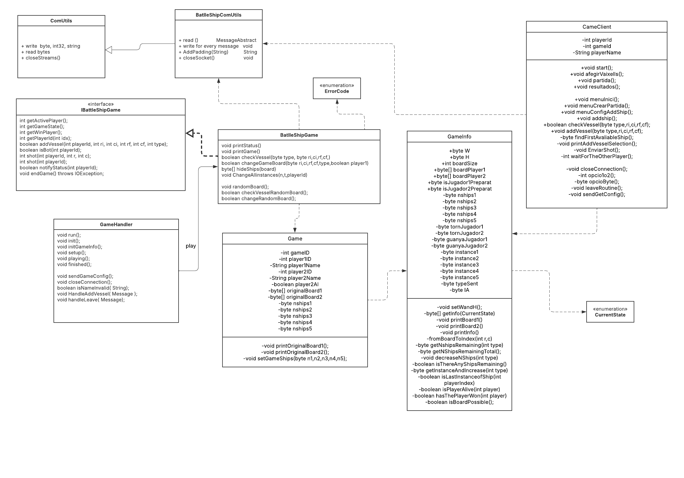

# INFORME PRÀCTICA 1 SD (sense testing --> `TestReport.md`)

## DADES BÀSIQUES

**Projecte 1 de software distribuit**: Enfonsar la Flota

**Alumne 1**:

- **Nom**: Andrés Río Nogués
- **Niub**: 20722984
- **Nom en GitHub**: AndresRioo

**Alumne 2**:

- **Nom**: Aleix Falgosa Campoy
- **Niub**: 20722774
- **Nom en GitHub**: Aleix15

## DIAGRAMA DE CLASSES



Estructura de classes del projecte, on es pot veure la relació entre les classes i com es comuniquen entre elles.


## EXECUCIÓ DEL CODI

## Com està estructurat el codi
El codi està estructurat en tres parts:
- **client**: Conté el codi del client que s'encarrega de fer les peticions al servidor.
- **server**: Conté el codi del servidor que s'encarrega de rebre les peticions del client i respondre-les.
- **comUtils**: Conté el codi comú que comparteixen el client i el servidor.


## Com compilar, encapsular i executar el codi
Per executar el codi cal tenir instal·lat el JDK de Java. Un cop instal·lat, es pot executar el codi de la següent manera:

### Servidor
```bash 
mvn clean package
java -jar target/Server-1.0-SNAPSHOT-jar-with-dependencies.jar -p 8080
```

### Client

```bash 
mvn clean package
java -jar target/Client-1.0-SNAPSHOT-jar-with-dependencies.jar -h localhost -p 8080
```


## TESTING

Explicat al altre readme `TestReport.md` la part de testing creuat i els tests unitaris. 


## EXPLICACIÓ DE LES SESSIONS I DEL CODI REALITZAT

### Sessió 1

Per aquesta primera sessió, hem creat la classe BattleshipComUtils que estén de ComUtils, encarregada de gestionar la transmissió de missatges 
entre el client i el servidor.
#### BSComUtils

Hem implementat diversos mètodes d'escriptura que permeten enviar missatges al servidor.Per exemple,write_OK() envia un missatge de confirmació 
amb un identificador aleatori de jugador i partida, mentre que write_CREATE() i write_JOIN() permeten als jugadors crear o unir-se a una partida. 
També hem afegit write_GETCONFIG(), write_GAMECONFIG(), write_SHOT(), write_HIT(), write_FAIL() i write_LEAVE(), cobrint totes les interaccions 
necessàries durant el joc. Aquests mètodes fan ús de tipus de dades com byte i int32 per garantir la compatibilitat amb el protocol de comunicació. 
En algúns d'ells, com en write_ADDVESSEL(), hem afegit validacions per evitar valors incorrectes en la configuració dels vaixells i complir amb el protocol.

Exemple:
```java

public class BattleshipComUtils extends ComUtils{

    public void write_ADDVESSEL(int playerId , int gameId , byte type, byte ri, byte ci, byte rf, byte cf) throws IOException {
        write_byte((byte) 7);
    
        if (type > 5 || type < 1) throw new IOException("Has d'escollir un tipus de vaixell entre el 1 i el 5");
        if (ri < 1 || rf < 1) throw new IOException("La fila comença a numerar-se a partir del 1");
        if (ci < 1 || cf < 1) throw new IOException("La columna comença a numerar-se a partir del 1");
    
    
        write_int32(playerId);
        write_int32(gameId);
    
        write_byte(type);
        write_byte(ri);
        write_byte(ci);
        write_byte(rf);
        write_byte(cf);
    }
}
```
Per altra banda, hem creat diferents classes per cada missatge que estenen de la classe messageAbstract, aquestes tindrán el seu propi mètode read() 
sobrescrit de messageAbstract. En la classe BSComUtils hem creat un mètode read(), que interpreta el tipus de missatge i crida al read() del missatge 
corresponent, i alhora retorna el missatge. En el cas que no es detecta com un dels missatges coneguts, el sistema genera un missatge d'error a la consola.


Mètode read() de la classe MessageOK.java:

```java

public class MessageOK extends MessageAbstract{

    /**
     * playerId: Player identifier
     */
    private int playerId;

    /**
     * gameId: Game identifier
     */
    private int gameId;

    @Override
    public void read(ComUtils comUtils) throws IOException {

        this.playerId = comUtils.bytesToInt32(comUtils.read_bytes(4), ComUtils.Endianness.BIG_ENNDIAN);
        this.gameId = comUtils.bytesToInt32(comUtils.read_bytes(4), ComUtils.Endianness.BIG_ENNDIAN);
    }
}
```

Mètode read() del BattleShipComUtils.java que truca al read del missatge corresponent:


```java

public class BattleshipComUtils extends ComUtils {

public MessageAbstract read() throws IOException {

    byte messageType = read_bytes(1)[0];
    MessageAbstract message;

    switch (messageType) {
        case 0: // ERROR
            message = new MessageError(messageType);
            break;
        case 1: // OK
            message = new MessageOK(messageType);
            break;
        case 2: // CREATE
            message = new MessageCreate(messageType);
            break;
        case 3: // JOIN
            message = new MessageJoin(messageType);
            break;
        case 4: // REJOIN
            message = new MessageReJoin(messageType);
            break;
        case 5: // GETCONFIG
            message = new MessageGetConfig(messageType);
            break;
        case 6: // GAMECONFIG
            message = new MessageGameConfig(messageType);
            break;
        case 7: // ADDVESSEL
            message = new MessageAddVessel(messageType);
            break;
        case 8: // GETSTATUS
            message = new MessageGetStatus(messageType);
            break;
        case 9: // GAMESTATUS
            message = new MessageGameStatus(messageType);
            break;
        case 10: // SHOT
            message = new MessageShot(messageType);
            break;
        case 11: // HIT
            message = new MessageHit(messageType);
            break;
        case 12: // FAIL
            message = new MessageFail(messageType);
            break;
        case 13: // LEAVE
            message = new MessageLeave(messageType);
            break;
        default:
            // Not recognized messages
            System.out.println(" ERROR READ BSCOMUTILS : Not recognized :  " + messageType);
            return null;

    }

    message.read(this); // Lee el cuerpo del mensaje
    return message;
}
}
```

Per finalitzar,hem implementat el mètode AddPadding(), que utilitzem en el write_CREATE(), write_JOIN(), write_REJOIN() per assegurar-nos que 
els noms dels jugadors tinguin exactament 50 bytes afegint caràcters si és necessari.

```java
public class BattleshipComUtils extends ComUtils {

    private String AddPadding(String str) {
        // Add padding to the name of the player
        StringBuilder paddedName = new StringBuilder(str);
        while (paddedName.length() < 50) {
            paddedName.append('\0'); // Null character
        }
        return paddedName.toString();
    }
}
```

### Sessió 2

#### Servidor : Sessió 2

En aquesta part hem començat amb la classe server i creant el nostre server per crear
un fil cada cop que un client es connecta al servidor. Aquest fil s'encarrega de gestionar la comunicació amb el client,
i per tant, la creació de la partida i la gestió de les accions dels jugadors. El que fem en el codi
`init()` és acceptar el client del ServerSocket i crear un objecte GameHandler amb el ComUtils del client i el nou socket propi.
Aquest GameHandler s'encarregarà de gestionar la partida del client de manera paral·lela, 
permetent a més d'un client jugar al mateix temps. Per això fem que GameHandler estengui de Thread i sobreescriu el mètode run().
Al trucar al mètode start() de GameHandler, comença la partida del client.

```java

public class Server {
    
    //...
    
    public void init() {  
        while(true) { 
            try {
                socket = ss.accept();

                comutils = getComutils(socket);

                BattleshipComUtils bcomutils = new BattleshipComUtils(comutils, socket);

                System.out.println("Client accepted");
                
                // Create a new GameHandler for every client.
                new GameHandler(bcomutils).start();

                comutils = null;
                
                
            } catch (IOException e) {
                throw new RuntimeException("I/O error when accepting a client:\n" + e.getMessage());
            } catch (SecurityException e) {
                throw new RuntimeException("Operation not accepted:\n"+e.getMessage());
            } catch (IllegalBlockingModeException e) {
                throw new RuntimeException("There is no connection ready to be accepted:\n"+e.getMessage());
            }
            
     
        }
    }
}
```

Un cop el client s'ha connectat al servidor, el GameHandler comença la partida amb el mètode start(). En el codi
`run()` de Server començem amb el mètode `init()'.

Aquest mètode espera 2 possibles missatges, CREATE o JOIN, i en funció del missatge rebut, crea una partida amb les dades del client o
crea una partida predefinida. En els dos casos, client juga contra un bot, però en el cas de JOIN, el bot ja té la partida creada i el client
s'hi uneix. En el cas de CREATE, el client crea la partida. 

En el cas de rebre un missatge que no sigui CREATE o JOIN, acabem amb la partida.

En el cas de Join, simplement revisem que el nom sigui correcte i enviem un missatge OK amb el  ID de la partida i el jugador.

En el cas de Create, revisem el nom i que la partida sigui possible (es pugui jugar, tingui sentit i que cumpleixi amb tot el protocol) i enviem un missatge OK amb el ID de la partida i el jugador.

Tots dos casos tindràn un `player2ID` com `-1` i un `player2AI` com `true`, ja que el bot sempre serà el jugador 2. Un cop acabem de configurar la partida, posem el estat com a `SETUP`, creem un tauler aleatori per el bot i 
notifiquem al client que la partida està llesta per jugar.


```java
public class GameHandler{
    /**
     * Initializes game settings and prepares the game session.
     */
    public void init() throws GameException, IOException {

        System.out.println("Server : Initializing game settings...");

        Random random = new Random();
        int randomPlayerId = random.nextInt(89999) + 10000; // Random number between 10000 and 99999
        //int randomPlayer2Id = random.nextInt(89999) + 10000; // Random number between 10000 and 99999
        int randomGameId = random.nextInt(89999) + 10000; // Random number between 10000 and 99999

        MessageAbstract message = bsComUtils.read(); // Read message

        if (message instanceof MessageJoin) { // JOIN message
            System.out.println("Player Joined the game, received JOIN message");
            MessageJoin messageJoin = (MessageJoin) message;

            if ( isNameInvalid( messageJoin.getNomJugador() ) ) {
                System.out.println("Server : Invalid player name");
                bsComUtils.write_ERROR(ErrorCode.INVALID_PLAYER_NAME.getErrorId(), ErrorCode.INVALID_PLAYER_NAME.getDescription().length(), ErrorCode.INVALID_PLAYER_NAME.getDescription());
                init(); // try again
                return;
            }

            // Create a new game with the random game ID and player ID
            initGameInfoFIXEDVALUES(randomPlayerId, randomGameId);
            game.setPlayer1Name(messageJoin.getNomJugador());
            // values are fixed if the player joins a game

        } else if (message instanceof MessageCreate) {
            System.out.println("Player Created the game, received CREATE message");
            MessageCreate messageCreate = (MessageCreate) message;

            if ( isNameInvalid( messageCreate.getNomJugador() ) ) {
                System.out.println("Server : Invalid player name");
                bsComUtils.write_ERROR(ErrorCode.INVALID_PLAYER_NAME.getErrorId(), ErrorCode.INVALID_PLAYER_NAME.getDescription().length(), ErrorCode.INVALID_PLAYER_NAME.getDescription());
                init(); // try again
                return;
            }

            int esPosible = initGameInfoVARIABLEVALUES(randomPlayerId, randomGameId, messageCreate.getW(), messageCreate.getH(), messageCreate.getT1(), messageCreate.getT2(), messageCreate.getT3(), messageCreate.getT4(), messageCreate.getT5(), messageCreate.getIA() ? 1 : 0);

            if ( esPosible == -1 ){ // check if the game is possible (board size and ships has enough space and makes sense)
                System.out.println("Server : Game not possible");
                bsComUtils.write_ERROR(ErrorCode.GAME_UNAVAILABLE.getErrorId(), ErrorCode.GAME_UNAVAILABLE.getDescription().length(), ErrorCode.GAME_UNAVAILABLE.getDescription());
                init();
                return;
            }

            game.setPlayer1Name(messageCreate.getNomJugador());
            //game.setPlayer2AI(messageCreate.getIA()); //not implemented, change if implemented (player 2 is always a bot)

        }   else {
            throw new GameException("ERROR : UNEXPECTED MESSAGE TYPE");
        }

        // now that the game is created, set the config values (original values)
        game.setGameShips((byte) game.getGameInfo().nships1, (byte) game.getGameInfo().nships2, (byte) game.getGameInfo().nships3, (byte) game.getGameInfo().nships4, (byte) game.getGameInfo().nships5);


        bsComUtils.write_OK(randomPlayerId, randomGameId); // Send OK message with random player and game ID
        System.out.println("Server : Game " + randomGameId + " , and player ID " + randomPlayerId + ", sent to the client with name " + game.getPlayer1Name());
        game.setPlayer2ID(-1); // bot player
        game.setPlayer2AI(true); // change if player 2 is not a bot

        /*
        TODO : LOGIC FOR WAITING THE OTHER PLAYER (NOW ONLY ONE PLAYER)
        NO PLAYER 2 IMPLEMENTED YET, ONLY PLAYER 1 SO NO PLAYER 2 WAITING (BOT LOGIC)

        if ( game.getPlayer2AI() ){
            // join from player 2
        }

         */

        game.setGameState(CurrentState.SETUP); // Set game state to SETUP
        randomBoard2(
                game.getGameInfo().nships1,
                game.getGameInfo().nships2,
                game.getGameInfo().nships3,
                game.getGameInfo().nships4,
                game.getGameInfo().nships5); // Random board for player 2 (bot)

        // notify the player that the game is ready
        if (!notifyStatus(randomPlayerId)) {
            throw new GameException("Error: notifyStatus failed");
        }

        System.out.println("Server : notify status sent");
        System.out.println("Server : Game settings initialized correctly");

    }
}


```


Per revisar que les partides siguin possibles, hem creat el mètode `initGameInfoVARIABLEVALUES()` que comprova que la mida del tauler sigui correcta de la següent manera:

Si la mida del tauler és més petita que 2x2, la partida no és possible.
Si la mida del tauler és més petita que la mida del vaixell més gran, la partida no és possible.
Si la mida del tauler és més petita que la suma de tots els vaixells, la partida no és possible.
Si hi ha més de 25 vaixells d'un tipus, la partida no és possible (el protocol dicta aquesta norma).

Si cumplim amb totes les condicions, la partida és possible i retornem 0, si no, retornem -1.

```java
public class GameInfo {
    /**
     * Check if the board is possible (naive approach)
     * @return 0 if the board is possible, -1 if not
     */
    public int isBoardPosible(){

        int caselles = W*H;
        int espaiVaixell = nships1*5 + nships2*4 + nships3*3 + nships4*3 + nships5*2;

        if (espaiVaixell > caselles){ // not enough space
            System.out.println("1. BOARD NOT POSSIBLE : NOT ENOUGH SPACE");
            return -1;
        }

        if (espaiVaixell == 0){ // no ships
            System.out.println("2. BOARD NOT POSSIBLE : NO SHIPS");
            return -1;
        }

        if (caselles < 4){ // the minimum board size is 2*2 (2*1 doesn't make sense)
            System.out.println("3. BOARD NOT POSSIBLE : BOARD TOO SMALL");
            return -1;
        }

        if (nships1 >= 1 && (W < 5 && H < 5)) { // ship 1 needs 5 spaces
            System.out.println("4. BOARD NOT POSSIBLE : SHIP 1 TOO BIG");
            return -1; // doesnt fit
        }

        if (nships2 >= 1 && (W < 4 && H < 4)) { // ship 2 needs 4 spaces
            System.out.println("5. BOARD NOT POSSIBLE : SHIP 2 TOO BIG");
            return -1; // doesnt fit
        }

        if (nships3 >= 1 && (W < 3 && H < 3)) { // ship 3 needs 3 spaces
            System.out.println("6. BOARD NOT POSSIBLE : SHIP 3 TOO BIG");
            return -1; // doesnt fit
        }

        if (nships4 >= 1 && (W < 3 && H < 3)) { // ship 4 needs 3 spaces
            System.out.println("7. BOARD NOT POSSIBLE : SHIP 4 TOO BIG");
            return -1; // doesnt fit
        }

        if (nships5 >= 1 && (W < 2 && H < 2)) { // ship 5 needs 2 spaces
            System.out.println("8. BOARD NOT POSSIBLE : SHIP 5 TOO BIG");
            return -1; // doesnt fit
        }

        // protocol limits the number of ships to 25
        if (nships1 > 25 || nships2 > 25 || nships3 > 25 || nships4 > 25 || nships5 > 25){
            System.out.println("9. BOARD NOT POSSIBLE : TOO MANY SHIPS");
            return -1; // too many ships
        }

        return 0; // board is possible
    }}

```

Amb aquesta part ja tindrimes la base per començar a jugar, i el servidor ja està preparat per rebre les peticions del client i gestionar-les.
Ara entrem en la part de SETUP, on rebrem les peticions del client per configurar la partida i afegir els vaixells.

En aquesta part, hem creat el mètode `setup()` que s'encarrega de gestionar la configuració de la partida.
En aquest mètode, esperem 3 tipus de missatges, GETCONFIG, GETSTATUS i ADDV, i en funció del missatge rebut, enviem la configuració de la partida,
l'estat de la partida o afegim un vaixell al tauler.

En el cas de rebre un GETCONFIG, enviem la configuració de la partida al client (l'estat original).
En el cas de rebre un GETSTATUS, enviem l'estat de la partida al client(l'estat actual).
En el cas de rebre un ADDV, afegim el vaixell al tauler i comprovem si s'ha acabat de configurar la partida, si és així, canviem l'estat de la partida a PLAYING.

A més podem rebre un LEAVE, que finalitza la partida i un ERROR, que finalitza la partida amb error.

```java

public class GameHandler {
    
    // ...
    
    /**
     * Receives the addvessel message and adds the vessel to the board.
     * @throws GameException error from the game flux
     * @throws IOException error from the communication
     */
    public void setup() throws GameException, IOException {

        while (game.getGameState() == CurrentState.SETUP) {

            MessageAbstract message = bsComUtils.read(); // Read message

            // if message is GameConfig, send the config from the game
            if (message instanceof MessageGetConfig) {
                System.out.println("Server : getConfig received (in setup)");
                sendGameConfig();

                // if message is GameStatus, send the status from the game
            } else if (message instanceof MessageGetStatus) {
                System.out.println("Server : MessageGetStatus received (in setup)");
                this.notifyStatus(((MessageGetStatus) message).getPlayerId());

                // if message is ADDV, add the vessel to the board
            } else if (message instanceof MessageAddVessel) {
                System.out.println("Server : AddVessel received");

                MessageAddVessel messageAddvessel = (MessageAddVessel) message;
                handleAddVessel(messageAddvessel);

                // if message is LEAVE, end the game
            } else if (message instanceof MessageLeave) {

                MessageLeave messageLeave = (MessageLeave) message;
                handleLeave(messageLeave);

                // shouldn't be reached (no possible error with OK message)
            } else if (message instanceof MessageError) { // Error message
                throw new GameException("Error: Received ERROR message");
                // shouldn't be reached (no possible error)
            } else {
                throw new GameException("Error: Unexpected message type");
            }
        }
    }
}
```


Per afegir un vaixell tenim el mètode `handleAddVessel()` que s'encarrega de gestionar l'afegir un vaixell al tauler.
Aquest mètode primer trucarà al mètode `addVessel()` que s'encarrega de comprovar si es pot afegir el vaixell al tauler, i si es pot, 
l'afegirà. Si el addvessel no es pot afegir, enviem un missatge 
d'error al client amb el codi d'error corresponent.

Cada cop que s'afegeix un vaixell, s'envia un missatge OK i es 
comprova si ja s'han afegit tots els vaixells, i si és així, canviem l'estat de 
la partida a PLAYING enviant el GameStatus actual.


```java

public class GameHandler {

    // ... 

    /**
     * This method handles all the addvessels messages received
     * @param messageAddvessel the message received with the info of the vessel to add
     * @throws IOException if there is an error writing to the socket
     */
    private void handleAddVessel(MessageAddVessel messageAddvessel) throws IOException {

        boolean result = this.addVessel(messageAddvessel.getPlayerId(),
                messageAddvessel.getRi(),
                messageAddvessel.getCi(),
                messageAddvessel.getRf(),
                messageAddvessel.getCf(),
                messageAddvessel.getType());

        // something went wrong, sending error message, saved in errorCode in addvessel
        if (!result) {
            System.out.println("Server : Vessel not added");
            bsComUtils.write_ERROR(errorCode.getErrorId(), errorCode.getDescription().length(), errorCode.getDescription());
            System.out.println("Server : Error sent");


        } else { // everything went well, sending OK

            // print the board after adding the vessel
            if (messageAddvessel.getPlayerId() == game.getPlayer1ID())
                this.game.getGameInfo().printBoard1();
            else
                this.game.getGameInfo().printBoard2();

            // send OK to keep going
            System.out.println("Server : Sending OK");
            bsComUtils.write_OK(
                    messageAddvessel.getPlayerId(),
                    messageAddvessel.getGameId()); // Send OK message

            // if all vessels are added, change game state to PLAYING
            if (game.getGameInfo().getNshipsRemainingTotal() == 0) {
                System.out.println("Server : All vessels added, changing game state to PLAYING");
                System.out.println("Server : Sending Game State to PLAYING");
                game.setGameState(CurrentState.PLAYING); // Set game state to PLAYING
                notifyStatus(game.getPlayer1ID());
                game.getGameInfo().tornJugador1 = 1;
                game.getGameInfo().tornJugador2 = 0;
            }
            System.out.println("Server : Vessel added and OK sent");
        }
    }


    /**
     * Attempts to add a vessel to the board for a given player.
     *
     * @param playerId the ID of the player.
     * @param ri       the starting row index.
     * @param ci       the starting column index.
     * @param rf       the ending row index.
     * @param cf       the ending column index.
     * @param typeINT  the type of vessel.
     * @return true if the vessel was successfully placed, false otherwise.
     */
    @Override
    public boolean addVessel(int playerId, int ri, int ci, int rf, int cf, int typeINT) {

        if (game.getGameInfo().getGameState() == CurrentState.SETUP) {
            if (checkVessel((byte) typeINT, (byte) ri, (byte) ci, (byte) rf, (byte) cf)) {
                return changeGameBoard((byte) ri, (byte) ci, (byte) rf, (byte) cf, (byte) typeINT, playerId == game.getPlayer1ID());
            } else {
                System.out.println("ERROR: Vessel not added");
                //Error code in checkVessel
                return false;
            }
        } else { // wrong state
            System.out.println("ERROR: Wrong state (should be setup and not -> " + game.getGameInfo().getGameState() + " )");
            errorCode = ErrorCode.INVALID_STATE;
            return false;
        }
    }
}
```

En aquesta part aconseguim que el servidor sigui capaç de gestionar les peticions del client i configurar la partida, i el client sigui capaç de
enviar les peticions al servidor i rebre les respostes corresponents. Permetent així que el client pugui configurar la partida 
i afegir els vaixells al tauler, evitant que es puguin afegir vaixells fora del tauler o que es puguin afegir més vaixells dels permesos pel protocol.

#### Client : Sessió 2

En aquesta part, hem començat implementant el mètode main() de la classe Client.java, ón hem creat un GameClient, d'aquesta instància cridem al 
seu mètode start(), responsable d'inicalitzar i manejar la sessió del GameClient.

Mètode main() en la classe Client.java:

```java

public class Client{

public static void main(String[] args) {

    if (args.length != 4) {
        throw new IllegalArgumentException("Wrong amount of arguments.\n" + INIT_ERROR);
    }

    if (!args[0].equals("-h") || !args[2].equals("-p")) {
        throw new IllegalArgumentException("Wrong argument keywords.\n" + INIT_ERROR);
    }
    int port;
    try {
        port = Integer.parseInt(args[3]);
    } catch (NumberFormatException e) {
        throw new NumberFormatException("<port> should be an Integer.");
    }
    String host = args[1];
    Client client = new Client(host, port);

    GameClient gamePlayer = new GameClient(client.getBSComutils());

    try {
        gamePlayer.start();
    } catch (IOException e) {
        System.out.println("CLASE CLIENTE (IOe): I/O Error when starting the game --> " + e.getMessage());
        throw new RuntimeException(e);
    } catch (GameException e) {
        System.out.println("CLASE CLIENTE (gameException) --> " + e.getMessage());
    } catch (InputMismatchException e) {
        System.out.println("Caracter no valido a la hora de introducir un valor, saliendo del juego...");
    } catch (RuntimeException e) {
        System.out.println("Tiempo de espera demasiado largo --> " + e.getMessage());
    } catch (Exception e) {
        System.out.println("Error  --> " + e.getMessage());
    } finally {
        try {
            System.out.println("Closing the socket.");
            client.getBSComutils().closeSocket();
            client.getSocket().close();
            System.out.println("Socket closed.");
            System.out.println("Ending the client.");
        } catch (IOException e) {
            throw new RuntimeException("I/O Error when closing the socket:\n"+e.getMessage());
        } finally {
            System.exit(0);
        }
    }
}
}
```

Mètode start() de la classe GameClient.java:
```java

public class GameClient {

    public void start() throws IOException, GameException {

        menuInici(); // ask name and send join

        System.out.println("Has entrat a la partida amb el jugadorId: " + playerId + " i gameId: " + gameId);

        MessageAbstract FirstMessage = bsComUtils.read();
        MessageGameStatus status;

        // ok was received previously, so the next message should be a game status (can't be a error)
        if (FirstMessage instanceof MessageError) {
            MessageError error = (MessageError) FirstMessage;
            System.out.println("Error received from server : " + error.getErrorDescription());
            closeConnection();
            System.exit(1);

        } else if (FirstMessage instanceof MessageGameStatus) {
            status = (MessageGameStatus) FirstMessage;
            gameInfo = new GameInfo(-1);
            gameInfo.setNewGameInfo(status.getGameInfo());

        } else {
            System.out.println("UNEXPECTED ERROR (start) : Unexpected message type --> " + FirstMessage.getMessageType());
            closeConnection();
            System.exit(1);
        }

        sendGetConfig();

        System.out.println("-----------AFEGEIX ELS TEUS VAIXELLS-----------------");
        afegirVaixells(); // state 2 (SETUP)
        System.out.println("-----------COMENÇA LA PARTIDA!-----------------");
        partida(); // state 3 (PLAYING)
        System.out.println("-----------FINAL DE LA PARTIDA------------------");
        resultados(); // state 4 (FINISHED)

    }
}

```
En el mètode start(), que cridem des de la classe Client.java, comença fent una crida a menuInici(), un mètode que demana el nom del jugador i li 
demana al jugador que seleccioni una opció, Unir-se, Crear Partida (Ho tractem en les seguents sessions), Sortir.

En el cas de seleccionar l'opció d'unir-se, utilitzem l'objecte per escriure un missatge JOIN, un cop enviat llegim el missatge que retorna el server 
i analitzem si es tracta d'un missatge ERROR o un missatge OK. En el primer cas, tornarem la descripció de l'error, i si consisteix en un nom de jugador 
invàlid torna a cridar al menuInici(). Per contra, ens guardarem el gameID i playerID obtinguts del missatge.

Altrament, en seleccionar sortir, cridarem a un mètode que tancarà el socket, i per tant acabarà la partida.

```java

public class GameClient {

public void menuInici() throws IOException , GameException {
        System.out.println("Benvingut a Enfonsar la Flota! \nQuin nom vols utilitzar durant el joc? ");
        nomJugador = sc.nextLine();

        System.out.println("Selecciona una acció del menu d'opcions:");
        System.out.println("1- Unir-se a una partida");
        System.out.println("2- Crear una partida");
        System.out.println("3- Sortir");

        int opcio = opcioByte();

        switch (opcio) {
            case 1:

                System.out.println("Unint-se...");
                bsComUtils.write_JOIN(nomJugador);
                MessageAbstract message = bsComUtils.read();

                if (message instanceof MessageError) {
                    MessageError error = (MessageError) message;
                    System.out.println("Error received from server : " + error.getErrorDescription());

                    if (error.getError() == ErrorCode.INVALID_PLAYER_NAME) {
                        System.out.println("ERROR : Select a new game name");
                        menuInici();
                        return;
                    }

                    closeConnection();
                    System.exit(1);

                } else if (message instanceof MessageOK) {
                    MessageOK ok = (MessageOK) message;
                    gameId = ok.getGameId();
                    playerId = ok.getPlayerId();

                } else {
                    System.out.println("UNEXPECTED ERROR : Unexpected message type -->" + message.getMessageType());
                    System.exit(1);
                }

                break;
            case 2:
                menuCrearPartida();
                break;
            case 3:
                System.out.println("Sortint del joc...");
                closeConnection();
                System.exit(0);
                break;
            default:
                System.out.println("Només hi ha 3 opcions! Torna a intentar");
                menuInici();
                break;
        }

    }
}

```
Un cop sortim del menú inicial, mirem si hem rebut un missatge GAMESTATUS, si es el cas, canviem el mode configuració al 2 SETUP, 
i envio un missatge GETCONFIG per obtenir un missatge amb la configuració. Seguim amb la configuració del joc en el mètode afegirVaixells(), 
aquí comprovem que abans d'afegir VESSELS l’estat del joc ha estat canviat a SETUP correctament. Si l’estat no és correcte, es tanca la connexió 
i es finalitza el programa amb error. Al contrari, tindrem un bucle que es repeteix mentre l'estat del joc sigui SETUP, permetent a l’usuari afegir 
tots els seus vaixells fins que el servidor canviï l’estat a PLAYING.

Si encara queden vaixells per afegir, es crida menuConfigAddShip(), i si ja s’han afegit tots, el client espera un missatge del servidor. 
Després d’afegir un vaixell o esperar al servidor, es llegeix un missatge del servidor per veure com ha respost. Si el servidor ha acceptat 
l’últim vaixell afegit, es redueix el comptador de vaixells restants. Si el servidor envia la configuració actualitzada del joc, mirem si 
indica que l’estat ha passat a PLAYING, això significa que tots els vaixells han estat afegits i la partida pot començar, guardant la nova informació del joc. 
Finalment, si el servidor rebutja un vaixell per algun error, es mostra el missatge d’error i es tracta segons el codi d’error rebut, en alguns casos es pot 
tancar la connexió.

```java
public class GameClient {

private void afegirVaixells() throws IOException, GameException {

        if (gameInfo.getGameState() != CurrentState.SETUP){
            System.out.println("ERROR (afegir Vaixells) : Unexpected game state");
            System.out.println("Game state: " + gameInfo.getGameState());
            closeConnection();
            System.exit(1);
        }

        MessageGameStatus status;

        while( gameInfo.getGameState() == CurrentState.SETUP ) {

            if (gameInfo.getNshipsRemainingTotal() != 0) {
                // if there are still ships to add, we enter the menuConfigAddShip()
                menuConfigAddShip();
            } else {
                // no li queden vaixells per afegir, el proxim message ha de ser un MessageGameStatus
                System.out.println("No hi ha més vaixells per afegir, esperant al server...");
            }

            MessageAbstract message = bsComUtils.read();

            // if message is OK, then we can continue adding ships and decrease the number of ships remaining
            if (message instanceof MessageOK) {
                gameInfo.decreaseNShips(gameInfo.getTypeSent());

                // if message is GAMESTATUS, then we can continue the game changing the state to (PLAYING)
            } else if (message instanceof MessageGameConfig) {

                MessageGameConfig config = (MessageGameConfig) message;
                config.printConfig();


            } else if (message instanceof MessageGameStatus) {
                status = (MessageGameStatus) message;
                //System.out.println("GameStatus received");

                if (status.getGameInfo().getGameState() == CurrentState.PLAYING) {
                    System.out.println("Tots els vaixells afegits, comencem a jugar!");
                } else {
                    printState(CurrentState.SETUP); // setup not ended , but the player asked for the status
                }
                gameInfo.setNewGameInfo(status.getGameInfo());

                // if message is ERROR, then we have to show the error and try again
            } else if (message instanceof MessageError) { // Error received
                MessageError error = (MessageError) message;
                System.out.println("Error received from server : " + error.getErrorDescription());

                // TODO: Handle the different error codes
                if (error.getError() == ErrorCode.INVALID_GAME_ID) {
                    // error with the game id, we have to leave the game
                    closeConnection();
                } else if (error.getError() == ErrorCode.INVALID_PLAYER_ID) {
                    // error with the player id, we have to leave the game
                    closeConnection();
                } else if (error.getError() == ErrorCode.INVALID_LENGTH) {
                    // As we didn't receive the ok, the remaining ships keep the same
                    System.out.println("ERROR : Invalid length");
                } else if (error.getError() == ErrorCode.TYPE_UNAVAILABLE) {
                    // As we didn't receive the ok, the remaining ships keep the same
                    System.out.println("ERROR : Type unavailable");
                } else if (error.getError() == ErrorCode.INVALID_COORDINATE) {
                    // As we didn't receive the ok, the remaining ships keep the same
                    System.out.println("ERROR : Invalid coordinate");
                } else if (error.getError() == ErrorCode.INVALID_STATE) {
                    // As we didn't receive the ok, the remaining ships keep the same
                    System.out.println("ERROR : Invalid state");
                } else {
                    System.out.println("UNEXPECTED ERROR (afegir vaixell message error) : Unexpected error code --> " + error.getErrorDescription());
                }
            } else {
                System.out.println("UNEXPECTED ERROR (afegir vaixell) : Unexpected message type --> " + message.getMessageType());
            }
        }
    }
}
```
En l'anterior apartat, hem mencionat que utilitzem el mètode menuConfigAddShip() per observar el menú afegir un vaixell. 
En aquesta sessió es demanava que tingués les opcions d'afegir vaixell i sortir, però també hem afegit les opcions de veure configuració inicial i l'actual.

Si selecciona l'opció d'afegir vaixell, crida al mètode addShip(), aquí busca un tipus de vaixell que encara es pugui col·locar, 
si no n'hi ha cap disponible, mostra un error i surt. Mostra a l’usuari quins vaixells pot afegir i com fer-ho. 
Li demanarà a l’usuari introduir la columna (ci) i la fila (ri) on vol situar el vaixell i comprova si aquestes coordenades són vàlides. 
Demanarà a l'usuari l'orientació desitjada i calcularà les coordenades finals depenent del tipus de vaixell. Per comprovar, 
si el vaixell està correctament ubicat sense problemes utilitzem el mètode checkVessel() que controlarà els diferents tipus d'error entre ells 
comprova si el tipus de vaixell es troba entre l'1 i el 5, si les coordenades estan dins del taulell, si el vaixell donat té totes les coordenades en la 
mateixa fila o columna, si la mida del vaixell coincideix correctament amb la del tipus de vaixell i finalment si alguna posició coincideix amb la d'altre vaixell. 
Un cop acaba de comprovar envia un missatge write_ADDVESSEL() al servidor.

Per altra banda, si l'opció del menú és veure la configuració original del tauler, escriurà un missatge write_GETCONFIG(), 
si volem veure l'actual enviarem un missatge write_GETSTATUS(), finalment si volem sortir cridarem a leaveRoutine() que envia 
l'ID del jugador (playerId) i l'ID de la partida (gameId) amb write_LEAVE(), notificant al servidor que el jugador vol abandonar la partida, 
llegeix la resposta del servidor i si es un messageOK tancarà el socket, finalitzant així la connexió.


Mètode menuConfigAddShip():

```java

public class GameClient {

    /**
     * Display the configuration menu.
     * Allowing the player to place a ship on the board or exit the game
     *
     * @throws IOException If there is an error in communication with the server
     */
public void menuConfigAddShip() throws IOException, GameException {
        System.out.println("Selecciona una acció del menu d'opcions:");
        System.out.println("1- Ubicar vaixell");
        System.out.println("2- Veure la configuració original del tauler");
        System.out.println("3- Veure la configuració actual del tauler");
        System.out.println("4- Sortir");

        int opcio = opcioByte();

        switch (opcio) {
            case 1:
                addShip();
                break;
            case 2:
                bsComUtils.write_GETCONFIG(playerId, gameId);
                break;
            case 3:
                bsComUtils.write_GETSTATUS(playerId, gameId);
                break;
            case 4:
                leaveRoutine();
                break;
            default:
                System.out.println("Només hi ha 4 opcions! Torna a intentar");
                menuConfigAddShip();
                break;

        }
    }
}

```

Mètode addShip():

```java
public class GameClient {

    /**
     * Add a ship to the board, asking the user where to place it.
     * Local method to track the state of the board
     */
    public void addShip() throws IOException{
        // first find the first available ship and then ask for the coordinates

        byte type = findFirstAvailableShip();

        if (type == -1) {
            System.out.println("ERROR : No type found");
            return;
        }

        // print the info from the board
        printAddVesselSelection(type);

        // ask the coordinates
        byte ri; // Initial row
        byte ci; // Initial column
        byte rf; // Final row
        byte cf; // Final column

        while(true) { // Loop until the user enters a valid position

            System.out.println("Introdueix la columna inicial del vaixell:");
            ci = opcioByte();

            System.out.println("Introdueix la fila inicial del vaixell:");
            ri = opcioByte();


            if (ci < 1 || ri < 1) {
                System.out.println("Posició incorrecte.Coordenades no poder ser inferior a 1. Torna a intentar.");
                continue;
            }

            System.out.println("Vaixell horizontal (1) o vertical (2)?");

            int hv = opcio1o2();

            if (hv == 1) { // Horizontal

                int lastColumn = ci + ShipType.typeToSize(type) - 1;
                cf = (byte) lastColumn;
                rf = ri; // the row is the same

            } else  { // Vertical
                int lastRow = ri + ShipType.typeToSize(type) - 1;
                rf = (byte) lastRow;
                cf = ci; // the column is the same
            }
            // Check if the vessel can be placed in the given coordinates
            if (!checkVessel(type, ri, ci, rf, cf)) {
                continue;
            }
            break; // everything is correct
        }

        System.out.println("Afegint un vaixell amb tipus " + ShipType.fromCode(type) + " i posicions (ri = " + ri + " , ci = " + ci + " , rf = " + rf + " , cf = " + cf +")");
        addVessel(type, ri, ci, rf, cf);

        System.out.println("Vaixell afegit correctament");
        bsComUtils.write_ADDVESSEL(playerId, gameId, type, ri, ci, rf, cf);
    }
}

```
Mètode checkVessel(): 
```java
public class GameClient {

    /**
     * Check if the vessel can be placed in the given coordinates
     * First condition is to check the type of the vessel
     * Then check if the coordinates are within bounds
     * Then check if the vessel is horizontal or vertical
     * Then check if the vessel has the correct size
     * Then check if the vessel is placed in a empty position
     *
     * @param type type of the ship
     * @param ri startign row
     * @param ci starting column
     * @param rf final row
     * @param cf final column
     * @return true if the vessel can be placed in the given coordinates
     */
public boolean checkVessel( byte type, byte ri, byte ci, byte rf, byte cf){

        ri--; ci--; rf--; cf--; // Adjust the coordinates to 0-based

        // incorrect type
        if (type < 1 || type > 5){
            System.out.println("Tipus de vaixell incorrecte, ha de ser entre 1 i 5. Torna a intentar.");
            return false;
        }
        // Check if the coordinates are within bounds after adjusting (coordinates 0-based)
        // first check if the coordinates don't have negative values
        // then check that the last position is within the board
        if (ri < 0 || ci < 0 || rf < 0 || cf < 0 || rf >= gameInfo.H || cf >= gameInfo.W) {

            if (ri < 0 || ci < 0 || rf < 0 || cf < 0) {
                System.out.println("ERROR: Les coordenades no poden ser negatives. Torna a intentar.");
            } else  {
                System.out.println("ERROR: El vaixell surt fora del tauler! Torna a intentar.");
            }
            return false;
        }
        // incorrect coordinates not in the same row or column
        if (ri != rf && ci != cf){
            System.out.println("El vaixell ha de ser horitzontal o vertical. Torna a intentar.");
            return false;
        }

        int amplada = Math.abs(cf - ci) + 1;  // Number of columns occupied
        int altura = Math.abs(rf - ri) + 1;   // Number of rows occupied

        // Incorrect size
        if (amplada != ShipType.typeToSize(type) && altura != ShipType.typeToSize(type)) {
            System.out.println("El vaixell no té la mida correcta. Ha de ser de mida " + ShipType.typeToSize(type) + "");
            System.out.println("Amplada: " + amplada);
            System.out.println("Altura: " + altura);
            return false;
        }


        // check if the vessel is placed in a empty position
        for (int i = Math.min(ri, rf); i <= Math.max(ri, rf); i++){
            for (int j = Math.min(ci, cf); j <= Math.max(ci, cf); j++){
                if (gameInfo.getBoard1Coords(i, j) != 0){
                    System.out.println("ERROR: La posició : (" + i +","+j+") està ocupada. Torna a intentar.");
                    return false;
                }
            }
        }

        return true;
    }
}
```
Métode leaveRoutine():
```java

public class GameClient {

private void leaveRoutine() throws IOException, GameException {

    System.out.println("Sortint...");
    bsComUtils.write_LEAVE(playerId, gameId);

    MessageAbstract message = bsComUtils.read();

    if (message instanceof MessageError) {
        MessageError error = (MessageError) message;
        System.out.println("Error received from server while leaving : " + error.getErrorDescription());
    } else if (message instanceof MessageOK) {
        System.out.println("Leaving succesful");
    } else {
        System.out.println("UNEXPECTED ERROR (leaveRoutine) : Unexpected message type --> " + message.getMessageType());
    }
    closeConnection();
    System.exit(0);
    }
}
```

### Sessió 3

#### Servidor : Sessió 3

En aquesta sessió hem implementat la part del servidor que permet gestionar la partida, en aquest cas, la part de jugar contra el bot i poder
enviar i rebre SHOTS.

El bucle d'aquesta part consisteix a llegir missatges de 4 tipus.

- GETSTATUS: Envia l'estat actual de la partida al client.
- GETCONFIG: Envia la configuració original de la partida al client.
- LEAVE: Finalitza la partida.
- SHOT: Dispara al tauler i comprova si ha tocat un vaixell, si ha tocat un vaixell, si ha enfonsat un vaixell o si ha fallat.

Si el missatge no és un SHOT, tornem a llegir un altre missatge, fins que el missatge sigui un SHOT.
Un cop rebem el shot, verifiquem el resultat i enviem un missatge al client amb el resultat del shot, si ha tocat un vaixell, si ha enfonsat un vaixell, si les
coordenades no són correctes o si ha fallat.

En el cas d'error enviem un missatge d'error amb el codi d'error corresponent i esperem 
a rebre un altre missatge SHOT (sense cap estatus, ja que, la partida segueix sent la mateixa).


En el cas de Hit i Sunk, notifiquem al jugador per a que torni a jugar, i si el jugador ha guanyat, finalitzem la partida.
En el cas de Fail, notifiquem el canvi de jugador i donem pas al bot per a que jugui.

Aquest tindrà el mateix principi, de que si fa hit, notifica i tornarà a disparar
si fa fail, notifica i canvia el torn de jugador.

Aquest bucle es repeteix fins a que un dels dos jugadors guanyi la partida.


```java

public class GameHandler {
    
    
    // ...
    
    /**
     * Manages the shots fired by the players and the bot.
     * @throws GameException error from the game flux
     * @throws IOException error from the communication
     */
    public void playing() throws GameException, IOException {

        System.out.println("Server : --------------- PLAYING ------------------");
        printGame(); // see how the game is going

        while (game.getGameState() == CurrentState.PLAYING) {

            MessageAbstract message = bsComUtils.read(); // Read message

            System.out.println("Server : PLAYING");
            printGame(); // see how the game is going

            // if message is GameConfig, send the config from the game
            if (message instanceof MessageGetStatus) {
                System.out.println("Server : MessageGetStatus received (in playing)");
                this.notifyStatus(((MessageGetStatus) message).getPlayerId());
                continue;

            } else if (message instanceof MessageGetConfig) {
                System.out.println("Server : getConfig received (in playing)");
                sendGameConfig();
                continue;

            } else if (message instanceof MessageLeave) {
                // LEAVE message
                handleLeave((MessageLeave) message);
                return;

            } else if (message instanceof MessageShot) {

                System.out.println("Server : Shot message received");
                MessageShot messageShot = (MessageShot) message;

                if (messageShot.getPlayerId() != getActivePlayer()){
                    System.out.println("Server : Not the turn of the player");
                    bsComUtils.write_ERROR(ErrorCode.INVALID_PLAYER_ID.getErrorId(), ErrorCode.INVALID_PLAYER_ID.getDescription().length(), ErrorCode.INVALID_PLAYER_ID.getDescription());
                    continue;
                }


                switch (shot(messageShot.getPlayerId(), messageShot.getR(), messageShot.getC())) {

                    case 0: //FAIL

                        System.out.println("Server : PLAYER FAIL ! from player " + messageShot.getPlayerId() + " at (" + messageShot.getR() + "," + messageShot.getC() +")" );
                        bsComUtils.write_FAIL(); // Send FAIL message

                        // Change the turn
                        game.getGameInfo().tornJugador1 = game.getGameInfo().tornJugador1 == 1 ? (byte) 0 : (byte) 1;
                        game.getGameInfo().tornJugador2 = game.getGameInfo().tornJugador2 == 1 ? (byte) 0 : (byte) 1;

                        break;
                    case 1: //HIT
                        System.out.println("Server : PLAYER Vessel HIT ! from player " + messageShot.getPlayerId() + " at (" + messageShot.getR() + "," + messageShot.getC() +")");
                        bsComUtils.write_HIT(false);
                        break;

                    case 2: //SUNK
                        System.out.println("Server : PLAYER Vessel SUNK ! from player " + messageShot.getPlayerId() + " at (" + messageShot.getR() + "," + messageShot.getC() +") ");
                        bsComUtils.write_HIT(true);

                        int winner = getWinPlayer();
                        if (winner != -999) { //No vessels remaining
                            this.endGame();
                        }
                        break;

                    case -1://ERROR
                        bsComUtils.write_ERROR(errorCode.getErrorId(), errorCode.getDescription().length(), errorCode.getDescription());
                        continue; // retry shot
                }
                // Notify the player that the game is ready with gamestatus message
                this.notifyStatus(messageShot.getPlayerId());

            } else {
                System.out.println("Server : Unexpected message type in playing");
                System.out.println("Server : recieved code : " + message.getMessageType());
            }

            if (game.getPlayer2AI() && getActivePlayer() == -1) { // playing against IA

                int resultShotIA = shot(game.getPlayer2ID());

                if (resultShotIA == -1) {
                    System.out.println("Server : bot didn't shot");
                } else if (resultShotIA == 2) {
                    System.out.println("Server : bot won, ending game...");
                    this.endGame();
                    this.notifyStatus(getPlayerId(0));
                }

            } else {
                System.out.println(game.getPlayer2AI());
                System.out.println("Server : Player 2 is not a bot ERROR");
            }

        }
    }
}

```


Per al codi de shot, hem creat dos mètodes, un per al jugador i un altre per al bot.
El codi de jugador simplement verifica que les coordenades siguin correctes i comprova si ha tocat un vaixell, si ha enfonsat un vaixell o si ha fallat.
Si les coordenades no són correctes, envia un missatge d'error amb el codi d'error corresponent.
Si fa un hit, revisa si ha enfonsat el vaixell i revisa si el jugador ha guanyat la partida mirant que
tots els vaixells estiguin enfonsats. Per revisar si es sunk o hit, utilitzem el mètode isLastInstanceOfShip() que comprova si és l'última instància del vaixell.


Un error important a evitar és que les instancies poden ser negatives ( un byte en Java va de -128 a 127 i tenim 25 tipus de vaixells disponibles
, si el client afegeix més de 12, la instancia 13 pasa a ser -12 i aixì succesivament). El que hem fet és asegurar que el valor de t sigui absolut per evitar valors negatius, 
tant a la hora de fer el shot, com a la hora de comprovar si el vaixell està sunked.


```java

public class BattleshipGame {
    
    // ...
    
    /**
     * Processes a shot fired by a player at a specific location.
     *
     * @param playerId the ID of the player taking the shot.
     * @param r        the row index of the shot.
     * @param c        the column index of the shot.
     * @return an integer representing the result of the shot: miss (0), hit(1), sunk(2). -1 in case of error.
     */
    @Override
    public int shot(int playerId, int r, int c) {

        // Verify r and c values
        if (r < 0 || r >= game.getGameInfo().H || c < 0 || c >= game.getGameInfo().W) {
            System.out.println("ERROR: Invalid shot coordinates");
            errorCode = ErrorCode.INVALID_COORDINATE;
            return -1; // ERROR
        }

        if (playerId == game.getPlayer1ID()) {
            // player ID shots to player 2 board

            byte valueBoard = game.getGameInfo().getBoard2Coords(r, c); // byte as nnt (n = ship instance, t = type of ship)
            int n = valueBoard / 10; // nn instance
            int t = Math.abs(valueBoard % 10); // t type (abs to avoid negative values)

            if (t == 0) {

                if (n == 0) {
                    // change n to 1 ( as it is empty with a missed shot )
                    game.getGameInfo().setBoard2Coords(r, c, (byte) 10); // Fail value (010)
                } else if (n > 3) {
                    System.out.println("ERROR: Not possible value???");
                }
                return 0; // FAIL

            } else if (t >= 1 && t <= 5 && n != 0) {

                System.out.println("r,c,n,t -> " + r + "," + c + "," + n + "," + t);

                if (game.getGameInfo().isLastInstanceOfShip(2, r, c, n, t)) {

                    System.out.println("LAST INSTANCE FOUND PLAYER 1, SWAPING TO SUNK n --> " + n + " playerId --> " + playerId);
                    changeAllInstances(n, t, playerId); // Mark all instances of the ship as SUNK on the board
                    game.getGameInfo().setBoard2Coords(r, c, (byte) 30); // Sunk value (030)
                    return 2; // SUNK
                } else {
                    game.getGameInfo().setBoard2Coords(r, c, (byte) 20); // Hit value (020)
                    return 1; // HIT
                }


            } else {
                System.out.println("ERROR: Invalid ship type");
                errorCode = ErrorCode.TYPE_UNAVAILABLE;
                return -1; // ERROR
            }

        } else if (playerId == game.getPlayer2ID()) {

            // player ID shots to player 1 board

            byte valueBoard = game.getGameInfo().getBoard1Coords(r, c); // byte as nnt (n = ship instance, t = type of ship)
            int n = valueBoard / 10; // nn instance
            int t = Math.abs(valueBoard % 10); // t type (abs to avoid negative values)

            if (t == 0) {

                if (n == 0) {
                    // change n to 1 ( as it is now empty with a missed shot )
                    game.getGameInfo().setBoard1Coords(r, c, (byte) 10); // Fail value (010)
                } else if (n > 3) {
                    System.out.println("ERROR: Not possible value");
                }
                return 0; // FAIL

            } else if (t >= 1 && t <= 5 && n != 0) {

                if (game.getGameInfo().isLastInstanceOfShip(1, r, c, n, t)) {

                    System.out.println("LAST INSTANCE FOUND PLAYER2, SWAPING TO SUNK n --> " + n + " playerId --> " + playerId);
                    changeAllInstances(n, t ,playerId); // Mark all instances of the ship as SUNK on the board
                    game.getGameInfo().setBoard1Coords(r, c, (byte) 30); // Sunk value (030)
                    return 2; // SUNK
                } else {
                    game.getGameInfo().setBoard1Coords(r, c, (byte) 20); // Hit value (020)
                    return 1; // HIT
                }


            } else {
                System.out.println("ERROR: Invalid ship type");
                errorCode = ErrorCode.TYPE_UNAVAILABLE;
                return -1; // ERROR
            }

        } else {
            System.out.println("ERROR: Invalid player ID");
            errorCode = ErrorCode.INVALID_PLAYER_ID;
            return -1; // ERROR
        }
    }
}
```

```java

public class GameInfo{
    /**
     * Check if the ship is sunk (all the instances of the ship are hit)
     * @param playerIndex player index
     * @param r row
     * @param c column
     * @param instance instance of the ship
     * @param type type of the ship
     * @return true if the ship is sunk, false if not
     */
    public boolean isLastInstanceOfShip(int playerIndex, int r, int c, int instance, int type){

        int index = fromBoardToIndex(r, c);

        for (int i = 0; i < boardPlayer2.length; i++) { // check the other board

            if (index == i) { // skip the current index of the ship
                continue;
            }

            // check if the ship is not sunk by checking
            // the instance is not elsewhere
            // the type is the same
            // the ship type is not 0
            if (playerIndex == 2 ) {
                if (boardPlayer2[i] / 10 == instance &&  // instance can be negative
                        Math.abs(boardPlayer2[i] % 10) == type &&  // type can't be negative!
                        boardPlayer2[i] % 10 != 0) {
                    return false;
                }
            } else {
                if (boardPlayer1[i] / 10 == instance &&
                        Math.abs(boardPlayer1[i] % 10) == type &&
                        boardPlayer1[i] % 10 != 0) {
                    return false;
                }
            }
        }
        return true; // if no other instance of the ship is found
    }
}
```

Per al codi del bot, hem creat un mètode que simula el comportament del bot, aquest mètode és molt senzill, simplement genera coordenades aleatòries
i comprova si ha tocat un vaixell, si ha enfonsat un vaixell o si ha fallat. Les coordenades no poden ser incorrectes però si que poden disparar
a una posició ja disparada. 

```java

public class BattleshipGame {
    
    // ...

 /**
     * Processes an automatic shot for a bot player.
     *
     * @param playerId the ID of the bot player.
     * @return an integer representing the result of the shot: miss (0), hit(1), sunk(2). -1 in case of error.
     */
    @Override
    public int shot(int playerId) {

        if (isBot(playerId)) {  // bot shot

            System.out.println("------------------ BOT TURN ( real playerID game --> " + game.getPlayer1ID() + ")------------------");
            int contador = 0;
            while (true) {
                Random random = new Random();

                int r = random.nextInt(game.getGameInfo().H);
                int c = random.nextInt(game.getGameInfo().W);

                int result = shot(getActivePlayer(), r, c);

                System.out.println("Server : Bot shot (0-based) --> (" + r + "," + c + ")" + "||  (1-based) --> (" + (r + 1) + "," + (c + 1) + ")");

                if (result == -1) { // should never happen
                    System.out.println("Server : Bot shot error?????");
                    continue;
                }

                if (result == 0) { // FAIL
                    System.out.println("Server : Bot FAIL ");
                    // ending bot shot
                    game.getGameInfo().tornJugador1 = game.getGameInfo().tornJugador1 == 1 ? (byte) 0 : (byte) 1;
                    game.getGameInfo().tornJugador2 = game.getGameInfo().tornJugador2 == 1 ? (byte) 0 : (byte) 1;
                    break;
                } else if (result == 1) { // HIT
                    System.out.println("Server : Bot HIT ");
                    contador++;
                    this.notifyStatus(getPlayerId(0)); // notify the player the hit
                    continue;
                } else if (result == 2) {
                    System.out.println("Server : Bot SUNK ");
                    contador++;
                    int winner = getWinPlayer();
                    if (winner != -999) {
                        return 2; // end game
                    }
                    this.notifyStatus(getPlayerId(0));
                }
            }

            System.out.println("------------------ BOT TURN ENDED (hits --> " + contador + ") ------------------");

            this.notifyStatus(getPlayerId(0));
            return 0;

        } else {
            System.out.println("ERROR: Invalid player ID, isBot said that the bot is not a bot. ");
            return -1;
        }
    }
}
```


Un cop tenim ja el guanyador, finalitzem la partida amb el mètode endGame(), que canvia l'estat de la partida a FINISHED i envia un missatge de GAMESTATUS
al client amb el resultat de la partida.

Aquest gameStatus és diferent a la resta, ja que, en aquest cas, envia el resultat de la partida, el tauler del jugador i el tauler rival.
Abans el que feiem era censurar el tauler del rival per a que no mostri al seva informació
però en aquest cas, com ja ha acabat la partida, podem mostrar tota la informació.

Un cop enviada la informació al client, el servidor espera a rebre un missatge de LEAVE per a finalitzar la connexió amb el client.


#### Client : Sessió 3

Reprenent la part del client de la sessió 2, un cop hem fet la part de configuració, passem a la part de jugar una partida sòl, 
per fer-ho utilitzem el mètode partida().

Mètode start() part final:
```java
public class GameClient {

public void start() throws IOException, GameException {
        System.out.println("-----------AFEGEIX ELS TEUS VAIXELLS-----------------");
        afegirVaixells(); // state 2 (SETUP)
        System.out.println("-----------COMENÇA LA PARTIDA!-----------------");
        partida(); // state 3 (PLAYING)
        System.out.println("-----------FINAL DE LA PARTIDA------------------");
        resultados(); // state 4 (FINISHED)
    } 
}
```
Dins de `partida()`, comença verificant que el joc està en 
estat PLAYING. Si l'estat no és correcte, es tanca la connexió i es finalitza el programa. Seguidament, trobarem un 
bucle fins que sortim de l'estat PLAYING, dins farem una pregunta al jugador per si vol veure l'estat de la partida (S/N). 
Si diu "S", es mostra el tauler rival (printBoard2()). Aquesta informació no es demana al servidor, ja que cada shot rep un gameStatus, 
aquesta informació està prèviament guardada. A continuació el jugador decideix si vol, fer un SHOT (1) o sortir del joc (2), 
executant leaveRoutine(). Per seleccionar l'opció, utilitzem el mètode opcio1o2() que comprova que el número entrat per teclat sigui o 1 o 2, 
si no l'introdueixes correctament et demanarà que l'introdueixis de nou. Tot seguit, envia un SHOT amb el mètode EnviarShot(), 
que demana la fila i columna que vol disparar amb el mètode opcioByte(), en el qual entra les coordenades per teclat com a bytes i 
comprova que l'entrada sempre sigui positiva, seguidament el mètode EnviarShot() acaba enviant un missatge write_SHOT() amb la informació.

Un cop enviem el SHOT, rebrem una resposta del servidor i identificarem quina és, en el cas de ser un messageHit, mirem si sink == true, que significa 
que el vaixell s'ha enfonsat o si sink == false, és a dir, només ha estat tocat. Si el tret ha fallat (MessageFail), es notifica al jugador, i si es rep 
un missatge d'error (MessageError), es mostra la seva descripció. Finalment, es llegeix l'estat actual del joc per actualitzar la informació del tauler.


Mètode partida():
```java
public class GameClient {

    private void partida() throws IOException, GameException{

        if (gameInfo.getGameState() != CurrentState.PLAYING){
            System.out.println("ERROR : Unexpected game state");
            System.out.println("Game state: " + gameInfo.getGameState());
            closeConnection();
            System.exit(1);
        }

        while(  gameInfo.getGameState() == CurrentState.PLAYING  ){

            // if it's the turn of the other player, we have to wait
            if (gameInfo.tornJugador1 == 0) {

                int resultat = waitForTheOtherPlayer();

                if (resultat == -1) {
                    continue;
                    // if the user doesn't play, we continue waiting
                    // or the state is finished and we end the loop
                }
            }

            System.out.println("Vols veure l'estat de la partida? (S/N)");
            String resposta = sc.next();

            if (resposta.equalsIgnoreCase("s")) {
                // as we recieve the game status, we can print the boards without asking for the info
                // getconfig is not needed (doesn't make sense to ask for the config in the middle of the game)

                System.out.println("Estat del tauler propi:");
                gameInfo.printBoard1();

                System.out.println("Estat del tauler rival:");
                gameInfo.printBoard2();
            }

            System.out.println("Shot (1) o sortir (2)?");

            if (opcio1o2() == 2){
                leaveRoutine();
            }

            EnviarShot();
            MessageAbstract resultShot = bsComUtils.read();

            if (resultShot instanceof MessageHit) {

                MessageHit hit = (MessageHit) resultShot;
                boolean sink = hit.getSink();

                if (sink) {
                    System.out.println("Vaixell enfonsat!");
                } else {
                    System.out.println("Tret encertat!");
                }

            } else if (resultShot instanceof MessageFail) {

                System.out.println("Tret fallat! Torn del rival");

            } else if (resultShot instanceof MessageError) {

                MessageError error = (MessageError) resultShot;
                System.out.println("Error received from server " + error.getErrorDescription());

                // todo: handle the different error codes
                if (error.getError() == ErrorCode.INVALID_GAME_ID ){ //3
                    System.out.println("ERROR : Invalid game id");
                    throw new GameException("Invalid game id");

                } else if ( error.getError() == ErrorCode.INVALID_PLAYER_ID) { // 4
                    System.out.println("ERROR : Invalid player id");
                    throw new GameException("Invalid player id");

                } else if ( error.getError() == ErrorCode.INVALID_COORDINATE) { // 9
                    System.out.println("ERROR : Invalid coordinate, try again!");
                    continue; // try again the shot
                } else if ( error.getError() == ErrorCode.INVALID_STATE) { // 10
                    if (gameInfo.isThereAnyShipRemaining()){ // if there are still ships to add, we are in SETUP
                        gameInfo.setGameState(CurrentState.SETUP);
                    } else { // if we are not playing anymore, we are in FINISHED
                        gameInfo.setGameState(CurrentState.FINISHED);
                    }
                    continue;
                } else {
                    System.out.println("Not possible Error received from server : " + error.getErrorDescription());
                    closeConnection();
                    System.exit(1);
                }
            } else {
                System.out.println("UNEXPECTED ERROR : Unexpected message type while playing (post sending shot) --> " + resultShot.getMessageType() + " expected : HIT, FAIL or ERROR");
                System.out.println("Message type received : " + resultShot.getMessageType());
                closeConnection();
                System.exit(1);
            }
            
            // read the state of the game post shot
            MessageGameStatus estatActual = (MessageGameStatus) bsComUtils.read();
            gameInfo.setNewGameInfo(estatActual.getGameInfo());
            
        }
    } 
}
```
Mètode opcio1o2():
```java

public class GameClient {

    private int opcio1o2() {
        int opcio = -1;
        while (opcio != 1 && opcio != 2) {
            try {
                opcio = sc.nextInt();
                if (opcio != 1 && opcio != 2) {
                    System.out.println("Opció incorrecta. Torna a intentar (1 o 2).");
                }
            } catch (java.util.InputMismatchException e) {
                System.out.println("Entrada no vàlida. Introdueix 1 o 2.");
                sc.next();  // avoid infinite loop
            }
        }
        return opcio;
    }
}
```
Mètode EnviarShot():
```java

public class GameClient {

    private void EnviarShot() throws IOException {

        System.out.println("Introdueix la columna del tret:");
        byte columna = opcioByte();

        System.out.println("Introdueix la fila del tret:");
        byte fila = opcioByte();

        bsComUtils.write_SHOT(playerId, gameId, fila, columna);
    }
}
```
Mètode opcioByte():
```java

public class GameClient {

    private byte opcioByte() {
        byte opcio = -1;
        while (opcio < 0) {
            try {
                opcio = sc.nextByte();
                if (opcio < 0) {
                    System.out.println("Opció incorrecta. Torna a intentar.");
                }
            } catch (java.util.InputMismatchException e) {
                System.out.println("Entrada no vàlida. Introdueix un número enter positiu.");
                sc.next();  // avoid infinite loop
            }
        }
        return opcio;
    }
}
```
Tornant al mètode start(), veiem que per acabar passa a l'estat FINISHED, el qual cridarà al mètode resultados(), 
ón tornarem a mirar si ens trobem en l'estat FINISHED. Si l'estat no és correcte, es tanca la connexió i es finalitza el programa. 
Com només juga l'usuari, únicament imprimirem el taulell final del rival i sortirem de la rutina amb el mètode leaveRoutine() vist en la sessió 2.

````java
public class GameClient {

    private void resultados() throws IOException, GameException {

        if (gameInfo.getGameState() != CurrentState.FINISHED) {
            System.out.println("ERROR : Unexpected game state");
            System.out.println("Game state: " + gameInfo.getGameState());
            closeConnection();
            System.exit(1);
        }

        if (gameInfo.getGuanyaJugador1() == 1) {
            System.out.println("Has guanyat!");
        }

        if (gameInfo.getGuanyaJugador2() == 1) {
            System.out.println("Has perdut!");
        }

        if (gameInfo.getGuanyaJugador1() == 0 && gameInfo.getGuanyaJugador2() == 0) {
            System.out.println("ERROR : No hi ha guanyador");
        } else if (gameInfo.getGuanyaJugador1() == 1 && gameInfo.getGuanyaJugador2() == 1) {
            System.out.println("ERROR : Hi ha dos guanyadors");

        }

        System.out.println("Estat final de la partida");
        System.out.println("Tauler propi:");
        gameInfo.printBoard1();
        System.out.println("Tauler rival:");
        gameInfo.printBoard2();

        leaveRoutine();

    }
}
````
### Sessió 4

#### Servidor : Sessió 4

En aquesta part vam implementar dins de la sessió 3 la possibilitat de jugar contra
el bot (que seria el codi anterior, abans només podia acabar la partida si cap SHOT era fail).

A més vam implementar el create explicat a la sessió 2 i la gestió d'errors dins dels missatges.

Per al socket vam implementar el timeout i vam gestionar possibles errors de conexió per a que
el servidor no es quedés esperant indefinidament.

En el codi simlpement afegim diferents try-catch en la nostra execució
per acabar amb un finally que tanca la connexió. Aixì evitem problemes de connexió i errors
i el nostre server no pot quedar-se penjat. 

```java


public class GameHandler {
    /**
     * Calls the methods in the correct order to run the game.
     */
    public void run() {
        System.out.println("Server : GameHandler running... ");

        try {
            init(); //create and join the player
        } catch (IOException e) {
            System.out.println("IO Error init() --> " + e.getMessage());
            closeConnection();
            return;
        } catch (GameException e) {
            System.out.println("GameException init() --> " + e.getMessage());
            closeConnection();
            System.out.println("Server : Ending game");
            return;
        }


        try {

            setup(); // addvessel

            game.setOriginalBoard1(game.getGameInfo().boardPlayer1.clone());
            game.setOriginalBoard2(game.getGameInfo().boardPlayer2.clone()); // for checking the sunk

            playing(); // shot
            finished(); // leave

        } catch (Exception e) {
            System.out.println("FLUX OF THE GAME BROKEN: " + e.getMessage());
        } finally {
            closeConnection();
        }


    }
}

```

Per el timeout vam afegir un límit de temps de 60 segons per a que el servidor no es quedés esperant indefinidament.

```java
public class Server{
    
    socket.setSoTimeout(60000); // 60 seconds timeout
}
```


#### Client : Sessio 4

Com que en aquesta sessió hem tractat una partida contra un bot, havíem d'afegir funcionalitats als anteriors mètodes del client per adaptar-ho. 
En partida(), hem d'esperar al fet que sigui el torn del jugador per disparar, per tant, si no és el torn del jugador, es crida waitForTheOtherPlayer(), 
ón es mostra un missatge indicant que és el torn de l'altre jugador i es llegeix un missatge del servidor, si el missatge és de tipus MessageGameStatus, 
s'actualitza l'estat del joc depenent de la situació, en cas que l'estat és FINISHED, la partida ha acabat i es retorna -1, altre cas si tornJugador1 == 0, 
vol dir que el rival ha encertat (HIT), i es retorna -1 per indicar que el jugador ha de continuar esperant, per altra banda, si tornJugador1 == 1, vol dir 
que el rival ha fallat (FAIL), i ara comença el torn del jugador. Per contra, si el missatge rebut del servidor és un MessageError, es mostra l'error i es 
tanca el programa. Per tant, si rebem com a resposta del mètode -1, es torna a esperar.

Seguidament, si pregunten al jugador si vol veure l'estat de la partida (S/N). Si diu "S", es mostren els dos taulers, en canvi de mostrar 1 com en la sessió 
anterior.


Mètode partida():
```java

public class GameClient {

    private void partida() throws IOException, GameException{

        if (gameInfo.getGameState() != CurrentState.PLAYING){
            System.out.println("ERROR : Unexpected game state");
            System.out.println("Game state: " + gameInfo.getGameState());
            closeConnection();
            System.exit(1);
        }

        while(  gameInfo.getGameState() == CurrentState.PLAYING  ){

            // if it's the turn of the other player, we have to wait
            if (gameInfo.tornJugador1 == 0) {

                int resultat = waitForTheOtherPlayer();

                if (resultat == -1) {
                    continue;
                    // if the user doesn't play, we continue waiting
                    // or the state is finished and we end the loop
                }
            }

            System.out.println("Vols veure l'estat de la partida? (S/N)");
            String resposta = sc.next();

            if (resposta.equalsIgnoreCase("s")) {
                // as we recieve the game status, we can print the boards without asking for the info
                // getconfig is not needed (doesn't make sense to ask for the config in the middle of the game)

                System.out.println("Estat del tauler propi:");
                gameInfo.printBoard1();

                System.out.println("Estat del tauler rival:");
                gameInfo.printBoard2();
            }

            System.out.println("Shot (1) o sortir (2)?");

            if (opcio1o2() == 2){
                leaveRoutine();
            }

            EnviarShot();
            MessageAbstract resultShot = bsComUtils.read();

            if (resultShot instanceof MessageHit) {

                MessageHit hit = (MessageHit) resultShot;
                boolean sink = hit.getSink();

                if (sink) {
                    System.out.println("Vaixell enfonsat!");
                } else {
                    System.out.println("Tret encertat!");
                }

            } else if (resultShot instanceof MessageFail) {

                System.out.println("Tret fallat! Torn del rival");

            } else if (resultShot instanceof MessageError) {

                MessageError error = (MessageError) resultShot;
                System.out.println("Error received from server " + error.getErrorDescription());

                // todo: handle the different error codes
                if (error.getError() == ErrorCode.INVALID_GAME_ID ){ //3
                    System.out.println("ERROR : Invalid game id");
                    throw new GameException("Invalid game id");

                } else if ( error.getError() == ErrorCode.INVALID_PLAYER_ID) { // 4
                    System.out.println("ERROR : Invalid player id");
                    throw new GameException("Invalid player id");

                } else if ( error.getError() == ErrorCode.INVALID_COORDINATE) { // 9
                    System.out.println("ERROR : Invalid coordinate, try again!");
                    continue; // try again the shot
                } else if ( error.getError() == ErrorCode.INVALID_STATE) { // 10
                    if (gameInfo.isThereAnyShipRemaining()){ // if there are still ships to add, we are in SETUP
                        gameInfo.setGameState(CurrentState.SETUP);
                    } else { // if we are not playing anymore, we are in FINISHED
                        gameInfo.setGameState(CurrentState.FINISHED);
                    }
                    continue;
                } else {
                    System.out.println("Not possible Error received from server : " + error.getErrorDescription());
                    closeConnection();
                    System.exit(1);
                }
            } else {
                System.out.println("UNEXPECTED ERROR : Unexpected message type while playing (post sending shot) --> " + resultShot.getMessageType() + " expected : HIT, FAIL or ERROR");
                System.out.println("Message type received : " + resultShot.getMessageType());
                closeConnection();
                System.exit(1);
            }
            
            // read the state of the game post shot
            MessageGameStatus estatActual = (MessageGameStatus) bsComUtils.read();
            gameInfo.setNewGameInfo(estatActual.getGameInfo());
            
        }
    }
}
```

Mètode waitForTheOtherPlayer():
```java

public class GameClient {

    private int waitForTheOtherPlayer() throws IOException, GameException {

        System.out.println("-------------------------");
        System.out.println("Torn del altre jugador");

        MessageAbstract messageTurnoRival = bsComUtils.read();

        if (messageTurnoRival instanceof MessageGameStatus){

            MessageGameStatus estatActual = (MessageGameStatus) messageTurnoRival;
            gameInfo.setNewGameInfo(estatActual.getGameInfo());

            if (gameInfo.getGameState() == CurrentState.FINISHED) {
                System.out.println("La partida ha acabat!");
                return -1;
            }

            if (gameInfo.tornJugador1 == 0) {
                System.out.println("El rival ha fet HIT!");
                System.out.println("-------------------------");
                return -1;
            } else {
                System.out.println("El rival ha fet FAIL!");
                System.out.println("-------------------------");
                System.out.println("Comença el teu torn!");
            }

        } else if (messageTurnoRival instanceof MessageError) {

            MessageError error = (MessageError) messageTurnoRival;
            System.out.println("Error received from server : " + error.getErrorDescription());
            System.exit(1);

        } else {
            System.out.println("UNEXPECTED ERROR : Unexpected message type in PLAYING state (waiting for the other player to play) --> " + messageTurnoRival.getMessageType() + " expected : GAMESTATUS or ERROR");
            System.out.println("Message type received : " + messageTurnoRival.getMessageType() + " expected : " );
            System.exit(1);
        }
        return 0;
    } 
}
```
Per altra banda, si ens tornem a fixar en el mètode resultados(), podem veure que per imprimir el resultat final dels dos jugadors, 
calen agafar els valors de GuanyaJugador1 i GuanyaJugador2 amb els seus getters de la classe GameInfo, si GuanyaJugador1() == 1, vol dir
que el jugador ha guanyat. Si GuanyaJugador2() == 1, vol dir que el jugador ha perdut. En el cas que cap dels dos valors és 1, llavors hi ha un 
error perquè no hi ha guanyador, i si tots dos jugadors han guanyat a la vegada, també és un error. Per acabar, es mostren els dos taulells i es 
crida al mètode leaveRoutine(), que envia un missatge al servidor indicant que el jugador abandona la partida.

````java

public class GameClient {

private void resultados() throws IOException, GameException{

        if (gameInfo.getGameState() != CurrentState.FINISHED){
            System.out.println("ERROR : Unexpected game state");
            System.out.println("Game state: " + gameInfo.getGameState());
            closeConnection();
            System.exit(1);
        }

        if (gameInfo.getGuanyaJugador1() == 1) {
            System.out.println("Has guanyat!");
        }

        if (gameInfo.getGuanyaJugador2() == 1) {
            System.out.println("Has perdut!");
        }

        if (gameInfo.getGuanyaJugador1() == 0 && gameInfo.getGuanyaJugador2() == 0) {
            System.out.println("ERROR : No hi ha guanyador");
        } else if ( gameInfo.getGuanyaJugador1() == 1 && gameInfo.getGuanyaJugador2() == 1) {
            System.out.println("ERROR : Hi ha dos guanyadors");

        }

        System.out.println("Estat final de la partida");
        System.out.println("Tauler propi:");
        gameInfo.printBoard1();
        System.out.println("Tauler rival:");
        gameInfo.printBoard2();

        leaveRoutine();

    } 
}
````

### TESTING

Tota la informació del testing es troba a TestReport
