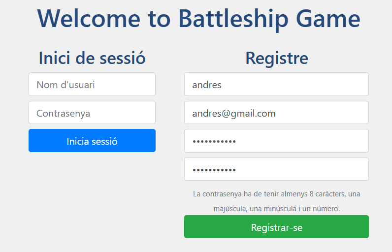
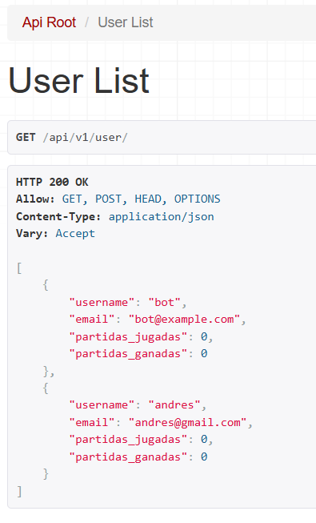
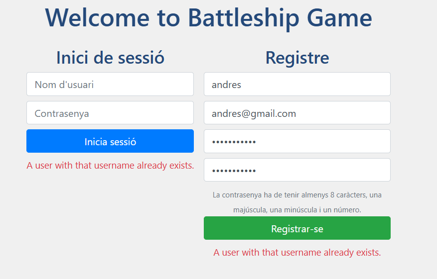
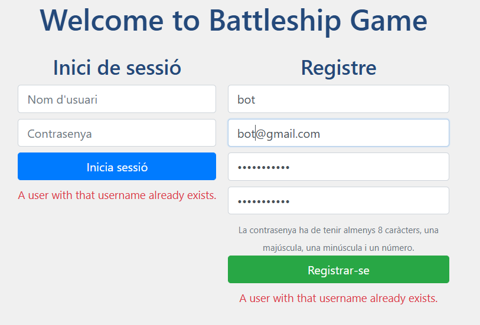
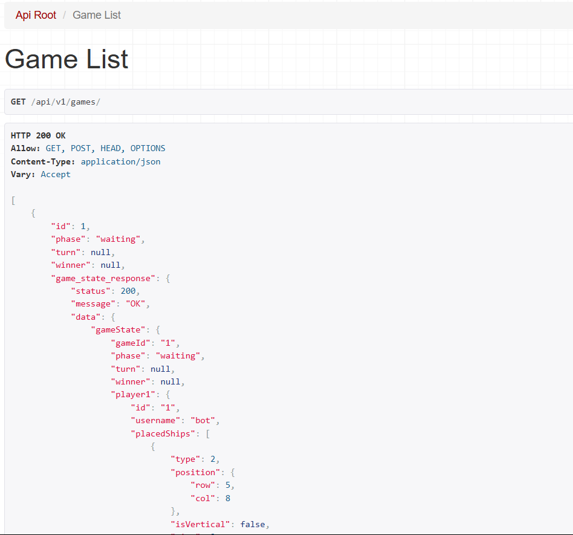
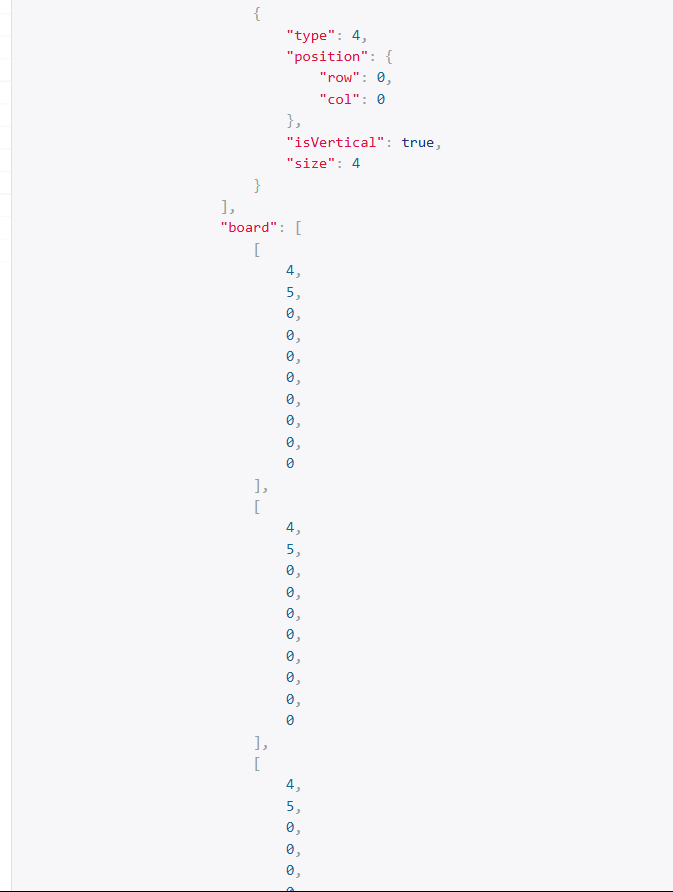
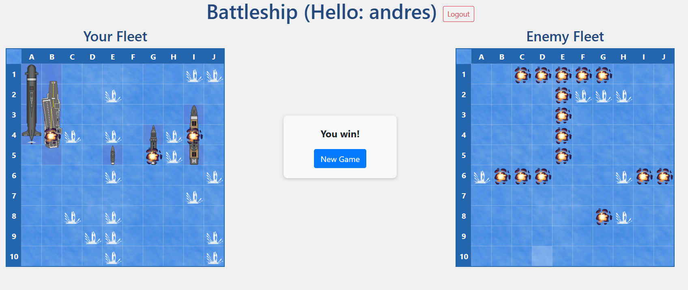
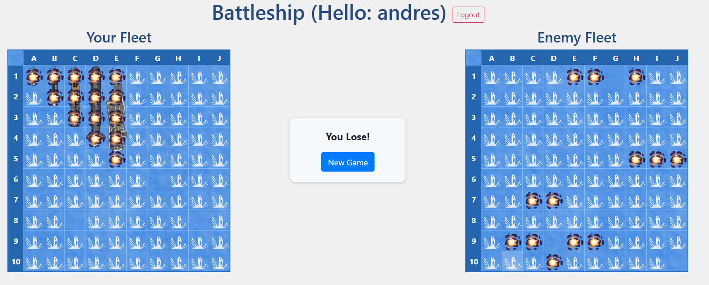
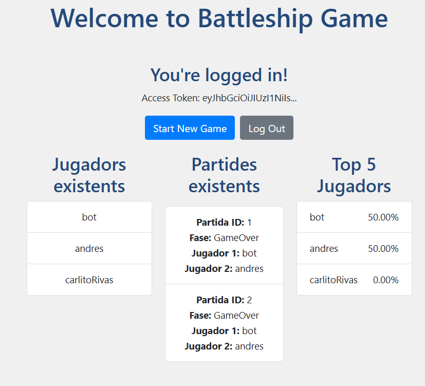
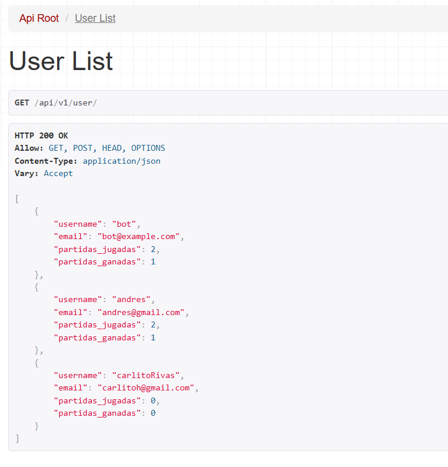

# About

| Equip | Membre 1           | Membre 2              |
|-------|--------------------|-----------------------|
|  C12  | Rio Nogues, Andres | Falgosa Campoy, Aleix | 

{ {#authors AndresRioo,Aleix15} }


# Llistat d'objectius complerts i no complerts

Aconseguir completar el codi d'enfonsar la flota amb persistencia mitjançant django. Objectius proposats i complerts:

- Guardar partides al backend per poder persistir-les. 
- Poder unir-se a qualsevol partida desde el frontend amb qualsevol usuari. 
- Poder crear usuaris desde el frontend (Registre amb nom, mail i contrasenya ben formats)
- Acabar amb la lògica del joc ( poder començar una partida, jugar a aquesta -on sempre s'alternen els torns sense tenir en compte el resultat del shot- i poder guanyar/perdre per acabar amb la partida )
- Creació d'un sistema d'autenticació per poder entrar al web. 
- Permetre partides simultàneas diferents entre diferents users. 
- Crear la leading table per veure el percentatge de victorias de cada jugador (inclós el bot)


No hem deixat cap objectiu sense assolir i no hem implementat el multijugador al no ser obligatori.

`Important destacar que les partides simultàneas són partides diferents! si dos jugadors entren en la mateixa partida i juguen alhora el backend no funcionarà correctament per qüestions de sincronització`


# Resum de l'organització de l'equip de treball durant la pràctica

Durant cada sessió ens hem repartit la feina. Cada pull request inclou informació detallada sobre el que s’ha fet en cada sessió, però en general, un treballava al laboratori i l’altre fora, alternant-nos cada setmana. L’Andrés s’ha encarregat de l’opcional del registre i l’Aleix de l’opcional de la leading table.


# Descripció de les dificultats trobades durant la pràctica

Vam tenir problemes a l'hora de crear la partida al backend i de entendre com funcionava tot el tema de serialitzadors imbrincats. No va ser fins la sessió 5 on vam poder acabar aquesta tasca gràcies al codi proporcionat.

També no ens vam adonar de com funcionava la rotació dels vessels i no va ser fins al testing que vam veure com es feia i ens vam adonar que vam implementar la lògica a l'inreves.  

# Informació de desplegament de la pràctica

La pràctica s’ha desenvolupat i executat íntegrament en entorn local. El backend (Django) es posa en marxa amb `poetry run python manage.py runserver` amb l'entorn activat `.\.venv\Scripts\activate` , mentre que el frontend (Vue) es llança amb `npm run dev`.

Per tal que l’aplicació funcioni correctament, és necessari executar prèviament les migracions de base de dades amb el comandament `python manage.py migrate`, ja que es creen diversos objectes imprescindibles per al seu funcionament.

La comunicació entre el frontend i el backend es realitza mitjançant peticions HTTP a través de localhost.


# Proves unitàries realitzades

Com a proves bàsiques de la nostra pràctica vam verificar que totes les crides al backend siguin correctes i que els canvis efectuats tinguin sentit. Entre aquestes vam revisar que :

- Registrar un user al frontend crea una nova instància amb tots els camps 
- Crear una nova partida al frontend genera correctament tots els camps amb l'estat i els 2 jugadors de forma correcta
- Guanyar o perdre una partida canvia la leading table i envia correctament al user al menú principal
- Unir-se a una partida ja creada simplement agafa la info del backend i no crea una nova instància.
- El token funciona i no permet entrar al web sense acreditació
- Fer un shot canvia automàticament la info de la partida
- El backend i frontend reflexen la mateixa informació de la partida


# Proves creuades realitzades

Aqui vam començar a fer proves més extremes amb el codi, entre elles :

- Refrescar en diferents punts de la partida 
- Crear usuaris amb noms iguals
- Crear un user anomenat `bot`
- Provar el web en diferents pestanyes amb diferents users


# Conclusions i Resultats d'aquestes proves

Vam veure que alguns refrescs podien crear resultats no esperats, per tornar a fer la crida inicial al backend (sobretot a l'hora de crear `games`). Aquest error l'hem solucionat parcialment per evitar problemes grossos si l'user vol refrescar en moments determinats. Ara l'app no es trenca però potser que es torni a crear una nova partida si el refresc ve donat en un moment inoportú. Si la partida se està jugant no hauria d'haver-hi cap problema, igual que si es refresca al guanyar la partida. 

També ens vam adonar d'errors amb el tema de perdre una partida, ja que el jugador podia continuar jugant, encara que el bot indiques que ja habia guanyat, causant errors i problemes amb la leading table.  Aquest error va se sencill de solucionar, només calia revisar l'estat de la partida abans de fer el shot. 

També vam veure que 2 users diferents no podien jugar en diferents pestanyes per utilitzar `localStorage` en comptes de `SessionStorage`. 

Vam afegir verificacions per el tema de crear users repetits i per simplificar al bot, el vam afegir com un player més a la bdd. Existeix la possibilitat de logejar-se amb el bot, causant problemes a l'hora de jugar, però ningú hauria de tenir accés a aquest jugador i només causaria problemes si l'usuari tingués accés a la contrasenya del bot, en un escenari real això no hauria de passar.

# Imatges amb el testing

## Afegir user 

Com queda el backend després d'afegir un user




## Error al registre

Error per crear un user amb el mateix nombre o amb el nombre `bot`




## Crear partida

Com queda el backend després d'afegir una partida




## Afegir vessels 

Com queda el backend després d'afegir els vessels



## Victoria i derrota 

Com es veu el frontend al guanyar o perdre la partida (moments abans d'anar al menú principal de manera obligada)




## Leading table

Com es veu el frontend i backend després d'aquestes partides





# EXPLICACIÓ DE LES SESSIONS I DEL CODI REALITZAT

## SESSIÓ 2

### Objectius

- Creació d'un projecte amb DJango
- Creació d'un projecte amb Vue
- Revisió i posada en marxa del codi bàsic de la pràctica

### Treball al lab

Per començar a treballar amb el backend, un cop inicialitzat DJANGO a la Sessió 1, vam executar la següent comanda:

``` powershell
python manage.py runserver
```
Això ens va permetre accedir a l'adreça http://127.0.0.1:8000/ i un cop allà veure que tot funcionava correctament.

Per altre banda, per treballar amb el frontend, vam executar la següent comanda:

``` powershell  
npm run dev
```
Un cop executada, podíem accedir a l'adreça http://localhost:5173/ i veure que tot funcionava correctament.

Seguidament, ens vam fixar en l'estructura del backend, especialment en la carpeta api, on s'inclouen fitxers com `models.py`, `views.py`, `serializers.py`, `urls.py`, `signals.py` i migrations.

A continuacióm vam crear els models Player i Game a `models.py`, amb les relacions entre jugadors, partides i les fases del joc.

``` python
    from django.db import models
    from django.contrib.auth.models import User
    from django.core.validators import MinValueValidator, MaxValueValidator
    
    class Player(models.Model):
        user = models.OneToOneField(User, on_delete=models.CASCADE)
        nickname = models.CharField(max_length=50)
    
    class Game(models.Model):
        PHASE_WAITING = "waiting"
        PHASE_PLACEMENT = "placement"
        PHASE_PLAYING = "playing"
        PHASE_GAMEOVER = "gameOver"
        PHASE_CHOICES = {
            PHASE_WAITING: "Waiting",
            PHASE_PLACEMENT: "Placement",
            PHASE_PLAYING: "Playing",
            PHASE_GAMEOVER: "Game Over",
        }
    
        players = models.ManyToManyField(Player, related_name="games")
        width = models.IntegerField(validators=[MinValueValidator(5), MaxValueValidator(200)], default=10)
        height = models.IntegerField(validators=[MinValueValidator(5), MaxValueValidator(200)], default=10)
        multiplayer = models.BooleanField(default=False)
        turn = models.ForeignKey(Player, related_name="turn", on_delete=models.SET_NULL, blank=True, null=True)
        phase = models.CharField(max_length=15, choices=PHASE_CHOICES.items(), default=PHASE_WAITING)
        winner = models.ForeignKey(Player, related_name="winner", on_delete=models.SET_NULL, blank=True, null=True)
        owner = models.ForeignKey(Player, related_name="owner", on_delete=models.SET_NULL, null=True)
```

Un cop creats els models, vam crear les migracions corresponents i les vam aplicar a la base de dades amb les següents comandes:

``` powershell
  poetry run python manage.py makemigrations
  poetry run python manage.py migrate
```
Això va crear les taules corresponents a la base de dades.

A continuació, vam fer la creació de senyals `signals.py` per assegurar que cada usuari nou genera automàticament un perfil Player.

``` python
  from django.db.models.signals import post_save
  from django.contrib.auth.models import User
  from django.dispatch import receiver
  from .models import Player
  
  @receiver(post_save, sender=User)
  def create_player(sender, instance, created, **kwargs):
      if created:
          Player.objects.create(user=instance, nickname=instance.username)

```

I configurem `apps.py` per registrar aquestes senyals.

``` python
  class ApiConfig(AppConfig):
      default_auto_field = 'django.db.models.BigAutoField'
      name = 'battleship.api'
  
      def ready(self):
          import battleship.api.signals
          
```
Implementació dels serialitzadors PlayerSerializer i GameSerializer a `serializers.py` per convertir models a JSON i viceversa.

``` python
  from rest_framework import serializers
  from .models import Player, Game
  
  class PlayerSerializer(serializers.ModelSerializer):
      class Meta:
          model = Player
          fields = '__all__'
  
  class GameSerializer(serializers.ModelSerializer):
      owner = serializers.ReadOnlyField(source='owner.user.username')
  
      class Meta:
          model = Game
          fields = '__all__'

```
Seguidament, vam crear les vistes `views.py` utilitzant ModelViewSet, incloent filtres de cerca i ordenació, i afegint funcionalitat per assignar automàticament el propietari d'una partida.

``` python
  from rest_framework import viewsets, filters, status
  from rest_framework.decorators import action
  from rest_framework.response import Response
  from django.shortcuts import get_object_or_404
  
  from .models import Player, Game
  from .serializers import PlayerSerializer, GameSerializer
  
  class PlayerViewSet(viewsets.ModelViewSet):
      queryset = Player.objects.all()
      serializer_class = PlayerSerializer
      filter_backends = [filters.SearchFilter]
      search_fields = ['nickname']
  
  class GameViewSet(viewsets.ModelViewSet):
      queryset = Game.objects.all()
      serializer_class = GameSerializer    
      filter_backends = [filters.SearchFilter, filters.OrderingFilter]
      search_fields = ['phase']
      ordering_fields = ['id']
  
      def perform_create(self, serializer):
          player = get_object_or_404(models.Player, user=User.objects.first())
          serializer.save(owner=player)
 ```
Finalment, vam fer l'enrutament de l'API a `urls.py` utilitzant DefaultRouter i NestedSimpleRouter de Django REST Framework, 
permetent definir rutes principals i anidades per gestionar relacions jeràrquiques entre recursos. Les rutes principals inclouen 
/players/ per gestionar jugadors, /games/ per gestionar partides i /user/ per gestionar usuaris. Les rutes anidades permeten 
operacions més específiques, com ara /games/{game_pk}/players/ per llistar o gestionar jugadors d'una partida concreta, 
/games/{game_pk}/players/{player_pk}/vessels/ per gestionar vaixells d'un jugador en una partida, 
/games/{game_pk}/players/{player_pk}/shots/ per gestionar els tirs d'un jugador, i /games/{game_pk}/players/{player_pk}/boards/ 
per gestionar els taulers d'un jugador.

``` python
  router = DefaultRouter()
  router.register(r'players', PlayerViewSet)
  router.register(r'games', GameViewSet)
  router.register(r'user', UserViewSet)
  
  urlpatterns = [
      path('', include(router.urls)),
  ]
  
  # /games/{game_pk}/players/
  games_players_router = NestedSimpleRouter(router, r'games', lookup='game')
  games_players_router.register(r'players', GamePlayerViewSet, basename='game-players')
  
  
  # /games/{game_pk}/players/{player_pk}/(vessels|shots|boards)/
  nested_player_router = NestedSimpleRouter(games_players_router, r'players', lookup='player')
  nested_player_router.register(r'vessels', VesselViewSet, basename='game-player-vessels')
  nested_player_router.register(r'shots', ShotViewSet, basename='game-player-shots')
  nested_player_router.register(r'boards', BoardViewSet, basename='game-player-boards')
  
  urlpatterns = [
      path('', include(router.urls)),
      path('', include(games_players_router.urls)),
      path('', include(nested_player_router.urls)),
  ]
```

### Treball fora del lab

En aquesta part vam crear els viewSets i Serialitzadors per les noves rutes de manera provisional, en els següents sessions vam
afegir el codi per gestionar tots els endpoints necessaris i tota la lògica necessària del joc

*Explicat més endavant*


## SESSIÓ 3

### Objectius
- Entendre l'estructura del Frontend
- Aprendre a connectar el frontend amb el backend mitjançant l'API

### Treball al lab

Hem començat a treballar amb l'API REST del backend utilitzant Django REST Framework i hem fet servir axios des del frontend per fer crides HTTP.

El primer pas ha estat crear un endpoint per obtenir la llista de tots els usuaris registrats al sistema.

Els canvis realitzats són els següents:
`serializers.py`:
``` python
  from django.contrib.auth.models import User
  
  class UserSerializer(serializers.ModelSerializer):
      class Meta:
          model = User
          fields = ['username', 'email']
```

`views.py`:
``` python
  from .serializers import PlayerSerializer, GameSerializer, UserSerializer
  from django.contrib.auth.models import User
  
  class UserViewSet(viewsets.ModelViewSet):
      queryset = User.objects.all()
      serializer_class = UserSerializer
      filter_backends = [filters.SearchFilter]
      search_fields = ['username', 'email']
```

`urls.py`:
``` python
  router.register(r'user', UserViewSet)
```


Després de fer aquests canvis, hem comprovat el funcionament de l'endpoint obrint http://localhost:8000/api/v1/user/.

Els usuaris els hem afegit manualment al panell d'administració de Django. Al afegir un, el senyal post_save
de signals.py crea automàticament un objecte Player associat i ho hem comprovat a http://localhost:8000/api/v1/players/.

A continuació, hem afegit una nova funció a auth.js per obtenir la llista de jugadors.
``` js
  getAllPlayers() {
    return this.getAxiosInstance().get("/api/v1/players/");
  }
```
Aquesta crida es fa a partir d'una instància configurada d'axios que inclourà el token d'autenticació.

Després,hem'utilitzat pinia per gestionar l'estat global. Al fitxer `authStore.js` s'ha afegit l'estat i l'acció.
state:
``` js
  state: () => ({
  username: null,
  accessToken: null,
  refreshToken: null,
  isAuthenticated: false,
  loading: false,
  error: null,
  playersList: [],
})
```
actions:
``` js
  async getAllPlayers() {
  try {
    const response = await AuthService.getAllPlayers();
    for (const player of response.data) {
      this.playersList.push({
        id: player.id,
        nickname: player.nickname,
      });
    }
  } catch (error) {
    const message = error.response?.data?.detail || error.message;
    throw new Error(message);
  }
}
```
Hem modificat Home.vue per fer la crida a l'API en muntar-se el component amb getAllPlayers() i actualitzar la llista de jugadors a l'inici:

``` js
  onMounted(() => {
  authStore.initializeAuthStore();
  authStore.getAllPlayers();
});
```
També s'ha afegit la visualització dels jugadors:
``` js
<div v-if="authStore.playersList.length > 0" class="mt-5">
  <h3>Jugadors disponibles</h3>
  <ul class="list-group">
    <li
      v-for="player in authStore.playersList"
      :key="player.id"
      class="list-group-item"
    >
      {{ player.nickname }}
    </li>
  </ul>
</div>
```
Aquest codi mostra la llista de jugadors si playersList té algun element. La renderització és reactiva gràcies a pinia.
Un cop fet tot això, executem el frontend, i veiem la llista de jugadors a la pàgina d'inici.

### Treball fora del lab

En aquesta sessió vam fer la creació del game dins del backend. Es a dir, quan li donas a crear game aquesta partida es crea al backend per poder persistir-la i seguir jugant posteriorment. 

Per poder fer això vam començar amb l'endpoint que crea aquesta partida, que seria la següent crida

``` js

  createGame() {
    return axiosInstance.post(`/api/v1/games/`);
  },

```

Aquest endpoint està definit a la següent ruta, i associat al `GameViewSet`

``` python

router.register(r'games', GameViewSet)

```

``` python

class GameViewSet(viewsets.ModelViewSet):
    queryset = Game.objects.all()
    serializer_class = GameSerializer

    def get_serializer_context(self):
            context = super().get_serializer_context()
            context['request'] = self.request
            return context
    
    def create(self, request, *args, **kwargs):
        try:
            serializer = self.get_serializer(data=request.data)
            serializer.is_valid(raise_exception=True)
            game = serializer.save()
            player = request.user.player
            game.players.add(player)
            Board.objects.create(game=game, owner=player)

            bot_player = Player.objects.get(nickname='bot')
            game.players.add(bot_player)
            Board.objects.create(game=game, owner=bot_player)

            return Response(serializer.data, status=status.HTTP_201_CREATED)
        
        except Exception as e:
            traceback.print_exc()
            return Response({"error": str(e)}, status=509)

```

Nosaltres fem servir el mètode create.

Primer creem una instància del serializer i comrpovem que aquest es vàlid, després amb ` game = serializer.save()` creem un objecte game per defecte i amb `player = request.user.player` i `game.players.add(player)` agafem el usuari de la petició i l'afegim al game. 

Un cop tenim el game creat, creem el board asignat al usuari de la petició i busquem a un jugador anomenat `bot` per afegir-lo també i crear el seu board (Aquest `bot` es crea automaticament al fer les migracions, no cal crear-lo manualment).

Per acabar fem `return Response(serializer.data, status=status.HTTP_201_CREATED)` que retorna una instància del serializer, amb els camps `id`, `phase`,`turn`,`winner` i `game_state_response`

Si mirem dins del serializer,  `game_state_response` es una instància d'altre serializer, que mitjançant diversos serializers va creant el `game_state_response`.

En aquest state posem mitjançant el `GameStateResponseSerializer` el `status` (per defecte 200), el `message` (per defecte OK) i el data, que es crea amb el `GameStateSerializer`.

Ara `GameStateSerializer` afegeix els camps següents a data:  el `gameID`, la `phase`, el `turn` i el `winner`.
Els players requereixen altre serializer `PlayerStateSerializer`, per tenir tota la informació asociada. 
En els mètodes `get_player1` i `get_player2` busquem els dos players asociats previament al `Game`, llavors cada mètode agafa un dels dos i crea la info dels dos mitjançant `PlayerStateSerializer`

Per acabar `PlayerStateSerializer` agafa el id i nickname del jugador associat i crea el seu board i el seus vaixells. 


El mètode `get_placedShips(self, board)` agafa tots els vaixells (BoardVessel) col·locats en el tauler que rep com a paràmetre. Per cada vaixell, construeix un diccionari amb el tipus (id del vaixell), la posició inicial (row, col), si està col·locat verticalment (isVertical) i la mida del vaixell. Tots aquests diccionaris es guarden en una llista que representa els vaixells col·locats al tauler i es retorna.

El mètode `get_board(self, board)` crea una matriu (grid) buida de dimensions width x height del joc. Primer hi col·loca els vaixells del jugador dins la graella, posant el seu id a cada casella que ocupa. Després, afegeix els trets (Shot) fets en aquest tauler: si el tret ha caigut en aigua (casella buida), s'hi posa un 11; si ha tocat un vaixell, es marca amb el valor negatiu del id del vaixell (simulant que ha estat tocat). Finalment, retorna aquest grid com a representació visual del tauler del jugador.


A mesura que avança el lloc, la informació es va guardant amb les accions de cada jugador.


``` python


class GameSerializer(serializers.ModelSerializer):
    game_state_response = serializers.SerializerMethodField()

    class Meta:
        model = Game
        fields = ['id', 'phase', 'turn', 'winner', 'game_state_response']

    def get_game_state_response(self, obj):
        return GameStateResponseSerializer(obj, context=self.context).data
    
class GameStateResponseSerializer(serializers.Serializer):
    status = serializers.IntegerField(default=200)
    message = serializers.CharField(default="OK")
    data = serializers.SerializerMethodField()

    def get_data(self, obj):
        return {
            'gameState': GameStateSerializer(obj, context=self.context).data
        }

class GameStateSerializer(serializers.Serializer):
    gameId = serializers.CharField(source='id')
    phase = serializers.CharField()
    turn = serializers.CharField(source='turn.nickname', allow_null=True)
    winner = serializers.CharField(source='winner.nickname', allow_null=True)
    player1 = serializers.SerializerMethodField()
    player2 = serializers.SerializerMethodField()

    def get_player1(self, obj):
        players = obj.players.order_by('id') # ordenar jugadores por id
        if players.count() < 1: # verificar que exista alguno
            return None
        board = obj.boards.filter(owner=players[0]).first() # coge el player 0
        if not board: # verificar que haya board
            return None
        return PlayerStateSerializer(board).data # devuelve el estado serializado 

    def get_player2(self, obj):
        players = obj.players.order_by('id')
        if players.count() < 2:
            return None
        board = obj.boards.filter(owner=players[1]).first()
        if not board:
            return None
        return PlayerStateSerializer(board).data
    

class PlayerStateSerializer(serializers.Serializer):
    id = serializers.CharField(source='owner.id')
    username = serializers.CharField(source='owner.nickname')
    placedShips = serializers.SerializerMethodField()
    # availableShips = serializers.SerializerMethodField()
    board = serializers.SerializerMethodField()

    def get_placedShips(self, board):
        ships = []
        for vessel in BoardVessel.objects.filter(board=board):
            ships.append({
                'type': vessel.vessel.id,
                'position': {
                    'row': vessel.ri,
                    'col': vessel.ci
                },
                'isVertical': vessel.rf != vessel.ri,
                'size': vessel.vessel.size
            })
        return ships

    def get_availableShips(self, board):
        all_vessels = Vessel.objects.all()
        placed_vessels = BoardVessel.objects.filter(board=board)
        ships = []

        for vessel in all_vessels:
            if not placed_vessels.filter(vessel=vessel).exists():
                ships.append({
                    'type': vessel.id,
                    'isVertical': True,
                    'size': vessel.size
                })
        return ships

    def get_board(self, board):
        width = board.game.width
        height = board.game.height
        grid = [[0 for _ in range(width)] for _ in range(height)]

        # Afegeix els vaixells
        for vessel in BoardVessel.objects.filter(board=board):
            value = vessel.vessel.id if vessel.alive else vessel.vessel.id
            for i in range(min(vessel.ri, vessel.rf), max(vessel.ri, vessel.rf) + 1):
                for j in range(min(vessel.ci, vessel.cf), max(vessel.ci, vessel.cf) + 1):
                    grid[i][j] = value

        # Afegeix els trets
        for shot in Shot.objects.filter(board=board):
            if grid[shot.row][shot.col] == 0:
                grid[shot.row][shot.col] = 11  # Fallado
            else:
                grid[shot.row][shot.col] = -grid[shot.row][shot.col]  # Tocado, se pone en negativo


        return grid
```


Un cop podem generar el estat dels dos jugadors, implementem la lògica per afegir vaixells i shots. 


Al frontend hi ha una funció anomenada `addVesselsToPlayer(gameId, playerId, vessels)`. Aquesta funció rep com a paràmetres l’ID de la partida (`gameId`), l’ID del jugador (`playerId`) i una llista de vaixells a col·locar (`vessels`).

Per cada vaixell de la llista, es crea un payload amb: el tipus de vaixell (un identificador enter), position: un objecte amb les coordenades inicials del vaixell (row, col), isVertical: booleà que indica si el vaixell es col·loca en vertical i size: mida del vaixell.

Aquest payload s’envia mitjançant una petició POST a l’endpoint.

Totes les peticions (una per vaixell) s’ajunten amb Promise.all, així es poden enviar totes alhora.

``` js

  addVesselsToPlayer(gameId, playerId, vessels) {
      const requests = vessels.map(vessel => {
        const payload = {
          type: vessel.type,
          position: { ...vessel.position },
          isVertical: vessel.isVertical,
          size: vessel.size,
        };

        console.log("Payload enviado:", payload);

        return axiosInstance.post(`/api/v1/games/${gameId}/players/${playerId}/vessels/`, payload);
      });

      return Promise.all(requests);
    },

```

Aquest endpoint està registrat amb:

``` python

nested_player_router.register(r'vessels', BoardVesselViewSet, basename='game-player-vessels')

```

Quan entra la petició a `BoardVesselViewSet`:

Primer es busca el jugador amb player_pk i el joc amb game_pk. A continuació es recupera el tauler (Board) associat a aquest jugador dins d’aquesta partida.

Si no hi ha jugador, joc o tauler, es retorna un error 404.


Un cop validat tot això, es crea un serializer de tipus PlacedShipSerializer, passant-li les dades del vaixell (`request.data`) i el context amb el board.

Es fa la validació amb is_valid() i si tot és correcte, es crida `save()` (que cridarà `create()` dins del serializer).

Després de col·locar el vaixell correctament, es torna a serialitzar el joc amb `GameSerializer` per retornar l’estat complet del joc actualitzat, incloent els vaixells que ja s’han col·locat, el torn, fase, etc.

``` python

class BoardVesselViewSet(viewsets.ViewSet):

    def create(self, request, game_pk=None, player_pk=None):

        player = get_object_or_404(Player, pk=player_pk)
        game = get_object_or_404(Game, pk=game_pk)
        board = Board.objects.filter(game=game, owner=player).first()

        if not player:
            return Response({"detail": "Player no encontrado"}, status=status.HTTP_404_NOT_FOUND)
        
        if not game:
            return Response({"detail": "Game no encontrado"}, status=status.HTTP_404_NOT_FOUND)

        if not board:
            return Response({"detail": "Board no encontrado"}, status=status.HTTP_404_NOT_FOUND)
        

        ships_data = request.data 

        serializer = PlacedShipSerializer(data=ships_data, context={'board': board})
        serializer.is_valid(raise_exception=True)
        serializer.save()

        game_serializer = GameSerializer(game, context={'request': request})
        return Response(game_serializer.data, status=status.HTTP_200_OK)


```

En el serializer `PlacedShipSerializer` rep el payload del frontend i s'encarrega de validar i transformar les dades abans de crear el vaixell al model BoardVessel.

`validate(self, data)` comprova que el diccionari position tingui les claus row i col. Si no, llença un error.

`create(self, validated_data)`

Aquí es recupera el tauler (board) des del context, s’intenta buscar el model Vessel corresponent al tipus (type) que s’ha passat i a partir de la posició inicial (ri, ci) i la mida, es calcula la posició final (rf, cf) tenint en compte si és vertical o horitzontal.

Es valida que el vaixell no surti fora del tauler (basant-se en les dimensions del joc) i es valida que el vaixell no es solapi amb cap altre. Per això es compara amb tots els vaixells existents al mateix tauler, i si hi ha col·lisió en les coordenades, es llença un error.

Si tot és correcte, es crea l’objecte `BoardVessel`.

``` python

class PlacedShipSerializer(serializers.Serializer):
    type = serializers.IntegerField()
    position = serializers.DictField(child=serializers.IntegerField())
    isVertical = serializers.BooleanField()
    size = serializers.IntegerField(read_only=True)


    def validate(self, data):
        
        pos = data['position']
        if 'row' not in pos or 'col' not in pos:
            raise serializers.ValidationError("position must have row and col")
        return data

    # ESTO SOLO TRANSFORMA DE COORDENADAS
    def create(self, validated_data):
        board = self.context.get('board')
        if not board:
            raise serializers.ValidationError("board context is required")

        try:
            vessel_obj = Vessel.objects.get(board_value=validated_data['type'])


        except Vessel.DoesNotExist:
            raise serializers.ValidationError("Vessel type does not exist (CREATE DE PLACEDSHIPSERIALIZER)")

        size = vessel_obj.size
        ri = validated_data['position']['row']
        ci = validated_data['position']['col']
        is_vertical = validated_data['isVertical']
        rf = ri + (size - 1 if is_vertical else 0)
        cf = ci + (0 if is_vertical else size - 1)

        # Validación de límites del tablero
        game = board.game
        if not (0 <= ri <= rf < game.height) or not (0 <= ci <= cf < game.width):

            print(f"DEBUG: ri={ri}, ci={ci}, rf={rf}, cf={cf}, size={size}, is_vertical={is_vertical}")
            print(f"DEBUG: game.height={game.height}, game.width={game.width}")

            raise serializers.ValidationError("El barco no cabe en el tablero")

        # Validación de solape
        for existing in BoardVessel.objects.filter(board=board):
            print(f"DEBUG EXISTING: ri={existing.ri}, rf={existing.rf}, ci={existing.ci}, cf={existing.cf}")
            print(f"DEBUG NEW: ri={ri}, rf={rf}, ci={ci}, cf={cf}")

            if not (cf < existing.ci or ci > existing.cf or rf < existing.ri or ri > existing.rf):
                print("DEBUG: Se detecta solape con barco existente")
                raise serializers.ValidationError("El barco se solapa con otro ya colocado")

        return BoardVessel.objects.create(
            vessel=vessel_obj,
            board=board,
            ri=ri,
            ci=ci,
            rf=rf,
            cf=cf,
            alive=True
        )

```

Un cop tenim tots els vaixells afegits cal indicar que hem canviat d'estat. Per això fem servir patch al següent endpoint, indicant la fase actual i de qui es el torn

``` js 


changeStateToPlaying(gameId) {
  const payload = {
    phase: "playing",
    turn: "player1", // O "player2", según quién empiece
  };

  console.log("Payload enviado:", payload);

  return axiosInstance.patch(`/api/v1/games/${gameId}/`, payload);
},

```

Quan aquest PATCH arriba al backend, es processa dins del mètode `partial_update` del `GameViewSet`. Aquest mètode primer recupera la instància concreta del joc mitjançant `get_object()`. Després, crea una còpia del `request.data` per poder modificar el diccionari sense tocar l’original.

Mirem qui es el jugador i es crea un serializer amb les dades modificades. Es valida que tot estigui bé i actualitza el game amb els valors donats al payload.


``` python

class GameViewSet(viewsets.ModelViewSet):
    queryset = Game.objects.all()
    serializer_class = GameSerializer

    def get_serializer_context(self):
            context = super().get_serializer_context()
            context['request'] = self.request
            return context

    # patch para cambiar de estado
    def partial_update(self, request, *args, **kwargs):
        try:
            instance = self.get_object()
            data = request.data.copy() # copiar la data

            # Detectar si están usando "player1" o "player2" como alias
            alias_fields = ["turn", "winner"]
            for field in alias_fields:
                value = data.get(field)
                if value == "player1":
                    # Usamos el primer jugador asociado
                    player = instance.players.all().order_by("id").first()
                    if player:
                        data[field] = player.id
                elif value == "player2":
                    # Segundo jugador asociado
                    players = instance.players.all().order_by("id")
                    if players.count() >= 2:
                        data[field] = players[1].id

            serializer = self.get_serializer(instance, data=data, partial=True)
            serializer.is_valid(raise_exception=True)
            self.perform_update(serializer)
            return Response(serializer.data, status=status.HTTP_200_OK)

        except Exception as e:
            import traceback
            traceback.print_exc()
            return Response({"error": str(e)}, status=509)


```


Ara que ja tenim tots els vaixells i estem al estat correcte, creem els shots.

En el frontend fem la següent crida al backend, enviant el `row` i `col` del nostre shot: 

``` js

checkHitPlayer(gameId, playerId ,row,col){

      const payload = {
        row: row,
        col: col 
      }
      return axiosInstance.post(`/api/v1/games/${gameId}/players/${playerId}/shots/`, payload);
  }
```

Aquest endpoint està registrat amb:

``` python

nested_player_router.register(r'shots', ShotViewSet, basename='game-player-shots')

```


En el `ShotViewSet` busquem el player i el game associat i fem diverses operacions per comprobar que tot sigui correcte.  Després amb el mètode `check_if_sunk()` comprobem el resultat del shot i retornem un codi segons el resultat (2 - sunk, 1 - hit, 0 - miss).

Després revisem si la partida s'acabat o no amb `check_if_game_over()`. Si s'acaba la partida retornem el codi 3, seleccionem el guanyador i canviem el estat de la partida.


``` python

class ShotViewSet(viewsets.ModelViewSet):
    queryset = Shot.objects.all()
    serializer_class = ShotSerializer
    filter_backends = [filters.SearchFilter, filters.OrderingFilter]
    search_fields = ['result']
    ordering_fields = ['row', 'col']

    def create(self, request, game_pk=None, player_pk=None):
        print("Entrando en create() de ShotViewSet")

        try:
            player = get_object_or_404(Player, pk=player_pk)
            game = get_object_or_404(Game, pk=game_pk)
            print(f"Recibido game: {game}, player: {player}")

            row = int(request.data.get('row'))
            col = int(request.data.get('col'))
            print(f"Disparo en fila {row}, columna {col}")

            if game.turn != player:
                return Response({'error': 'No es tu turno'}, status=400)

            opponent = game.players.exclude(id=player.id).first()
            if not opponent:
                return Response({'error': 'No hay oponente'}, status=400)

            opponent_board = Board.objects.get(game=game, owner=opponent)

            vessel_hit = BoardVessel.objects.filter(
                board=opponent_board,
                ri__lte=row, rf__gte=row,
                ci__lte=col, cf__gte=col
            ).first()

            # añadir previamente para el check sunk y el check game over
            shot = Shot.objects.create(
                player=player,
                board=opponent_board,
                game=game,
                row=row,
                col=col,
                result=0, # valor temporal
            )


            if vessel_hit:
                is_sunk = self.check_if_sunk(vessel_hit, opponent_board, row, col)
                if is_sunk:
                    result = 'sunk'
                    result_value = 2
                else:
                    result = 'hit'
                    result_value = 1
            else:
                result = 'miss'
                result_value = 0
                # game.turn = opponent # cambiar de turno solo si se hace miss

            print(f"Resultado del disparo: {result}")

            # Comprobamos si ha ganado
            game_over = self.check_if_game_over(opponent_board)
            if game_over:
                game.phase = "GameOver"
                game.winner = player
                result_value = 3 # codigo para indicar fin de partida
                game.save()
                print(f"Partida finalizada. Ganador: {player}")
                
            else:
                game.turn = opponent
                game.save()

            # actualitzar el result_value del shot
            shot.result = result_value
            shot.save()

            
            serializer = self.get_serializer(shot)
            data = serializer.data

            return Response(data, status=201)

        except Exception as e:
            import traceback
            traceback.print_exc()
            return Response({'error': str(e)}, status=500)

    def check_if_sunk(self, vessel, board, row, col):
        """
        Comprueba si el barco `vessel` ha sido hundido tras el disparo en (row, col).
        """
        vessel_cells = [
            (r, c)
            for r in range(vessel.ri, vessel.rf + 1)
            for c in range(vessel.ci, vessel.cf + 1)
        ]

        shots = Shot.objects.filter(
            board=board,
            row__in=[r for r, _ in vessel_cells],
            col__in=[c for _, c in vessel_cells]
        )

        shot_cells = set((shot.row, shot.col) for shot in shots)
        shot_cells.add((row, col))  # añadir disparo actual

        return all(cell in shot_cells for cell in vessel_cells)

    def check_if_game_over(self, board):
        """
        Comprueba si todos los barcos han sido hundidos.
        Si alguna parte de un barco no ha sido alcanzada por un disparo, el juego continúa.
        """
        vessels = BoardVessel.objects.filter(board=board)

        for vessel in vessels:
            for row in range(vessel.ri, vessel.rf + 1):
                for col in range(vessel.ci, vessel.cf + 1):
                    if not Shot.objects.filter(board=board, row=row, col=col).exists():
                        print(f"Juego NO terminado: casilla sin disparar en fila {row}, columna {col}")
                        return False  # Parte del barco sigue viva

        print("Todos los barcos han sido hundidos. Juego terminado.")
        return True

```

El serializer funciona per defecte. 

``` python

class ShotSerializer(serializers.ModelSerializer):
    player_nickname = serializers.ReadOnlyField(source='player.nickname')

    class Meta:
        model = Shot
        fields = '__all__'

```


Al frontend fem la gestió dels resultats del shot de la següent manera:

Primer verifiquem que la informació de la partida sigui correcta, un cop tot està verificat mandem el nostre shot. Segons el codi que rebem imprimim un missatge per pantalla.

Si la partida ha acabat, sumem una victoria al jugador i tornem al menu principal després de 3 segons. Si no hem guanyat, cridem al mètode que s'encarrega de gestionar els shots del bot, que té una lògica similar.

``` js

async handleOpponentBoardClick(row, col) {
      if (this.gamePhase !== "playing") return;
      if (this.opponentBoard[row][col] < 0) {
        this.gameStatus = "Already hit!";
        return;
      } else if (this.opponentBoard[row][col] === 11) {
        this.gameStatus = "Already missed!";
        return;
      }

        try {
          const response = await api.checkHitPlayer(this.currentGameId, this.player2Id , row, col);
          const data = response.data;
          console.log("Respuesta recibida:", data);

          
        if (data.result === 1 || data.result === 2) {
          // 1 = hit, 2 = hundido
          console.log(`Hit en columna ${col}, fila ${row}`);
          this.opponentBoard[row][col] = -1; // marcar como hit
          this.gameStatus = data.result === 2 ? "Ship Sunk!" : "Hit!";
        } else if (data.result === 0) {
          console.log("Has fallado.");
          this.opponentBoard[row][col] = 11; // marcar como miss
          this.gameStatus = "Miss!";
        }

        if (data.result == 3) { // codigo para acabar partida (viene dado por un sunk)
          console.log(`Hit en columna ${col}, fila ${row}`);
          this.opponentBoard[row][col] = -1; // marcar como hit
          this.gameStatus = "You win!";
          this.gamePhase = "gameOver";

          console.log("HAS GANADO ! sumas una victoria");

          api.sumarVictoria(); // para la estadistica

           // Esperar 3 segundos antes de volver al menú
            setTimeout(() => {
              window.location.href = "/";
            }, 3000);

          return; // Para evitar que setTimeout dispare el turno del bot
        }
        } catch (error) {
          console.error("Error en la petición:", error);
        }

      setTimeout(this.opponentTurn, 1000);
    
    },

```

Per el codi de sumar una victoria simplement fem un patch a `Game` de la següent manera:


``` python


class UserViewSet(viewsets.ModelViewSet):
    queryset = User.objects.all()
    serializer_class = UserSerializer
    filter_backends = [filters.SearchFilter]
    search_fields = ['username', 'email']
    permission_classes = [permissions.AllowAny] #para el registro

    def partial_update(self, request, *args, **kwargs):
        user = request.user
        player = getattr(user, 'player', None)
        if not player:
            return Response({'error': 'Player no encontrado para este usuario'}, status=404)
        
        bot_player = Player.objects.get(nickname='bot')

        if not bot_player:
            print("error con el bot, no se inicializa bien")


        action = request.data.get('action')
        if action == 'partida': # gana el bot
            player.refresh_from_db()  # recarga del estado de la DB
            player.partidas_jugadas += 1

            bot_player.partidas_jugadas += 1
            bot_player.partidas_ganadas += 1

            player.save()
            bot_player.save()

            print(f"No hubo victoria, action -> {action}")
        elif action == 'victoria': # gana el user
            player.refresh_from_db()  # recarga del estado de la DB
            player.partidas_jugadas += 1
            player.partidas_ganadas += 1

            bot_player.partidas_jugadas += 1

            player.save()
            bot_player.save()

            print(f"Sí hubo victoria, action -> {action}")
        else:
            return Response({'error': 'Acción no reconocida'}, status=400)

        return Response({
            'partidas_jugadas': player.partidas_jugadas,
            'partidas_ganadas': player.partidas_ganadas
        }, status=200)
    
    # conseguir user id
    @action(detail=False, methods=["get"], permission_classes=[permissions.IsAuthenticated])
    def me(self, request):
        serializer = self.get_serializer(request.user)
        return Response(serializer.data)

```

Important destacar que sumem les partides al bot i al jugador autenticat, no al `owner` del `Game`. Ho hem implementat d'aquesta manera per a poder unir-te a qualsevol partida de qualsevol usuari. Així si acabas una partida que no és teva, la victoria et conta a tú igualment.  


## SESSIÓ 4 

### Objectius

- Aprendre a utilitzar JWT (JSON Web Tokens) per a l'autenticació.
    - Implementar un sistema d'autenticació tant en el frontend com en el backend.
- Aprendre a utilitzar els permisos de Django per a l'autorització.
- Continuar avançant en la implementació de la connexió entre el frontend i el backend utilitzant Django REST framework i Axios.
- Afegir un formulari de registre [fora del laboratori].


### Treball al lab

#### Backend

En aquesta part, implementarem un sistema d'inici de sessió utilitzant JWT (JSON Web Tokens) per a l'autenticació.

``` python

REST_FRAMEWORK = {
    # Utilitza els permisos estàndard de Django `django.contrib.auth`,
    # o permet accés només de lectura per a usuaris no autenticats.
    'DEFAULT_PERMISSION_CLASSES': [
        'rest_framework.permissions.IsAuthenticated',
    ],
    'DEFAULT_AUTHENTICATION_CLASSES': (
        'rest_framework.authentication.BasicAuthentication',
        'rest_framework.authentication.SessionAuthentication',
        'rest_framework_simplejwt.authentication.JWTAuthentication',
    ),
    'DEFAULT_SCHEMA_CLASS': 'drf_spectacular.openapi.AutoSchema',
}

```

En aquest codi afegim al nostre backend la necessitat de estar autenticat per a poder accedir a la API. Aquest permís s'aplicara per defecte a totes les vistes. Per tenir una serie de permisos diferents segons la vista cal afegir a `views.py` a la vista que volem canviar la següent comanda :

``` python
from rest_framework import viewsets, permissions
from django.contrib.auth.models import User
from .serializers import UserSerializer

class UserViewSet(viewsets.ModelViewSet):
    queryset = User.objects.all()
    serializer_class = UserSerializer
    filter_backends = [filters.SearchFilter]
    search_fields = ['username', 'email']
    permission_classes = [permissions.IsAdminUser] # selecció de permisos 
```

A més cal canviar la classe `urls.py` de la següent manera :

``` python 
urlpatterns = [
    path('admin/', admin.site.urls),
    path("schema/", SpectacularAPIView.as_view(), name="schema"),
    path("docs/", SpectacularSwaggerView.as_view(url_name="schema"),name="swagger-ui"),
    path(r'ht/', include('health_check.urls')),
    path('api/token/', TokenObtainPairView.as_view(), name='token_obtain_pair'), # linia descomentada
    path('api/token/refresh/', TokenRefreshView.as_view(), name='token_refresh'), # linia descomentada
    path("api/v1/", include('battleship.api.urls'))
]
```

Ara tenim dues rutes per poder logejar-se a la nostra app i poder mantenir la sessió activa amb JWT.

`api/token/`

Aquesta ruta permet als usuaris obtenir un access token i un refresh token. Necessitem passar-li usuari i contrasenya (via POST), i et torna dos tokens JWT si són correctes.

`api/token/refresh/`

Permet obtenir un nou access token donant-li un refresh token vàlid. 
Serveix per mantenir la sessió activa sense haver de tornar a posar l’usuari i la contrasenya.

#### Frontend

En el nostre frontend tenim dos fitxers .js per fer servir el token. El primer seria `auth.js` que s'encarrega de gestionar l'autentificació i l'altre  `authStore.js` que s'utilitzarà per emmagatzemar l'estat d'autenticació i la informació de l'usuari.

En aquesta sessió deixarem d'utilitzar mocks al nostre frontend per començar a utilitzar el backend. Com exemple tenim el `login` implementat de la següent manera :

``` js

    // clase auth.js

  login(user) {
    return axios.post("/api/token/", {
      username: user.username,
      password: user.password,
    });
  }

```

``` js 

    // clase authStore.js

login(user) {
    this.loading = true;
    this.error = null;

    return AuthService.login(user)
    .then((response) => {
        console.log("response", response);
        // response = JSON.parse(response); // això era una simulació, en el cas real és una resposta d'axios i podem comentar aquesta línia
        this.username = user.username;
        this.accessToken = response.data.access;
        this.refreshToken = response.data.refresh;
        this.isAuthenticated = true;

        sessionStorage.setItem("username", this.username);
        sessionStorage.setItem("access", this.accessToken);
        sessionStorage.setItem("refresh", this.refreshToken);
    })
    .catch((error) => {
        console.log("error", error);
        this.error =
        error.response?.data?.detail || "Error d'inici de sessió. Torna-ho a intentar.";
        this.isAuthenticated = false;
    })
    .finally(() => {
        this.loading = false;
    });
},

```

Desglossem-ho:

- Estem cridant la funció login del servei auth.js, passant l'objecte user com a argument.
- La funció login fa una petició POST a l'endpoint /api/token/ amb el nom d'usuari i la contrasenya.
- Si la petició té èxit, emmagatzemem els tokens d'accés i de refresc al sessionStorage i establim el isAuthenticated a true.
- Si la petició falla, establim el missatge d'error i el isAuthenticated a false.
- Finalment, establim el loading a false per indicar que la petició ha finalitzat. Aquest valor s'utilitza per mostrar un missatge de "Iniciant sessió..." a la interfície.
- Els accessToken i refreshToken es guarden al sessionStorage per utilitzar-los més tard en peticions autenticades al backend.
- El username també es guarda per poder-lo mostrar al component Game.vue com a missatge de benvinguda.


Ara cal canviar les altres funcions per evitar l'ús de mocks 

***LOGOUT***

Per al logout simplement esborrem la info guardada al sessionStorage

``` js

  logout() {
    sessionStorage.removeItem("access");
    sessionStorage.removeItem("refresh");
  }


```

``` js

logout() {
      this.accessToken = null;
      this.refreshToken = null;
      this.isAuthenticated = false;
      sessionStorage.removeItem("username");
      sessionStorage.removeItem("access");
      sessionStorage.removeItem("refresh");
    },

```

***REFRESH***

Enviem el refreshToken al backend per a que retorni un nou accesToken. S'utilitza quan aquest ha caducat, per evitar un nou login.


``` js
 refresh(refreshToken) {
    
    return axios.post("/api/token/refresh/", {
      refresh: refreshToken,
    });

 }
``` js

``` js
refreshToken() {
      const refresh = sessionStorage.getItem("refresh");
      if (!refresh) return;

      this.loading = true;

      AuthService.refresh(refresh)
        .then((response) => {
          this.accessToken = response.data.access;
          sessionStorage.setItem("access", this.accessToken);
        })
        .catch((error) => {
          console.error("Error al refrescar token:", error);
          this.logout();
        })
        .finally(() => {
          this.loading = false;
        });
    },
```

Explicació pas a pas:

- Obté el refreshToken del sessionStorage.
- Si no existeix, no fa res (no pots refrescar sense token).
- Mostra un loading mentre espera la resposta.
- Crida la funció del servei AuthService.refresh(refreshToken) que fa la petició POST a /api/token/refresh/.
- Si tot va bé, guarda el nou accessToken a la variable i al sessionStorage.
- Si hi ha error, mostra l’error i fa logout (perquè el refresh ha fallat, així que desconnectem l’usuari).
- Finalment, treu el loading.

#### Utilitzar el token per a altres peticions

Ara que tenim el token d'accés, hem d'utilitzar-lo per fer peticions autenticades al backend. Ho podem fer afegint una capçalera Authorization a la petició amb el token. Per exemple, la funció getAllPlayers() ara necessitarà el token a la capçalera:

``` js

  getAllPlayers() {
    // return this.getAxiosInstance().get("/api/v1/players/");
    return this.getAxiosInstance().get("/api/v1/players/", {
      headers: {
        Authorization: `Bearer ${token}`,
      },
    });
  }

```

**Establir el token a la instància d’axios**

Ara mateix estem establint el token a cada petició. Això no és ideal perquè ho hauríem de fer a cada vegada. En comptes d’això, podem establir el token a la instància d’axios perquè s’afegeixi automàticament a totes les peticions. Per fer-ho, modifiquem la funció getAxiosInstance() al servei auth.js:

``` js

  getAxiosInstance() {
    const apiUrl = import.meta.env.VITE_API_URL;
    const instance = axios.create({
      baseURL: apiUrl,
      headers: {
        Authorization: `Bearer ${this.getAccessToken()}`,
      },
    });

    instance.interceptors.response.use(
      (response) => response,
      async (error) => {
        if (error.response.status === 401 && this.isLoggedIn()) {
          try {
            const response = await this.refresh(this.getRefreshToken());
            sessionStorage.setItem("access", response.data.access);
            error.config.headers["Authorization"] =
              "Bearer " + response.data.access;
            return axios.request(error.config);
          } catch (err) {
            this.logout();
          }
        }
        return Promise.reject(error);
      }
    );
  }

```

Desglossem-ho:

- Creem una instància d’axios amb la URL base i la capçalera Authorization amb el token d’accés.
- Utilitzem un interceptor per gestionar errors 401. Si rebem un error 401 i l’usuari està autenticat, intentem renovar el token amb la funció refresh.
- Si la renovació té èxit, actualitzem el token al sessionStorage i establim la capçalera Authorization amb el nou token.
- Finalment, fem la petició de nou amb la configuració actualitzada. Si la renovació falla, fem servir logout() per desconnectar l’usuari.
- Ara podem fer peticions al backend sense haver d’afegir el token manualment cada vegada. La instància d’axios l’afegeix automàticament.
- També podem utilitzar getAxiosInstance() per fer peticions al backend. Per exemple, a la funció getAllPlayers() podem tornar a escriure-la així:
 
 ``` js
  getAllPlayers() {
    return this.getAxiosInstance().get("/api/v1/players/");
  }
```
Llavors, a services/api.js, podem importar el servei auth.js i obtenir la instància d’axios per fer crides API de la lògica del joc:

``` js
import AuthService from "@/services/auth.js";
const axiosInstance = AuthService.getAxiosInstance();

```

### Treball fora del lab

En aquesta part afegirem un formulari de registre a la pàgina principal de la nostra web. Cal demanar la següent informació 

- Nom d’usuari
- Contrasenya
- Confirmació de la contrasenya
- Correu electrònic

A més de validar que sigui correcta. 

Primer canviem el backend per poder crear nous usuaris amb aquesta informació :

``` python 

class UserViewSet(viewsets.ModelViewSet):
    queryset = User.objects.all()
    serializer_class = UserSerializer
    filter_backends = [filters.SearchFilter]
    search_fields = ['username', 'email']
    permission_classes = [permissions.AllowAny]  # Aquí permites que cualquiera acceda (registro público)

```

``` python 

class UserSerializer(serializers.ModelSerializer):
    password = serializers.CharField(write_only=True) # evitar exponer contraseñas

    class Meta:
        model = User
        fields = ['username', 'email', 'password']

    def create(self, validated_data): 
        # sobreescribir metodo create para que no use el metodo create, sino create_user para que este hasheada y django la acepte
        return User.objects.create_user(
            username=validated_data['username'],
            email=validated_data['email'],
            password=validated_data['password']
        )

```

En aquest canvi canviem el permís del user view per a que tothom tingui accés (un registre no pot demanar autentificació) i canviem el serializer de user per sobreescriure el mètode create. Cal canviar-ho per que el mètode original fa servir `User.objects.create(...)` que no fa cap hash a la contrasenya. Django no guarda les contrasenyas amb text pla, llavors per a poder fer el login cal hashear-les previament, per això utilitzem el mètode `create_user`.

Un cop tenim el backend preparat per a rebre peticions al endpoint `/api/v1/users/`, anem al frontend per poder enviar aquestes dades.

``` js

register(user) {
  return axios.post("/api/v1/user/", {
    username: user.username,
    password: user.password,
    email: user.email,
  });
}

```

``` js

register(user) {
      this.loading = true;
      this.error = null;

      return AuthService.register(user)
        .then((response) => {
          return response; // devolvemos la respuesta al componente de vue
        })
        .catch((error) => {
          const data = error.response?.data;
          if (data) {
            const firstKey = Object.keys(data)[0];
            this.error = data[firstKey][0];
          } else {
            this.error = "Error en el registro. Inténtalo de nuevo.";
          }
          throw error; // lanzamos error para que el componente lo maneje
        })
        .finally(() => {
          this.loading = false;
        });
    },

```

Igual que abans afegim el codi corresponent a `auth.js` i a `authStore.js`per a poder enviar peticions i rebre respostes de la nostra API. Aquest codi envia les 3 dades demanades per crear l'usuari i retorna la resposta al component `Home.vue` per a poder reflexar la resposta rebuda. 

Un cop ja tenim tot conectat anem al component per a crear els camps del registre :

El primer còdi s'encarrega de crear els camps del registre per poder afegir la informació, a més de transmetre els missatge d'error/èxit segons la resposta rebuda previament.

El segon codi crida al mètode per comprobar que els espais tinguin la info correcta a més de enviar la petició i rebre la resposta.

El tercer codi confirma que la contrasenya cumpleix els requisits mínims.

``` vue
<!-- Register -->
      <div style="max-width: 300px">
        <h3>Registre</h3>
        <form @submit.prevent="registerUser">
          <input
            v-model="registerUsername"
            type="text"
            placeholder="Nom d'usuari"
            class="form-control mb-2"
          />
          <input
            v-model="registerEmail"
            type="email"
            placeholder="Correu electrònic"
            class="form-control mb-2"
          />
          <input
            v-model="registerPassword"
            type="password"
            placeholder="Contrasenya"
            class="form-control mb-2"
          />
          <input
            v-model="registerConfirmPassword"
            type="password"
            placeholder="Confirmació de la contrasenya"
            class="form-control mb-2"
          />
          <small class="text-muted">
            La contrasenya ha de tenir almenys 8 caràcters, una majúscula, una minúscula i un número.
          </small>
          <button class="btn btn-success w-100">Registrar-se</button>
          <div v-if="registerError" class="text-danger mt-2">
            {{ registerError }}
          </div>

          <div v-if="successMessage" class="text-success mt-2">
            {{ successMessage }}
          </div>
```

``` vue

const registerUser = () => {
  registerError.value = "";

  if (
    !registerUsername.value.trim() ||
    !registerEmail.value.trim() ||
    !registerPassword.value.trim() ||
    !registerConfirmPassword.value.trim()
  ) {
    registerError.value = "Tots els camps són obligatoris.";
    return;
  }

  const emailRegex = /^[^\s@]+@[^\s@]+\.[^\s@]+$/;
  if (!emailRegex.test(registerEmail.value)) {
    registerError.value = "El correu electrònic no és vàlid.";
    return;
  }

  const pwdError = validatePassword(registerPassword.value);
  if (pwdError) {
    registerError.value = pwdError;
    return;
  }

  if (registerPassword.value !== registerConfirmPassword.value) {
    registerError.value = "Les contrasenyes no coincideixen.";
    return;
  }
  
  // trucar al Registre amb els valors de la vista
  authStore.register({
    username: registerUsername.value,
    email: registerEmail.value,
    password: registerPassword.value,
  })
  .then(() => {
    // neteja de camps
    registerUsername.value = "";
    registerEmail.value = "";
    registerPassword.value = "";
    registerConfirmPassword.value = "";

    // tot ha anat bé
    successMessage.value = "Usuario registrado correctamente";
    registerError.value = "";
  })
  .catch((error) => {
    // no ha anat bé
    registerError.value =
      authStore.error || error.response?.data?.detail || "Error al registrar usuario";
    successMessage.value = "";
  });


};

```

``` vue
const validatePassword = (password) => {
  const minLength = 8;
  const hasUpperCase = /[A-Z]/.test(password);
  const hasNumber = /\d/.test(password);
  const hasSpecialChar = /[!@#$%^&*(),.?":{}|<>]/.test(password);

  if (password.length < minLength) return "La contraseña debe tener al menos 8 caracteres";
  if (!hasUpperCase) return "La contraseña debe tener al menos una letra mayúscula";
  if (!hasNumber) return "La contraseña debe tener al menos un número";
  if (!hasSpecialChar) return "La contraseña debe tener al menos un carácter especial";

  return null; // Si pasa todo
};

```

Amb tot això podem registrar nous usuaris i començar noves partides amb aquests.


## SESSIÓ 5

### Objectius

- Practicar en l'ús de serialitzadors imbricats
- Finalitzar la implementació del joc

### Exercici 1,2 i 3

La implementació completa del joc ja es va abordar a la sessió 3, on es van connectar correctament el backend i el frontend, i es van crear els ViewSets i Serializers necessaris per tal de persistir l’estat de la partida.

### Exercici 4

Pel que fa al refresc de l’estat del joc, aquest es realitza automàticament després de cada acció del jugador. Quan un jugador realitza una tirada, el frontend envia la petició corresponent al backend i, un cop processada, actualitza l’estat amb la resposta obtinguda. Si la tirada no acaba la partida, es llança automàticament el torn del bot mitjançant una nova crida al backend. D’aquesta manera, el bot actua immediatament després del jugador i el nou estat ja incorpora la seva acció, sense necessitat d’un refresc periòdic. El sistema queda per tant sincronitzat després de cada acció, tal com es demana a l'exercici.


### Exercici 5 : Llistat de partides en joc

Creem el mètode getListGames al authStore per obtenir totes les partides des de l'endpoint /api/v1/games/.

En aquest mètode, fem una petició GET a l'API per obtenir totes les partides,es processen les dades per extreure informació rellevant com l'ID de la partida, la fase i els jugadors, i les emmagatzemem a la llista listGames creada en authStore.

**Mètode getListGames() a `authStore`:**
``` js
async getListGames() {
    try {
        const response = await AuthService.getAllGames();
        this.listGames = [];
        for (const game of response.data) {
            this.listGames.push({
                id: game.id,
                phase: game.phase,
                player1: game.game_state_response.data.gameState.player1.username,
                player2: game.game_state_response.data.gameState.player2.username,
            });
        }
    } catch (error) {
        const message = error.response?.data?.detail || error.message;
        throw new Error(message);
    }
}
```

Seguidament, s'ha d'afegir una crida a aquest mètode al component Home.vue per obtenir la llista de partides quan es carregui el component i es fa servir un v-for per iterar sobre la llista de partides (authStore.listGames) i mostrar-les en un <ul>.

Renderització a `Home.vue`:
``` js
<div class="d-flex flex-column" style="min-width: 30%;">
  <h3 class="mb-3">Partides existents</h3>
  <ul class="list-group flex-grow-1">
    <li
        v-if="authStore.listGames.length === 0"
        class="list-group-item text-muted"
    >
      No hi ha partides disponibles.
    </li>
    <li
        v-for="game in authStore.listGames"
        :key="game.id"
        class="list-group-item d-flex flex-column"
    >
      <div><strong>Partida ID:</strong> {{ game.id }}</div>
      <div><strong>Fase:</strong> {{ game.phase }}</div>
      <div><strong>Jugador 1:</strong> {{ game.player1 }}</div>
      <div><strong>Jugador 2:</strong> {{ (game.player2 === 'bot' || !game.player2) ? authStore.username : game.player2 }}</div>
    </li>
  </ul>
</div>
```

### Exercici 6

Es fa servir el mètode getTopPlayers() dins del authStore, que obté la llista de jugadors i les seves estadístiques des dels endpoints /api/v1/players/ i /api/v1/games/.

Cada jugador ve amb dues variables: partidas_jugadas (total de partides en què ha participat) i partidas_ganadas (nombre de partides que ha guanyat). A partir d’aquestes dades, per a cada jugador es calcula el percentatge de victòries, considerant només les partides en què ha participat. Aquest percentatge es calcula com (partidas_ganadas / partidas_jugadas) * 100, i s’afegeix a un llistat amb el seu identificador i pseudònim.

Un cop s’han processat tots els jugadors, la llista es classifica en ordre descendent segons el percentatge de victòries i es retornen els 5 primers jugadors amb millor rendiment.

**Mètode getTopPlayers() a `authStore`:**
``` js
async getTopPlayers() {
  try {
    const response = await AuthService.getAllUserStats(); // usuarios con partidas_jugadas y partidas_ganadas

    this.topPlayers = response.data.map(user => {
      const totalGames = user.partidas_jugadas || 0;
      const winnedGames = user.partidas_ganadas || 0;
      const score = totalGames > 0 ? (winnedGames / totalGames) * 100 : 0;

      return {
        id: user.id,
        nickname: user.nickname || user.username,
        score: score.toFixed(2),
      };
    });

    this.topPlayers.sort((a, b) => b.score - a.score);
    this.topPlayers = this.topPlayers.slice(0, 5);

  } catch (error) {
    const message = error.response?.data?.detail || error.message;
    throw new Error(message);
  }
}
```
Després, afegim una crida a aquest mètode al component Home.vue per obtenir la llista de jugadors quan es carregui el component i finalment es fa servir un v-for per iterar sobre la llista dels 5 millors jugadors (authStore.topPlayers) i mostrar-los en altre <ul>.

Renderització a `Home.vue`:
``` js
<div
    v-if="authStore.topPlayers.length > 0"
    class="d-flex flex-column"
    style="min-width: 30%; text-align: center;"
>
  <h3>Top 5 Jugadors</h3>
  <ul class="list-group flex-grow-1">
    <li
        v-for="player in authStore.topPlayers"
        :key="player.id"
        class="list-group-item d-flex justify-content-between"
    >
      <span>{{ player.nickname }}</span>
      <span>{{ player.score }}%</span>
    </li>
  </ul>
</div>
```
