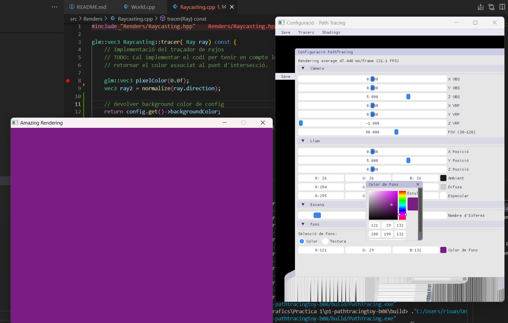
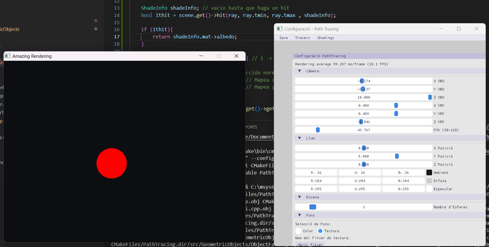
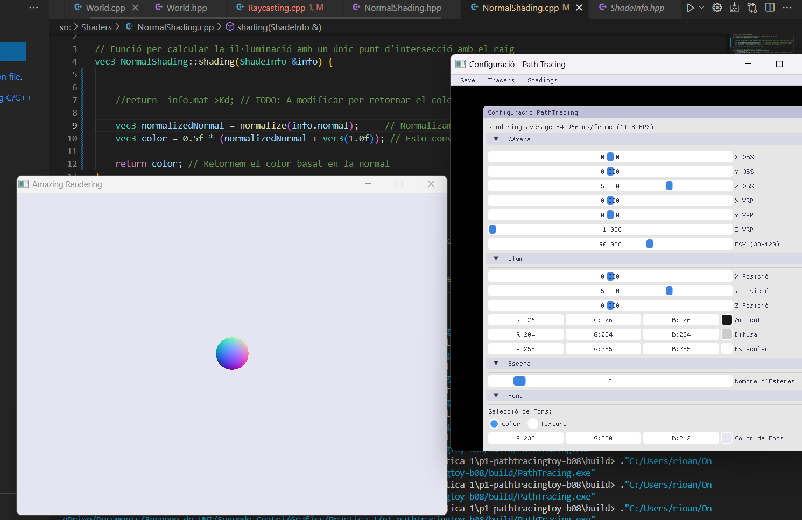
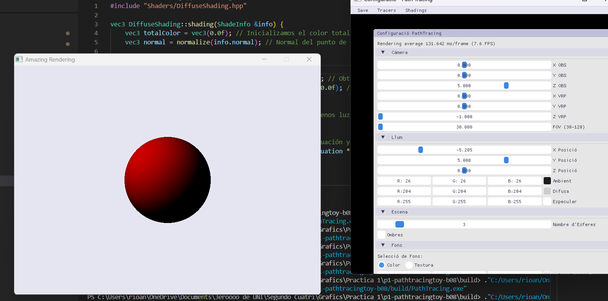
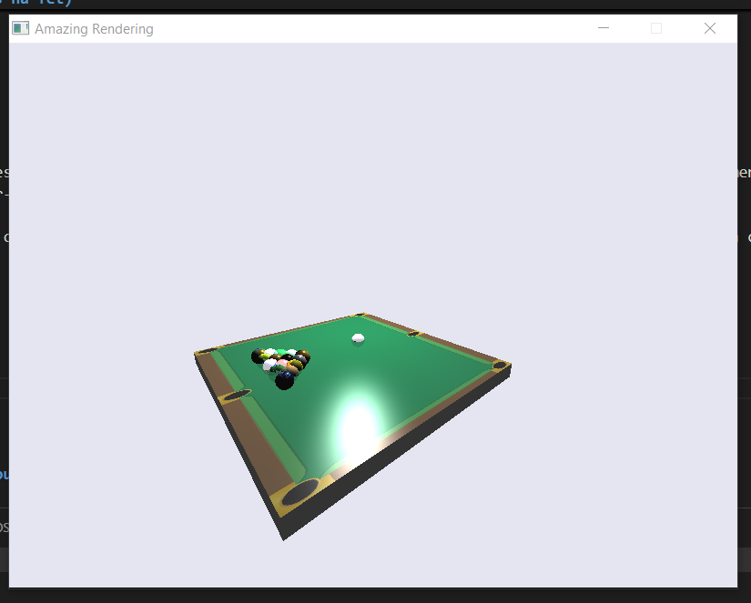
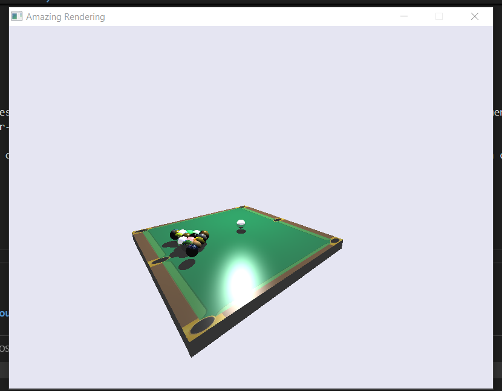

# Pràctica 1: Raytracing

Pràctica 1 - GiVD 2024-25

En aquest fitxer cal que feu l'informe de la pràctica 1. Aneu omplint la informació que us demanem.

## Equip:

**Equip: B08** 

* estudiant 1 : Andrés Río Nogués  ( Git : AndresRioo )
* estudiant 2 : Francesc Navarro Vazquez ( Git : quico16 )

## Informe de progrés

Cal que aneu indicant a cada sessió les tasques que heu realitzat i les que no, donant resposta a les preguntes que es formulen en l'enunciat. Com a exemple, us donem l'esquelet inicial a partir de l'enunciat de la primera etapa, tant de **features** implementades com de preguntes a contestar:

**FITXA 1**


### Features (marqueu les que heu fet i qui les ha fet)

- Introducció: Primera etapa
    - [ Acabada ] Mostrar color del Background
      - Andrés y Quico a clase

    - [ Acabada ] Mostrar textura al Background
      - Andrés y Quico a clase

    - [ Acabada ] Color Shading
      - Andrés y Quico a clase

    - [ Acabada ] Intersecció amb l'escena (1 esfera)
      - Andrés y Quico a clase

    - [ Acabada ] Normal Shading
      - Andrés 

    - [ Acabada ] Diffuse Shading
      - Andrés

    - [ Acabada ] Intersecció amb l'escena (múltiples esferes)
      - Andrés    

    - [ Acabada ] Ombres
      - Andrés y Quico

    - [ Acabada ] [**Opcional**] Cel Shading
      - Quico

    - [ Acabada ] Hit Box
      - Andrés y Quico

    - [ Acabada en Fitxa 4] [**Opcional**] Hit Triangle
      - Andres


### FITXA 2 : RAYTRACING ###


### Features (marqueu les que heu fet i qui les ha fet)

- **1. Optimitzacions: Bounding Boxes**  
    - [ Acabada ] **1.1** Implementació de la classe Box per definir una capsa 3D  
      - Quico
    - [ Acabada ] **1.2** Mètode hit() per determinar la intersecció amb la capsa  
      - Quico
    - [ Acabada ] **1.3** Creació d'una bounding box mínima contenidora de l'escena  
      - Quico
    - [ Acabada ] **1.4** Activació/desactivació de Bounding Box des de la interfície  
      - Quico

- **2. Llum puntual i Blinn-Phong**  
    - [ Acabada ] **2.1** Implementació del shading **Blinn-Phong**  
      - Andrés
    - [ Acabada ] **2.2** Càlcul de la component **ambient**  
      - Andrés
    - [ Acabada ] **2.3** Càlcul de la component **difusa**  
      - Andrés
    - [ Acabada ] **2.4** Càlcul de la component **especular**  
      - Andrés
    - [ Acabada ] **2.5** Control de la intensitat de la llum des de la interfície  
      - Andrés

- **3. Reflexions en Miralls i RayTracing**  
    - [ Acabada ] **3.1** Implementació de la classe **Metal** per materials reflectants 
      - Andrés 
    - [ Acabada ] **3.2** Implementació del mètode evaluate() per calcular reflexió especular  
      - Andrés
    - [ Acabada ] **3.3** Nou render **Raytracing** per gestionar reflexions  
      - Andrés
    - [ Acabada ] **3.4** Control de la profunditat màxima de reflexió (`MAXDEPTH`) des de la interfície  
      - Andrés

- **Homework**
    - [ Acabada ] **1** Construcció d'una nova escena   
      -  Andrés 


### FITXA 3 : TRANSPARÈNCIES ###


### Features (marqueu les que heu fet i qui les ha fet)

- **PAS 1. RAJOS SECUNDARIS: TRANSPARÈNCIES**  
    - [ Acabat ] 
      - Andrés

- **PAS 2. OMBRES AMB MATERIAL TRANSPARENTS**  
    - [ Acabat ]  
      - Quico

- **PAS 3. TEXTURES**  
    - [ Acabat  ] 
      - Andrés 

- **HOMEWORK 3. SPHERES AMB TEXTURES**  
    - [ Acabat  ]
      - Andrés


### FITXA 4 : PATHTRACING ###


### Features (marqueu les que heu fet i qui les ha fet)

- **PAS 1. SUPERSAMPLING**  
    - [ Acabat ] 
      - Andres

- **PAS 2. CONSTRUIR LA ESCENA**  
    - [ Acabat ]  
      - Quico

- **PAS 3. PATH TRACING**  
    - [ Acabat  ] 
      - Andres

- **HOMEWORK. Meshes**  
    - [ Acabat  ] 
      - Andres


### Preguntes

**3.1 Començant a provar el codi**

  

- **3.1.c: Quina escena es crea?**

    Inicialment, es crea una escena buida al constructor de World (scene = make_shared<Scene>();), aquesta escena té una càmera que defineix el punt de vista. Aquesta escena té un degradat en el fons generat pel mètode tracer() de Raycasting, on el color de cada píxel es calcula en funció de la direcció del raig llançat des de la càmera.

- **3.1.c: Quants objectes té l'escena?**

    Si fem un debug i posem un breakpoint a la linea 10 de la classe World (setConfig(config);), podem veure que l'escena té 4 objectes, que serien 4 esferes.

- **3.1.c: Qui la crea?**

    L'escena és creada i gestionada per la classe World. Aquesta s'encarrega d'inicialitzar la càmera i l'estructura base de l'escena en el seu constructor (scene = make_shared<Scene>();).

- **3.1.c: Quin setup o configuració té la classe?**

    La configuració de World és determinada per la variable setup, que defineix paràmetres essencials com la posició de l'observador (setup->observador), el punt de referència visual (setup->vrp), el camp de visió (setup->fov) i la resolució de la imatge (setup->viewportWidth i setup->viewportHeight). A més, gestiona la il·luminació a través de setup->lightPos, setup->lightAmbient, setup->lightDiffuse i setup->lightSpecular. Aquests valors es poden modificar en temps real des de la interfície gràfica i, en anomenar refreshProperties(), l'escena s'actualitza automàticament per reflectir els canvis.

- **3.1.c: Des d'on es crea o es refresca?**

    L'escena es genera al constructor de World i s'actualitza cada vegada que l'aplicació requereix un nou renderitzat (Controller::getInstance()->requestRender();). Aquest mètode activa renderWorld(), que recalcula els raigs de la càmera, genera la imatge al framebuffer i aplica els paràmetres de configuració. Quan es produeixen modificacions a la posició de la càmera o la il·luminació, refreshProperties() s'encarrega d'actualitzar aquests valors, garantint que la visualització reflecteixi qualsevol canvi realitzat des de la interfície o el codi.

- **3.1.d: Des d'on es crea el degradat que es veu a la finestra de rendering?**

    El degradat de la finestra es calcula en el metode de tracer() de la clase Raycasting, el qual és invocat des de renderWorld() al bucle on es generen els raigos. La variable pixelColor rep el color de cada píxel després de la crida a render->traer(ray);, aquest és responsable de definir la tonalitat que es mostra en la imatge.

-**3.1.d: Per què es veu aquest degradat?**

    El degradat es veu perquè el color de cada píxel es calcula directament a partir de la direcció del raig. Com que ray.direction es normalitza i s’ajusta a valors entre 0 i 1, es genera una transició de colors que depèn de la inclinació del raig respecte a la càmera. Això fa que la imatge tingui un efecte suau, amb colors canviants segons la posició dels píxels en la pantalla.

- **3.1.d: A quin mètode es calcula aquest color?**

    El color es calcula al mètode tracer() de la classe Raycasting. Aquest mètode és cridat dins de renderWorld(), quan es traça un raig per a cada píxel de la pantalla. En aquest punt, el raig es normalitza i s’aplica la fórmula del degradat per determinar el color final del píxel que es mostrarà al framebuffer.

- **3.1.e: Com s'ha de modificar el codi per veure el color de background entrat per la interfície en comptes del degradat?**

    Al mètode tracer en comptes de retornar un valor en funció de la posició de la càmera, retorna el valor guardat a config en la variable backgroundColor, que correspon al valor seleccionat en la GUI de fons en mode Color 

    ```c++

    // FUNCIÓ TRACER DE RAYCASTING.CPP

    // CODI PER VEURE EL DEGRADAT EN FUNCIÓ DE LA CÁMARA

    glm::vec3 pixelColor(0.0f);
    vec3 ray2 = normalize(ray.direction);

    pixelColor = 0.5f * vec3(ray2.x+1, ray2.y+1, ray2.z+1);
    return pixelColor;

    ```

    ```c++

    // FUNCIÓ TRACER DE RAYCASTING.CPP

    // CODI PER VEURE EL COLOR DE BACKGROUND ENTRAT PER LA INTERFÍCIE 

    return config.get()->backgroundColor;

    ```

    
    
    Aquesta imatge mostra el mètode `tracer` amb el codi per mostrar el fons en mode color.


- **3.1.e: Pots veure com arriba el flag de background al teu RayCasting?**

    En la clase config podem observar una variable de tipus int anomenada int backgroundMode  que s'utilitza per seleccionar si volem el background amb un color uniforme o amb una textura. En els següents apartats veurem com fer servir aquesta variable per seleccionar entre color o textura al fons. En la clase Raycasting tenim la variable config , el que significa que al mètode tracer sempre arribarà aquest flag per seleccionar la nostra opció a la GUI. 

- **3.1.f: Si ara volguessis veure una textura de fons, com penses que la podries veure? Podries usar la informació de la direcció del raig per poder obtenir una primera aproximació d’accés a la textura de fons?**

    Ara per seleccionar una textura de fons cal utilitzar el flag int backgroundMode  de la classe config per seleccionar el fons. Si aquest té un valor de 0 utilitzem el color sòlid de fons, si té valor de 1 utilitzem la textura. 

    Llavors dins la clase tracer, fem un if per seleccionar entre els tipus de fons. Pel fons d'1 color apliquem el codi d'abans i per la textura afegim el següent codi. 

    

    Aquest codi el que fa és agafar la informació del raig enviat ( normalitzat ) i passar-los al rang entre 0 i 1 per saber a quina part de la textura correspon ( coordenades UV ). Un cop tenim les coordenades UV agafem la variable background de config ( la textura en imatge ) i agafem el píxel corresponent amb el mètode ja implementat getPixelColor(vec2 uv).


    ```c++

    // FUNCIÓ TRACER DE RAYCASTING.CPP

    if ( config.get()->backgroundMode ) { // 1 -> textura

        vec2 uv;
        uv.x = 0.5f * (1 + ray2.x); // Convertir [-1,1] a [0,1]
        uv.y = 0.5f * (1 + ray2.y); 

        return config->background->getPixelColor(uv);

    } else { // 0 -> color 

        // devolver background color de config
        return config.get()->backgroundColor; 
    }
    ```


- **3.1.g: Quants objectes conté la teva escena inicialment?**

    Per veure els objectes en l'escena només cal afegir un breakpoint i accedir al array objects de la variable scene. Aquest comença inicialment buit i s'omple amb les 4 esferes en trucar el constructor, que aquest crida el mètode init i afegeix els objectes als arrays. 

    

    Array Objects de scene després del init en el constructor de World. 


- **3.1.g: Modifica el codi per a que es tingui en compte la intersecció només amb la primera esfera del vector d’objectes i que es pinti amb el seu color base (o albedo). Per això hauràs de cridar al mètode hit de la classe Scene, el podries modificar per a tenir en compte l’esfera?**

    Perquè el mètode bool Scene::hit(Ray& r, float tmin, float tmax, ShadeInfo &shadeInfo) const de Scene pugui tenir en compte la primera intersecció únicament amb el primer objecte li afegim el següent codi.

    ``` c++

    // Clase scene métode hit

    return objects[0]->hit(r, tmin, tmax, shadeInfo); solución solo para el primer objeto

    ```

    Amb aquest codi accedim al primer objecte de la llista i cridem el mètode hit corresponent a la seva classe de GeometricObject ( en aquest cas una esfera ). Retorna true si ha impactat i false si no. 

- **3.1.g: Caldrà que modifiquis també el mètode tracer de la classe Raycasting? Potser podries cridar al mètode hit de la classe Scene?**

    Sí. Dins la classe de tracer de Raycasting.cpp la modifiquem per veure si el raig impacta amb qualsevol objecte o no. Si no impacta amb un objecte, executa el codi anterior per veure el color de fons. Si sí que impacta, retorna el color base de l'esfera, guardat a l'objecte shadeInfo. Aquest objecte guarda la informació del hit, com el raig, la normal, el material on ha impactat... 

    ``` c++

    // Clase Raycasting.cpp métode tracer

    bool Ithit = scene.get()->hit(ray, ray.tmin, ray.tmax , shadeInfo);

    if (Ithit){
      return shadeInfo.mat->albedo; // pintar color base (albedo)
    }

    ```


    

    Codi a tracer per controlar la intersecció del ray amb qualsevol objecte . 

- **3.1.h: Canvia ara per a que el color es calculi des del NormalShading, es a dir, enlloc de pintar l’esfera amb el color del seu material o albedo, es vol usar el càlcul del color fet a la classe NormalShading.**


    Cal canviar la lògica al mètode tracer de la classe Raycasting perquè, en comptes de retornar el color base del material, utilitzi el càlcul de color de la classe NormalShading. Primer, es crea un objecte ShadeInfo que s'omple quan hi ha un impacte amb un objecte a l'escena. Si es detecta un impacte (Ithit és vertader), es crea una estratègia de Shading amb NormalShading i es crida al seu mètode shading, passant shadeInfo, per obtenir el color. Així, el sistema utilitzarà el càlcul de color a partir de les normals dels objectes.

    ```c++

    // Clase Raycasting.cpp métode tracer

    ShadeInfo shadeInfo; // vacio hasta que haga un hit    
    bool Ithit = scene.get()->hit(ray, ray.tmin, ray.tmax , shadeInfo);

    if (Ithit){

        shared_ptr<ShadingStrategy> shadingStrategy;
        shadingStrategy = make_shared<NormalShading>(scene, lights, config->observador, false );

        return shadingStrategy->shading(shadeInfo);

    }


    ``` 


- **3.1.h: Fixa’t que des del Menu Shadings pots activar aquesta estratègia però cal que la usis en calcular el color de sortida de cada píxel. Com hi pots accedir? A quina variable pots aconseguir l’estratègia a instanciar? I des d’on la crearàs?**

    Per accedir al shader seleccionat a la GUI, cal consultar l'objecte Config, ja que la classe `GUItracertoy` actualitza la variable `selectedShader` segons l'opció triada al menú.

    ```c++

    // CLASE GUITRACER TOY METODO RENDER MENUS

      if (ImGui::BeginMenu("Shadings")) {
              if (ImGui::MenuItem("Normal", NULL, selectedShading == "Normal Shading")) {
                  setup->selectedShader = 0;
                  Controller::getInstance()->requestRender();
              }
              if (ImGui::MenuItem("Diffuse", NULL, selectedShading == "Diffuse")) {
                  setup->selectedShader = 1;
                  Controller::getInstance()->requestRender();
              }
              ImGui::EndMenu();
      }

    ```

    Un cop sabem quin shader volem, el creem dins la classe `World` segons el valor de `config->selectedShader`, que conté la configuració seleccionada a la GUI.

    ```c++

    // CLASE WORLD Mètode renderWorld

    // Seleccionamos la estrategia de sombreado según el valor en Config
    shared_ptr<ShadingStrategy> shadingStrategy;

    switch (config->selectedShader) {
        case 0  :  // NormalShading
            shadingStrategy = make_shared<NormalShading>(scene, lights, config->observador,  config.get()->shadow);
            break;
        case 1 :  // DiffuseShading 
            shadingStrategy = make_shared<DiffuseShading>(scene, lights, config->observador , config.get()->shadow);
            break;
        default:
            shadingStrategy = make_shared<NormalShading>(scene, lights, config->observador, false); // Por defecto
            break;
    }

    ```

    “Abans, la creació de l'estratègia es feia dins del mètode `tracer` de `Raycasting`, però això no era eficient, ja que es creava un objecte per cada píxel. Per optimitzar-ho, ara `Raycasting` té un atribut `shared_ptr<ShadingStrategy> shadingStrategy`, i la creació es fa abans de pintar cada píxel al mètode `renderWorld` de `World`.”


- **3.1.i: Ara modifica el càlcul de color al NormalShading per a que es pinti cada punt de l’esfera segons la seva normal. Com canviaràs el codi del mètode de shading de la classe NormalShading?**


    Modifiquem el mètode de normalShading perquè utilitzi el valor de la seva normal a cada punt de l'esfera.

    ```c++

      // Funció per calcular la il·luminació amb un únic punt d'intersecció amb el raig
      vec3 NormalShading::shading(ShadeInfo &info) {

        vec3 color = 0.5f * (info.normal + vec3(1.0f)); // pasar de [-1,1] a [0,1]

        return color; 
        
      
    }
    ```

    

    Esfera amb el color de la seva normal


- **3.1.j: Ara ja estem a punt per fer una primera il·luminació en funció d’on bé la llum. L’anomenem DiffuseShading, on el color d’albedo es pondera segons el cosinus de l’angle que forma la normal i el vector de llum. Usa el producte escalar dels vectors normalitzats per aconseguir aquest cosinus i recorda que ambdós vectors han d’estar normalitzats. Fes aquest nou càlcul de color en un nou shading, tal i com feies en el NormalShading**


    Després de crear la nova clase DiffuseShading afegim el seu corresponent codi ( tenint en compte que només hi ha 1 llum, més endavant afegim el codi per si hi hagués més llums).

    ```c++

    // Funció per calcular la il·luminació amb un únic punt d'intersecció amb el raig
    vec3 DiffuseShading::shading(ShadeInfo &info) {


        // Obtenim la llum i la normal
        vec3 lightDir = normalize(lights[0]->vectorL(info.p)); // Direcció de la llum
        vec3 normal = normalize(info.normal); // Normal del punt d'intersecció

        // Calculem el cosinus de l'angle entre la normal i el vector de llum
        float cosTheta = std::max(  dot(normal, lightDir), 0.0f);  // si es negativo devolvemos 0

        // Retornem el color difús ponderat per la constant d'albedo
        return info.mat->albedo * cosTheta; 
    }
    ```

    Aquest codi pondera l'albedo amb el cosinus de l’angle que forma la normal i el vector de llum.

    Ara en comptes d'utilitzar el NormalShading com strategy, fem servir el diffuseShading. 

    

    Visualització de Diffuse Shading


- **3.1.j: Podries afectar també amb la component difusa de la llum per obtenir l’esfera més o menys il·luminada**


    Per tenir en compte la component difusa de la llum utilitzem la propietat de component difusa (`light->getId();`) com factor al resultat. 

    ```c++

    vec3 DiffuseShading::shading(ShadeInfo &info) {

      vec3 totalColor = vec3(0.0f); // Inicializamos el color total
      vec3 normal = normalize(info.normal); // Normal del punto de intersección

      // Iterar sobre cada luz
      for (const auto& light : lights) {
          vec3 lightDir = normalize(light->vectorL(info.p)); // Obtener dirección de la luz
          float cosTheta = std::max(dot(normal, lightDir), 0.0f); // Calcular coseno del ángulo
          // evitar valores inferiores a 0


          // Acumular el color difuso ponderado por la atenuación y la componente difusa de la luz
          totalColor += info.mat->albedo * cosTheta * light->getId(); 
      }

      return totalColor; // Devolver el color total
    }

    ```

    Ara amb la component difusa, el color es veu afectat per l'angle d'incisió a la superfície. Contra més gran sigui el cosinus de Theta (la normal i la llum estan alineats), més il·luminada estarà la superfície. 


**3.2 VISUALITZANT UNA ESCENA AMB DIFERENTS OBJECTES**

- **3.2.a: Codifica el mètode hit() de la classe Scene per a que es facin les interseccions amb totes les esferes i es retorni la intersecció amb t mínima, és a dir, si es consideren les esferes opaques, és la forma de calcular bé les seves visibilitats**

    Per aconseguir que el hit faci intersecció amb tots els objectes cal iterar un a un fins a trobar la t mínima (distància escalar des de l'origen del raig fins al punt d'intersecció).

    ```c++

    // CLASE SCENE MÉTODE HIT

    bool Scene::hit(Ray& r, float tmin, float tmax, ShadeInfo &shadeInfo) const {

    //return objects[0]->hit(r, tmin, tmax, shadeInfo); solución solo para el primer objeto

    bool hit = false;
    shadeInfo.t = tmax; // Inicializar shadeInfo.t para la comparación inicial

    for (const auto& object : objects) {

        ShadeInfo shadeIndividual = ShadeInfo(); // variable vacia para ir guardando todos los hits y comparar con el mínimo encontrado

        if (object->hit(r, tmin, tmax, shadeIndividual)) { 
          // guardar en shadeIndividual la información del hit ( si ha habido )

            hit = true; // existe 1 intersección
            
            if ( shadeInfo.t > shadeIndividual.t ){ 
              // Actualizar la interseccion mínima

                shadeInfo.operator=(shadeIndividual);
            }
        }

        //break; // quitar para calcular la intersección solo con el primer objeto (apartado anterior)
    }

    return hit;  // existe 1 intersección

    }

    ```

    El que fa el codi és iterar els objectes, guardar la seva informació d'intersecció ( si existeix ) i actualitzar el shadeInfo amb la intersecció mínima. Aquest procés retorna true si el raig ha impactat amb almenys 1 objecte i retorna false si no hi ha cap intersecció. 

    

    Resultat de calcular totes les interseccions

- **3.2.b: Ara anem a afegir esferes aleatòries a l’escena i comprovem que es visualitzen correctament. Per això has de mirar de connectar la interfície gràfica amb el mètode que genera les esferes de forma aleatòria de la classe Scene.**

    Simplement, cal trucar al mètode generateRandomSpheres(int nSpheres) quan la SliderInt de la interfície gràfica sigui modificada. A més cal tornar a renderitzar per veure els canvis. 


    ```c++

    // CLASE GUITracerToy métode renderConfigGUI


    // Funció per renderitzar la interfície de configuració
    void GUITracerToy::renderConfigGUI() {

      ...

    // SECCIÓ ESCENA
    if (ImGui::CollapsingHeader("Escena", ImGuiTreeNodeFlags_DefaultOpen)) {

        ImGui::Separator();

        if (ImGui::SliderInt("Nombre d'Esferes", &setup->numSpheres, 1, 20)) {
            // TODO: Cal cridar el metode per a generar objectes aleatoris
            // i despres cridar a refrescar l'escena amb requestRender()
            // Controller::getInstance()->requestRender();

            Controller::getInstance()->generateRandomSpheres(setup->numSpheres);
            Controller::getInstance()->requestRender();
        }

        ...
    }
    }

    ```

    

    Resultat de afegir esferes aleatòries a l'escena


**3.3  CALCULANT OMBRES**

**En aquest pas afegiràs ombres a tots els teus shadings. Quan es troba un punt d’intersecció, en calcular la seva il·luminació cal tirar un raig del punt intersecat a la llum i veure si hi ha algun objecte que li tapi la llumi. Si és així, es tornarà el color ambient de l’objecte ponderat amb la intensitat ambient de la llum.**

- **3.3.1:  Es vol que des de la interfície de configuració s’activi un paràmetre nou anomenat shadow. Aquest paràmetre s’ha de guardar a la configuració, quan es marca el flag de “shadow” de la interfície gràfica. Pots usar un check button de la llibreria imgui.**

    Primer de tot, el que hem fet és afegir a la classe `Config` el paràmetre `bool shadow` que seria un flag per indicar si es volen veure les ombres o no. 

    Per poder activar aquest paràmetre afegim una checkbox a la nostra GUI a l'apartat d'escena de la següent manera.

    ```c++

    // CLASE GUITracerToy métode renderConfigGUI

    ...

    if (ImGui::Checkbox("Ombres", &setup->shadow)) {
            Controller::getInstance()->requestRender();
        }

    ...


    ```

    Amb aquest codi afegim un CheckBox a la nostra interfície a més d'aconseguir modificar el valor prèviament definit shadow entre true (activat) i false (desactivat).


**3.3.2: Implementa el raig d'ombra seguint els següents passos:**

- **3.3.2.1: Implementa el codi del mètode computeShadow a la classe ShadingStrategy que donat un punt de l’escena, retorna si el punt està a l’ombra o no.**


    Per veure l'ombra dels objectes de l'escena, cal analitzar per a cada llum el seu raig i detectar si aquest impacta en un objecte o no. Si el raig de llum no impacta contra cap objecte, podem afirmar que el píxel està il·luminat. En canvi, si totes les llums estan bloquejades, el punt quedarà en l'ombra (color negre).

    ```c++

    // Classe ShadingStrategy.hpp

    virtual float computeShadow(vec3 point) {

      for (const auto& light : lights) {  
          vec3 L = normalize(light->vectorL(point));  
          vec3 shadowOrigin = point + L * 0.001f; 
          
          Ray shadowRay(shadowOrigin, L); 
          ShadeInfo shadowInfo;

          // Si NO hay intersección con un objeto antes de la luz, hay iluminación
          if (!scene->hit(shadowRay, 0.001f, light->distanceToLight(point), shadowInfo)) {
              return 1.0f;  // Punto iluminado
          }
        }

      return 0.0f;  // Punto en sombra
    }

    

    ```

- **3.3.2.2: Modifica el shading al NormalShading per a que tingui en compte les ombres cridant al mètode anterior i pinti la component ambient a les parts d’ombra.**


    Hem modificat el codi de `NormalShading::shading`, que teníem definit prèviament, pel següent:

    ```c++

    // Funció per calcular la il·luminació amb un únic punt d'intersecció amb el raig
    vec3 NormalShading::shading(ShadeInfo &info) {

      vec3 color = 0.5f * (info.normal + vec3(1.0f)); // info.normal ya esta normalizado

      if(shadow){

          float ombra = computeShadow(info.p); 
          return color * ombra;  // Atenuar color si está en sombra 
      } else {
          return color; // solo color 
      }
      
    }

    ```

    Ara fem servir `computeShadow` per determinar si el punt està en ombra o no. Aquesta funció només s'activa quan la casella de selecció (checkBox) de la variable `shadow` està activada. Si el punt està en ombra, la variable `float ombra` serà 0 i el píxel apareixerà negre. Si el punt no està en ombra, `ombra` serà 1 i el píxel mantindrà el seu valor original.


    

    Resultat de shading a NormalShading


- **3.3.2.3: Es eficient fer-ho d’aquesta manera? Com podries pensar d’accelerar el procés? Potser ara vas a 0.2FPS, com podríem reduir el temps de càlcul?**

    Aquesta implementació és funcional però poc eficient, ja que per cada punt intersecat es llança un nou raig cap a cada llum, i si hi ha molts objectes o llums, el nombre de càlculs creix ràpidament. Per optimitzar, es poden evitar càlculs innecessaris, com crear el shading strategy per cada píxel, i limitar els raigs d'ombra amb una t.max en comptes d’anar fins a l’infinit. A més, com veurem a la fitxa 2, es pot utilitzar una bounding box (hit box invisible) que englobi tots els objectes, i això permet descartar ràpidament raigs que no poden impactar res, reduint així el temps de càlcul.

- **4. HOMEWORK**

-**4.1. T’animes a afegir ombres al DiffuseShading?**

Per fer aquest apartat, hem fet una cosa semblant al que hem fet als apartats anteriors. El que hem fet és afegir el següent codi per a poder calcular les ombres dels objectes al DiffuseSHading.
```c++
float shadowFactor = 1.0f; // Por defecto, no hay sombra

if (shadow) { 
  shadowFactor = computeShadow(info.p); // Calcular si hay sombra
}

// Acumular el color difuso ponderado por la atenuación y la componente difusa de la luz
totalColor += info.mat->albedo * cosTheta * attenuation * light->getId() * shadowFactor; // Multiplico per crear l'ombra
```

-**4.2. [OPT] T’animes a seguir afegint més shadings al codi? Implementa un nou shading, l’anomenat CelShading per a aconseguir visualitzacions semblants a les dels dibuixos animats. Necessites afegir informació en el material? Fes captures de pantalles amb els resultats obtinguts Considera també les ombres**

Per fer això, hem hagut d'afegir un nou shading a a la clase World.cpp, aquest shading és el cas 3. A part hem afegit els includes corresponents a la clase Render.hpp:
```c++
switch (config->selectedShader) {
  case 0  :  // NormalShading
    shadingStrategy = make_shared<NormalShading>(scene, lights, config->observador,  config.get()->shadow);
    break;
  case 1 :  // DiffuseShading 
   shadingStrategy = make_shared<DiffuseShading>(scene, lights, config->observador , config.get()->shadow);
    break;
  case 2:  // BlinnPhongShading
    shadingStrategy = make_shared<BlinnPhongShading>(scene, lights, config->observador , config.get()->shadow);
    break;
  case 3:  // ToonShading
    shadingStrategy = make_shared<ToonShading>(scene, lights, config->observador , config.get()->shadow);
    break;
  default:
    shadingStrategy = make_shared<NormalShading>(scene, lights, config->observador, false); // Por defecto
    break;
}
``` 
A part d'això, hem creat des de 0 la classe ToonShading.cpp i ToonShading.hpp. Aquest codi està basat en el codi de la classe DiffuseShading, però afegint el següent codi en el mètode shading() per a poder donar aquest efecte de dibuix animat. Per altra banda, no hem hagut d'afegir cap informació en el material per a implementar el shading.

```c++
float shadowFactor = 1.0f; // Por defecto, no hay sombra
float toonIntensity = 1.0f;

if (shadow) { 
    shadowFactor = computeShadow(info.p); // Calcular si hay sombra
}

if(cosTheta > 0.95){
    toonIntensity = 1.0;
}else if(cosTheta > 0.5){
    toonIntensity = 0.6;
}else if(cosTheta > 0.25){
    toonIntensity = 0.4;
}else{
    toonIntensity = 0.2;
}

// Acumular el color difuso ponderado por la atenuación y la componente difusa de la luz

// sombreado mas suave
//totalColor += toonIntensity * info.mat->getDiffuse(info.uv) * cosTheta * attenuation * light->getId() * shadowFactor; // Multiplico per crear l'ombra


// toon shading clasico
totalColor += toonIntensity * info.mat->getDiffuse(info.uv) * attenuation * light->getId() * shadowFactor; // Multiplico per crear l'ombra
    

```


-**4.3. Per accelerar els càlculs, podries calcular la capsa mínima contenidora de l’escena i a cada raig mirar primer si interseca amb aquesta capsa. Pots implementar l’objecte Box, intentant reproduir el mètode de hit que trobaràs a les diapositives de teoria**

Aquesta part hem decidit documentar-la a la següent fitxa, ja que en aquesta segona fitxa està millor explicada i és més fàcil a l'hora de documentar.

-**4.4 [OPT] En el codi tens també objectes com malles triangulars o Mesh. Només cal implementar el mètode de hit per a que puguis arribar a carregar fitxers .obj en les teves visualitzacions. La classe Mesh utilitza la classe Face per a indexar els vèrtexs. Aquests models es codifiquen usant la representació indexada de vèrtexs en el format .obj (ho veurem la setmana vinent). Per anticipar-te, pots anar pensant o buscant com fer el hit del raig amb un triangle...**


### FITXA 2 : RAYTRACING ###


### Features (marqueu les que heu fet i qui les ha fet)

- **1. Optimitzacions: Bounding Boxes**  
    - [ Acabada ] **1.1** Implementació de la classe Box per definir una capsa 3D  
      - Quico
    - [ Acabada ] **1.2** Mètode hit() per determinar la intersecció amb la capsa  
      - Quico
    - [ Acabada ] **1.3** Creació d'una bounding box mínima contenidora de l'escena  
      - Quico
    - [ Acabada ] **1.4** Activació/desactivació de Bounding Box des de la interfície  
      - Quico

- **2. Llum puntual i Blinn-Phong**  
    - [ Acabada ] **2.1** Implementació del shading **Blinn-Phong**  
      - Andrés
    - [ Acabada ] **2.2** Càlcul de la component **ambient**  
      - Andrés
    - [ Acabada ] **2.3** Càlcul de la component **difusa**  
      - Andrés
    - [ Acabada ] **2.4** Càlcul de la component **especular**  
      - Andrés
    - [ Acabada ] **2.5** Control de la intensitat de la llum des de la interfície  
      - Andrés

- **3. Reflexions en Miralls i RayTracing**  
    - [ Acabada ] **3.1** Implementació de la classe **Metal** per materials reflectants 
      - Andrés 
    - [ Acabada ] **3.2** Implementació del mètode evaluate() per calcular reflexió especular  
      - Andrés
    - [ Acabada ] **3.3** Nou render **Raytracing** per gestionar reflexions  
      - Andrés
    - [ Acabada ] **3.4** Control de la profunditat màxima de reflexió (`MAXDEPTH`) des de la interfície  
      - Andrés

- **Homework**
    - [ Acabada ] **1** Construcció d'una nova escena   
      -  Andrés 


-**PAS 1 :   OPTIMITZACIONS: Bounding Boxes**


-**1.1 Si no ho has fet encara, crea una classe Box per definir una capsa 3D definida pels seus vèrtexs extrems, pmin i pmax, suposant que la capsa estarà alineada als eixos coordinats. Pots agafar de mostra la classe Sphere per guiar la teva implementació. Com la classe Box derivarà de la classe Object, implementa-hi el seu mètode hit, intentant reproduir el mètode de hit que trobaràs il·lustrat a les diapositives de la presentació de la pràctica 1.**

En aquest cas, el que hem fet és crear la classe Box idèntica a la classe Sphere, però canviant els paràmetres de la classe Sphere.hpp, pels vèrtexs mínim, i màxim de la caixa. A més hem modificat el mètode, hit de la classe box pel següent:
```c++
vec3 pmin, pmax;

bool Box::hit(Ray& r, float tmin, float tmax, ShadeInfo &shadeInfo) const {
    float t_enter = tmin, t_exit = tmax;
    vec3 normal(0, 0, 0);
    float epsilon = 1e-4; // Pequeña tolerancia para errores de punto flotante

    for (int i = 0; i < 3; i++) {
        float invD = 1.0f / r.direction[i];
        float t0 = (pmin[i] - r.origin[i]) * invD;
        float t1 = (pmax[i] - r.origin[i]) * invD;

        if (invD < 0.0f) std::swap(t0, t1);

        if (t0 > t_enter) { 
            t_enter = t0;
            normal = vec3(0, 0, 0); // Reset normal
            normal[i] = -1; // Normal hacia dentro si viene desde fuera
        }
        if (t1 < t_exit) {
            t_exit = t1;
        }

        if (t_exit < t_enter) return false;
    }

    shadeInfo.t = t_enter;
    shadeInfo.p = r(t_enter);
    shadeInfo.mat = material;
    shadeInfo.normal = normal;

    return true;
}
```

-**1.1.1  Des del mètode init() d la classe Scene, crea una box i comenta la resta. Comprova que es veu bé amb el RayCasting implementat en la Fitxa1. Usa el shading de NormalShading que retorni el color que representa la normal quan es trobi que el raig interseca amb un objecte**

Per poder mostrar la caixa el que hem fet és comentar totes les esferes del mètode init(), i afegir el codi necessari per a poder mostrar la caixa.
```c++
objects.push_back(std::make_shared<Box>(glm::vec3(0.0f, 0.0f, 0.0f), glm::vec3(1.0f, 1.0f, 1.0f), glm::vec3(1.0f, 1.0f, 1.0f))); // box
```


-**1.1.2 Fes un mètode a la classe Scene que construeixi la mínim capsa contenidora, o Bounding Box, de l’escena que contingui tots els objectes de l’escena. Quan pots cridar aquest mètode per construir la capsa mínima? Quan usaràs la capsa per optimitzar les teves interseccions amb el raig? Comprova amb l’escena de les esferes (sense l’esfera gran) si et funciona la teva optimització. Afegeix un flag a la interfície que activi o desactivi aquesta optimització per poder veure el canvi en FPS que dona l’execució usant o no aquesta Bounding Box.**

El mètode per calcular la caixa mínima contenidora de tots els objectes és un mètode que cridem després d'haver afegit tots els objectes a la llista objectes en el metode init(). A més, també el cridem després d'haver afegit totes les esferes en el mètode generateRandomSpheres(). El mètode que hem creat recorre tots els objectes per calcular la posició del vèrtex mínim i màxim de la caixa contenidor, i és el següent:

```c++
void Scene::computeBoundingBox() {
    if (objects.empty()) {
        bboxMin = vec3(0);
        bboxMax = vec3(0);
        return;
    }

    // Inicializamos con los valores del primer objeto
    bboxMin = objects[0]->getMinCoords();
    bboxMax = objects[0]->getMaxCoords();

    for (const auto& obj : objects) {
        vec3 objMin = obj->getMinCoords();
        vec3 objMax = obj->getMaxCoords();

        bboxMin = vec3(fmin(bboxMin.x, objMin.x), fmin(bboxMin.y, objMin.y), fmin(bboxMin.z, objMin.z));
        bboxMax = vec3(fmax(bboxMax.x, objMax.x), fmax(bboxMax.y, objMax.y), fmax(bboxMax.z, objMax.z));
    }

    //objects.push_back(std::make_shared<Box>(bboxMin,bboxMax, vec3(1.0f, 1.0f, 1.0f)));

}
``` 

Per optimitzar les interseccions dels raigs, hem hagut de modificar el mètode, hit(), de manera que quan es comprova la intersecció d’un raig amb els objectes de l’escena (hit()), primer es verifica si el raig col·lideix amb la Bounding Box. Si no hi ha intersecció, es pot evitar calcular col·lisions amb objectes individuals, millorant l’eficiència. El mètode que ens ha quedat després de modificar-lo és el següent:

```c++
bool Scene::hit(Ray& r, float tmin, float tmax, ShadeInfo &shadeInfo) const {
    // TODO TUTORIAL 0 i TUTORIAL 1:
    // Heu de codificar la vostra solucio per aquest metode substituint el 'return false'
    // Una possible solucio es cridar el mètode "hit" per a tots els objectes i quedar-se amb la interseccio
    // mes propera a l'observador entre tmin i tmax, en el cas que n'hi hagi més d'una.
    // Si un objecte es intersecat pel raig, cal actualitzar la variable shadeInfo 


    
    if (useBoundingBoxOptimization) {
        vec3 invD = vec3(1.0f) / r.direction; // Precomputamos para evitar cálculos repetidos
        if (!boundingBoxHit(r, tmin, tmax, invD))
            return false;
    }

    bool hitSomething = false;
    float closestT = tmax;

    for (const auto& obj : objects) {
        if (obj->hit(r, tmin, closestT, shadeInfo)) {
            hitSomething = true;
            closestT = shadeInfo.t; // Ajustamos el rango de búsqueda
        }
    }
    return hitSomething;
    

    
    ///*METODO ANTERIOR
    //return objects[0]->hit(r, tmin, tmax, shadeInfo); solución solo para el primer objeto

    bool hit = false;
    shadeInfo.t = tmax; // Inicializar shadeInfo.t para la comparación inicial

    for (const auto& object : objects) {

        ShadeInfo shadeIndividual = ShadeInfo(); // variable vacia para ir guardando todos los hits y comparar con el mínimo encontrado

        if (object->hit(r, tmin, tmax, shadeIndividual)) {
            // guardar en shadeIndividual la información del hit ( si ha habido )

            hit = true; // existe 1 intersección
            
            if ( shadeInfo.t > shadeIndividual.t ){ 
                // Actualizar la interseccion mínima

                shadeInfo.operator=(shadeIndividual);
            }
        }

        //break; // para 1 único objeto
    }

    return hit;  // existe 1 intersección
    //*/

}
```

Per altra banda, hem creat el mètode boundingBoxHit() per comprovar si hi ha o no un hit del raig amb la caixa que conté tots els objectes.

```c++
bool Scene::boundingBoxHit(Ray& r, float tmin, float tmax, const vec3& invD) const {
    vec3 t0s = (bboxMin - r.origin) * invD;
    vec3 t1s = (bboxMax - r.origin) * invD;

    vec3 tminVec = glm::min(t0s, t1s);
    vec3 tmaxVec = glm::max(t0s, t1s);

    float tNear = glm::compMax(tminVec);
    float tFar = glm::compMin(tmaxVec);

    return tNear <= tFar && tFar >= tmin && tNear <= tmax;
}
```

Per comprovar la millora de l'eficiència quan utilitzem i quan no fem servir la caixa mínima contenidora hem afegit un flag a Scene.hpp que quan és fals, mai entra al if del mètode hit() que s'encarrega de comprovar si hi ha hit amb la caixa i viceversa.

-**COMPROVACIÓ MILLORA EFICIÈNCIA**


Sense la bounding box ( flag desactivat )


Amb la bounding box ( flag activat )

Podem observar que en activar el flag, els nostres FPS augmenten pel fet que de mirar el hit amb totes les esferes per la majoria dels raigs de la nostra escena.

-**1.1.3 Com canvia la teva eficiència? Si canvies el FOV, notes algun canvi?**

Quan el FOV és més elevat, menys raigs intersequen amb la bounding box, estalviant així el càlcul de hit amb totes les esferes de l'escena. En canvi, un FOV inferior provoca que més raigs impactin la bounding box, que ocupa més espai a la pantalla. Això significa que una major quantitat de píxels contenen la bounding box, augmentant considerablement la quantitat de càlculs necessaris.


FOV elevat, la bounding box ocupa tota la nostra pantalla


FOV reduit, ara només ocupa part de la nostra pantalla

Podem veure com els nostres FPS baixen en funció del valor del FOV. Pasem de 10 FPS a 4 FPS. 


-**PAS 2 :  LLUMS PUNTUALS I BLINN-PHONG**

-**2.1 : Blinn-Phong shading: Afegeix una nova estratègia de shading anomenada BlinnPhongShading. Revisa els paràmetres necessaris per a poder passar tota la informació que necessita el mètode de Blinn-Phong**

Afegim una nova classe Blinn-Phong shading als nostres shadings, modificant les següents classes per poder seleccionar el nostre shading a partir de la GUI.

```c++

    // CLASE WORLD : Seleccionar el shading

    switch (config->selectedShader) {
        case 0  :  // NormalShading
            shadingStrategy = make_shared<NormalShading>(scene, lights, config->observador,  config.get()->shadow);
            break;
        case 1 :  // DiffuseShading 
            shadingStrategy = make_shared<DiffuseShading>(scene, lights, config->observador , config.get()->shadow);
            break;
        case 2:  // BlinnPhongShading
            shadingStrategy = make_shared<BlinnPhongShading>(scene, lights, config->observador , config.get()->shadow);
            break;
        case 3:  // ToonShading
            shadingStrategy = make_shared<ToonShading>(scene, lights, config->observador , config.get()->shadow);
            break;
        default:
            shadingStrategy = make_shared<NormalShading>(scene, lights, config->observador, false); // Por defecto
            break;
    }

  
    // CLASE SHADING FACTORY : afegir el blinn phong


    typedef enum  SHADING_TYPES{
        NORMALSHADING,
        DIFFUSESHADING,
        BLINNPHONGSHADING
    } SHADING_TYPES;


    #include "Shaders/ShadingFactory.hpp"

    shared_ptr<ShadingStrategy> ShadingFactory::createShading(SHADING_TYPES t, shared_ptr<Scene> scene, vector<shared_ptr<Light>> lights, vec3 lookFrom, bool shadow) {
        shared_ptr<ShadingStrategy> s;
        switch(t) {
        case NORMALSHADING:
            s = make_shared<NormalShading>(scene, lights, lookFrom, shadow);
            break;
        case DIFFUSESHADING:
            s = make_shared<DiffuseShading>(scene, lights, lookFrom, shadow);
            break;
        case BLINNPHONGSHADING:
            s = make_shared<BlinnPhongShading>(scene, lights, lookFrom, shadow);
            break;

        default:
            s = nullptr;
    }

        return s;
    }

    ShadingFactory::SHADING_TYPES ShadingFactory::getIndexType(shared_ptr<ShadingStrategy> m) {
        if (dynamic_pointer_cast<NormalShading>(m) != nullptr) {
            return SHADING_TYPES::NORMALSHADING;
        } else if (dynamic_pointer_cast<DiffuseShading>(m) != nullptr) {
            return SHADING_TYPES::DIFFUSESHADING;
        } else if (dynamic_pointer_cast<BlinnPhongShading>(m) != nullptr) {
            return SHADING_TYPES::BLINNPHONGSHADING;
        }else {
            return SHADING_TYPES::NORMALSHADING; 
        }
    }


```


**AFEGIR PAS A PAS BLINNPHONGSHADING**

Abans de començar partim del diffuse shading amb el següent escenari :


El Material que tenim a les esferes tenen la Ka a (0.2, 0.2, 0.2), la Ks a (0.8, 0.8, 0.8)
amb uns shineness de 100.0 (constructor per defecte).


-**2.2 PAS 1 : La COMPONENT AMBIENT:**

Per calcular la component ambient, només cal agafar la component ambiental del material i multiplicar-la per la component ambient de la llum.

```c++

    // BlinnPhong amb només component ambient

    vec3 ambientColor = info.mat->Ka; // Componente ambiental del material

    vec3 llumAmbient = ambientColor * light->getIa();  

    return llumAmbient;

```

La escena queda de la següent manera : 


A més si l'afegim la component difusa podem observar el color de les esferes.

```c++

    // BlinnPhong amb component ambient i difusa

    vec3 ambientColor = info.mat->Ka; // Componente ambiental del material
    vec3 diffuseColor = info.mat->getDiffuse(info.uv); // Componente difusa del material

    vec3 llumAmbient = ambientColor * light->getIa();  
    vec3 llumDifosa = diffuseColor * light->getId() * cosTheta; 

    return llumAmbient + llumDifosa

```


Tot es veu afectat per la llum ambient, on si augmentem la llum ambient la nostra escena queda molt més clara. 


-**2.2 PAS 2 : La COMPONENT ESPECULAR:**

Ara només agafem la component especular del material i de la llum. Primer, es calcula vectorV, que és la direcció cap a la càmera, i halfVector, que és el vector mitjà entre la direcció de la llum i vectorV. Després, es calcula specAngle, que és el producte escalar entre la normal i halfVector, determinant la intensitat de la reflexió especular. Aquesta intensitat s'eleva a shininess per modelar la brillantor del material. Finalment, llumEspecular es calcula multiplicant el color especular del material, la intensitat de la llum i el factor especular. 

``` c++

    // BlinnPhong amb només component especular

    vec3 especularColor = info.mat->Ks; // Componente especular del material
    vec3 lightDir = normalize(light->vectorL(info.p)); // Obtener dirección de la luz

    vec3 vectorV = normalize(lookFrom - info.p); // Dirección a la cámara
    vec3 halfVector = normalize(lightDir + vectorV); 

    float specAngle = std::max(dot(normal, halfVector), 0.0f);
    float specFactor = pow(specAngle, shininess); // Reflexión especular

    vec3 llumEspecular = especularColor * light->getIs() * specFactor;

    return llumEspecular


```


Si ajuntem les 3 components i a més afegim a les components directes ( component difosa i especular ) l'atenuació de la llum ( en funció de la distància de l'objecte respecte a la llum ) i el shadow factor ( si l'objecte es troba a l'ombra o no   )

```c++


    float shadowFactor = 1.0f; // Por defecto, no hay sombra

    if (shadow) { 
        shadowFactor = computeShadow(info.p); // Calcular si hay sombra
    }

    float attenuation = light->attenuation(info.p);


    // Sumar los componentes de la iluminación
    
    totalColor += attenuation * llumDifosa * shadowFactor; 
    // component directa, multipliquem per atenuació i per el shadow factor
    totalColor += attenuation * llumEspecular * shadowFactor; 
    // component directa, multipliquem per atenuació i per el shadow factor

    totalColor += llumAmbient ;


    return totalColor;

```


-**2.2 PAS 3 : La LLUM GLOBAL:**

Per acabar, afegim la llum global a la nostra GUI i l'afegim al càlcul del nostre color. Aquesta llum afecta tots els objectes de manera uniforme i no depèn de la direcció de la llum.

```c++

    float shadowFactor = 1.0f; // Por defecto, no hay sombra

    if (shadow) { 
        shadowFactor = computeShadow(info.p); // Calcular si hay sombra
    }

    float attenuation = light->attenuation(info.p);
    vec3 llumGlobal = ambientColor * light->getIaGlobal();


    // Sumar los componentes de la iluminación
    
    totalColor += attenuation * llumDifosa * shadowFactor; 
    // component directa, multipliquem per atenuació i per el shadow factor
    totalColor += attenuation * llumEspecular * shadowFactor; 
    // component directa, multipliquem per atenuació i per el shadow factor

    totalColor += llumAmbient ;
    totalColor += llumGlobal ;


    return totalColor;

```


Resultat final de blinnPhong shading.


-**PAS 3: REFLEXIONS EN MIRALLS: PRIMERS RAJOS SECUNDARIS**

-**1. SCATTER DE RAJOS SECUNDARIS: CLASSE MATERIAL METALL**

-**Fes una nova classe derivada de Material que codifiqui el tipus Metal. Inspirat en la classe Lambertian però aquest cop el mètode evaluate() haurà de retornar cert i simularà la reflexió especular. Aquest mètode ha de calcular un únic raig reflectit (raig simètric al raig d’entrada en relació a la normal al punt d’intersecció) i també retornarà el color (Ks) amb el que contribueix el color del raig reflectit al color final. Per a calcular el vector reflectit, podeu usar el mètode glm::reflect.**

  Per calcular el raig reflectit, primer obtenim el punt d’intersecció amb l’objecte, que es calcula amb la fórmula: 

  `Punt intersecció = Punt origen + distancia escalar de origen hasta la intersecció * direccio raig`

  Un cop tenim el punt d’intersecció, obtenim la direcció del raig reflectit utilitzant el mètode `glm::reflect()`, que retorna el vector reflectit respecte a la normal de la superfície i un raig d'entrada. Finalment, creem el nou raig `r_out` amb el punt d’intersecció com a origen i la direcció reflectida, i assignem el color del material a la variable `color`.”

```c++

    bool Metal::evaluate(const Ray& r_in, float t, vec3 normal, vec3& color, Ray & r_out) const  {

    color = Kd;

    // Obtener el origen del rayo y la dirección reflejada

    // punto interseccion = punto origen + distancia * direccion rayo incidencia 

    glm::vec3 origin = r_in.origin + t * r_in.direction;
    glm::vec3 reflectedDirection = glm::reflect(r_in.direction, normal); // Calcula la dirección reflejada

    // Crea el nuevo rayo reflejado con el mismo origen y la dirección reflejada
    r_out = Ray(origin, reflectedDirection);

    return true ;
    }
        
```

-**2. NOU RENDER: RAYTRACING.**

-**Fes un nou render anomenat Raytracing (pots copiar el teu actual Raycasting a aquesta nova classe i modificar-la). Activa’l des de la interfície gràfica. Revisa el mètode menús() de la classe GUITracerToy per activar l’opció. Adequa el codi del mètode render de la classe Raytracing perquè consideri rajos secundaris i controli la recursivitat amb el valor MAXDEPTH. Afegeix recursió en el raig perquè es segueixin els rajos secundaris REFLECTITS en el cas que l’objecte intersecat sigui un mirall (tingui un material de tipus Metall).**


  Quan seleccionem Raytracing a la interfície gràfica, actualitzem `selectedTracer` a 1. Això fa que la classe Raytracing sigui utilitzada per renderitzar la imatge.

```c++

    // CLASE GUITRACER TOY

    if (ImGui::BeginMenu("Tracers")) {
          if (ImGui::MenuItem("Raycasting", NULL, selectedTracer == "Raycasting")) {
              setup->selectedTracer = 0;
              Controller::getInstance()->requestRender();
          }
          if (ImGui::MenuItem("Raytracing", NULL, selectedTracer == "Raytracing")) {
              setup->selectedTracer = 1;
              Controller::getInstance()->requestRender();
          }
          if (ImGui::MenuItem("Pathtracing", NULL, selectedTracer == "Pathtracing")) {
              setup->selectedTracer = 2;
              Controller::getInstance()->requestRender();
          }
          ImGui::EndMenu();
      }


```

  A la classe `World` abans de dibuixar tots els raigs, seleccionem el tipus de tracing que hem indicat a la nostra GUI.  


  ```c++

    // CLASE WORLD

    shared_ptr<Render> render;

    switch ( config->selectedTracer ) {
        case 0 : // Raycasting
            render = make_shared<Raycasting>(scene, lights, camera, config, shadingStrategy);
            break;
        case 1 : // RayTracing
            render = make_shared<Raytracing>(scene, lights, camera, config, shadingStrategy);
            break;
        case 2 : 
            break;
        default:
            render = make_shared<Raycasting>(scene, lights, camera, config, shadingStrategy);
    }

  ```

  A més, és necessari incloure en la variable `config` la variable `MaxDepth` per limitar el nombre màxim de raigs reflectits que podem generar. Per adaptar el Ray Tracing per considerar raigs secundaris, cal crear un mètode auxiliar recursiu que s'executi cada vegada que un objecte intersecat té propietats reflectants (en aquest cas, quan és metàl·lic). En aquest mètode, avaluem si el material és reflectant. Si ho és, comprovem si el raig reflectit impacta amb un altre objecte o si, per contra, impacta només al fons. Si el raig reflectit col·lideix amb el fons, retornem només el color base del material. Si, en canvi, el raig reflectit col·lideix amb un altre objecte, retornem la suma del color del material intersecat més el color del raig reflectit multiplicat per la component especular del material. En aquesta implementació, no considerem el fons de l'escenari per calcular la reflexió, però es tindrà en compte en els següents apartats.


  **Explicació del codi:** 
  
  El mètode `tracerRecursiveNoBackground()` és el responsable de gestionar la recursivitat del traçat de raigs. Dins d'aquest mètode, quan un raig impacta un objecte, verifiquem si aquest objecte té un material reflectant. Si és així, creem un nou raig amb la direcció reflectida i cridem de nou a `tracerRecursiveNoBackground()` amb una profunditat de `depth - 1`. Si el nou raig reflectit no col·lideix amb cap objecte, simplement retornem el color base. Si, en canvi, col·lideix amb un altre objecte, tornem a calcular el color resultant sumant el color base del primer objecte amb la contribució del raig reflectit. D'aquesta manera, aconseguim simular la reflexió de manera recursiva, limitant el nombre de rebots `MaxDepth` per evitar bucles infinits.”

  ```c++

  // CLASE RAYTRACING

  glm::vec3 Raytracing::tracer( Ray ray) const {
    
    int depth = config.get()->maxdepth + 1; // evitar que profundidad 0 sea negro

    return tracerRecursiveNoBackground(ray, depth );   // sin reflejo del fondo
    //return tracerRecursive(ray, depth );  // con reflejo

  }

  glm::vec3 Raytracing::tracerRecursiveNoBackground(Ray ray, int depth) const {
    if (depth <= 0) {
        return glm::vec3(0.0f);  // Si no quedan rebotes, color negro (sin contribución)
    }

    glm::vec3 pixelColor(0.0f);
    vec3 ray2 = normalize(ray.direction);

    ShadeInfo shadeInfo;
    bool Ithit = scene.get()->hit(ray, ray.tmin, ray.tmax, shadeInfo);

    // Si el rayo golpea un objeto
    if (Ithit) {
        vec3 color = shadingStrategy->shading(shadeInfo);
        vec3 color_out;
        Ray ray_out;

        if (shadeInfo.mat.get()->evaluate(ray, shadeInfo.t, shadeInfo.normal, color_out, ray_out)) {
            // El material refleja, pero nos aseguramos de que no refleja el fondo
            vec3 reflectionColor = tracerRecursiveNoBackground(ray_out, depth - 1);

            ShadeInfo check; // seguir con la informacion anterior

            // Si el reflejo golpea el fondo, no sumarlo
            if (!scene.get()->hit(ray_out, ray_out.tmin, ray_out.tmax, check)) {  
                return color;  // Solo el color base del objeto
            }

            // si golpea otro objeto, mirar su reflejo
            return glm::clamp(color + shadeInfo.mat.get()->Ks * reflectionColor, 0.0f, 1.0f);
        } else {
            return color;  // El material no refleja, solo devuelve su color base
        }
    }

    // DIBUJAR FONDO
    if ( config.get()->backgroundMode ) { // 1 -> textura

        vec2 uv;
        uv.x = 0.5f * (1 + ray2.x); // Convertir [-1,1] a [0,1]
        uv.y = 0.5f * (1 + ray2.y); 

        return config->background->getPixelColor(uv);

    } else { // 0 -> color 

        // devolver background color de config
        return config.get()->backgroundColor; 
    }
    
  }

  ```


-**3. CONTROL DE LA RECURSIVITAT**

-**Per a controlar el fi de la recursivitat en l'estratègia de render necessita la profunditat actual o depth i un atribut de la configuració, MAXDEPTH, per a controlar el fi de la recursivitat dels rajos reflectits. Afegeix a la interfície un slider per controlar la màxima profunditat dels rajos secundaris.**


  Simplement afegim la següent línia de codi a `GUITracerToy` per afegir un slide que va de 0 a 10. La info es guarda en la variable `maxdepth` en l'objecte `Config`.

  ```c++

    updated |= ImGui::SliderInt("Màxima profunditat", &setup->maxdepth , 0, 10);

  ```
    

-**TESTS**

-**Amb la mateixa escena que provaves fins ara, fes que l’esfera gran sigui metàl·lica. Els paràmetres usats en el material d’aquesta esfera són ka = 0.2, 0.2, 0.2, kd = 0.8, 0.8, 0, ks = 1.0, 1.0, 1.0, shineness = 100.0. Hem desactivat i activat ombres i tenim les llums ambients com s’indica a la interfície. Hem usat MAXDEPTH = 1.**

Fent l'esfera gran metàl·lica amb els paràmetres indicats, podem veure la reflexió de les boles a la bola gran groga.


Resultat amb diferents shadings ( BlinnPhong i ToonShading ) amb i sense ombra.


-**Si ara fas totes les esferes metàl·liques, pots veure més reflexions augmentant la màxima profunditat a la interfície.**

Podem veure com canvia l'escena segons el nombre màxim de reflexions que calculem.


Max depth = 0


Max depth = 1


Max depth = 2


Max depth = 3


Max depth = 4


Max depth = 5


Max depth = 5


-**Prova amb els altres tipus de shadings per veure d’altres efectes en les reflexions.**


Normal shading amb profunditat 1


Toon shading amb profunditat 2

-**Si treus l’esfera gran, pots comprovar quins efectes té utilitzar o no la Bounding Box de l’escena quan augmentes la profunditat del raig? Com varien els FPS? Com varien els mil·lisegons?**

L'ús de bounding boxes hauria de millorar l'eficiència en el ray tracing, però en augmentar la profunditat dels raigs, pot passar que la seva eficàcia disminueixi. Això es deu al fet que, per cada raig llançat, es generen més raigs secundaris (per reflexos o ombres), i cada un d'aquests raigs ha de verificar la intersecció amb la BB. Si les BB no estan optimitzades o si abasten més espai del necessari, es pot produir un augment en el nombre de càlculs d'intersecció, anul·lant els beneficis de rendiment.

Llavors l'eficiència depèn de l'escena. Si tenim només 3 esferes a prop podem veure com la bounding box no millora el rendiment. En canvi, si tenim 20 esferes que ocupen una part de la pantalla podem veure com si millora.


3 esferes sense bounding box i profunditat 10 (11.5 FPS)

 
 
 
3 esferes amb bounding box i profunditat 10 (10.4 FPS)

  
  
    
      
20 esferes sense bounding box i profunditat 10 (5.2 FPS)


20 esferes amb bounding box i profunditat 10 (9.6 FPS)


-**Mira què passa si quan no hi ha hit retornes el color de fons o de textura. Com et queden les teves escenes?**

  Hem afegit una nova checkbox per poder seleccionar si volem el fons o no mitjançant l'atribut `bool reflejaElBackground;` de config. Obtenim els següents resultats.

Amb color base de fons
  
  


Amb foto de fons 
  

   
    
     
      
Amb foto de fons i sombra
  

-**HOMEWORK 1: CONSTRUEIX UNA NOVA ESCENA VIA CODI**

Per afegir aleatorietat a la nostra escena de forma programàtica podem utilitzar la funció `glm::linearRand` per donar aleatorietat als nostres paràmetres. En aquest codi farem que l'esfera vermella ara tingui totes les propietats aleatòries, sigui de metall i que estigui en una posició aleatòria.

```c++

    // Codi a init de scene

    // Generar una posición aleatoria para la esfera
    float posX = glm::linearRand(0.0f, 5.0f); // Rango para la posición X
    float posY = glm::linearRand(0.0f, 5.0f); // Rango para la posición Y
    float posZ = glm::linearRand(0.0f, -2.0f); // Rango para la posición Z

    // Generar un radio aleatorio para la esfera
    float radio = glm::linearRand(0.5f, 2.0f); // Rango para el radio

    // Crear la esfera con posición y radio aleatorios
    objects.push_back(std::make_shared<Sphere>(glm::vec3(posX, posY, posZ), radio, glm::vec3(1.0f, 0.0f, 0.0f))); // Esfera vermella

    vec3 color1(glm::linearRand(0.0, 1.0), glm::linearRand(0.0, 1.0),glm::linearRand(0.0, 1.0));
    vec3 color2(glm::linearRand(0.0, 1.0), glm::linearRand(0.0, 1.0),glm::linearRand(0.0, 1.0));
    vec3 Kd = color1*color2;
    vec3 Ks(glm::linearRand(0.7, 1.0), glm::linearRand(0.7, 1.0), glm::linearRand(0.7, 1.0));
    vec3 Ka(glm::linearRand(0.7, 1.0), glm::linearRand(0.7, 1.0), glm::linearRand(0.7, 1.0));

    auto materialRandom = std::make_shared<Metal>();

    materialRandom.get()->Ka = Ka; // component ambient
    materialRandom.get()->Kd = Kd; // component difusa
    materialRandom.get()->Ks = Ks; // component especular

    materialRandom.get()->shininess = glm::linearRand(10.0f, 100.0f); 

    objects[0].get()->setMaterial(materialRandom); 


```

Podem veure com cada cop que executem el codi, els valors canvien, obtenint una escena diferent a l'anterior.


  


### FITXA 3 : TRANSPARÈNCIES ###


### Features (marqueu les que heu fet i qui les ha fet)

- **PAS 1. RAJOS SECUNDARIS: TRANSPARÈNCIES**  
    - [ Acabat ] 
      - Andrés

- **PAS 2. OMBRES AMB MATERIAL TRANSPARENTS**  
    - [ Acabat ]  
      - Quico

- **PAS 3. TEXTURES**  
    - [ Acabat  ] 
      - Andrés 

- **HOMEWORK 3. SPHERES AMB TEXTURES**  
    - [ Acabat  ]
      - Andrés

**Fitxa 3 Transparències**

**PAS 1. RAJOS SECUNDARIS: TRANSPARÈNCIES**

**Fes un nou Material anomenat Transparent1 que serveixi per fer transparències amb el seu propi mètode evaluate(). En aquest cas, ha de calcular un únic raig transmès i retornarà la Kt del material si el raig secundari és tramès o la Ks si el raig transmès és de reflexió interna. Per a calcular el vector transmès, podeu usar el mètode glm::refract. Tingues en compte que necessitaràs la nu_t per a definir el material transparent. Afegeix la possibilitat de ser transparent en la part de la recursivitat a RayTracing. Recorda matisar el color local obtingut per Blinn-Phong, o per l’estratègia de shading que estiguis usant, segons (1-kt) per així veure bé la transparència.**

Afegim el nou material i modifiquem el seu mètode `evaluate()` per calcular el raig refractat. 

En aquest codi, calculem el punt on s'origina el raig passat per paràmetre, calculem la normal per a que estigui en la direcció correcta i mitjançant el mètode `glm::refract()`, calculem el raig refractat amb la direcció del raig d'entrada, la normal i la relació entre els índexs d'incidència. Un cop tenim la direcció del raig refractat, mirem que aquest es transmés o reflexió interna total.

Si aquest refracte, guardem el valor de color com la component transmesa de l'objecte i retornem un raig amb la direcció refractada.

Si aquest reflexa, fem igual que el material metall.


```c++

// Nou material Transparent

bool Transp::evaluate(const Ray& r_in, float t, vec3 normal, vec3& color, Ray & r_out) const  {
    // Obtener el origen del rayo y la dirección reflejada
    glm::vec3 origin = r_in.origin + t * r_in.direction;

    float nu_i = 1.0f;  // Índice de refracción del medio inicial aire
    float nu_t = this->ior; // Índice de refracción del material Transp

    // Comprobar si el rayo entra o sale del material
    float cos_theta = glm::dot(-r_in.direction, normal);
    if (cos_theta < 0) {
        std::swap(nu_i, nu_t);
        normal = -normal;  // Invertir la normal si el rayo está saliendo
    }

    glm::vec3 refractedDirection = glm::refract(r_in.direction, normal, nu_i / nu_t); // Calcula la dirección refractada

    if (glm::length(refractedDirection) > 0) {  // Si se transmite (transparente)
        color = Kt; // Aplica la opacidad al color
        origin += refractedDirection * 0.001f;  // Pequeño desplazamiento para evitar autointersección
        r_out = Ray(origin, refractedDirection);
        return true;


    } else {  // Reflexión interna total
        color = Ks; // Aplica la opacidad al color reflejado
        glm::vec3 reflectedDir = glm::reflect(r_in.direction, normal);
        origin += reflectedDir * 0.001f;
        r_out = Ray(origin, reflectedDir);
        return true;
    }
}
```

També cal editar la classe Raytracing per poder gestionar el cas en què el material sigui transparent. 

```c++

glm::vec3 Raytracing::tracerRecursive( Ray ray , int depth) const {

    if (depth <= 0) {
        return glm::vec3(0.0f);  // Color negro si llegamos al límite de rebotes ( no ha encontrado una fuente de luz )
    }

    glm::vec3 pixelColor(0.0f);
    vec3 ray2 = normalize(ray.direction);


    ShadeInfo shadeInfo; // vacio hasta que haga un hit    
    bool Ithit = scene.get()->hit(ray, ray.tmin, ray.tmax , shadeInfo);


    // DIBUJAR OBJETO
    if (Ithit){

        vec3 color = shadingStrategy->shading(shadeInfo);

        vec3 color_out;
        Ray ray_out;

        if ( shadeInfo.mat.get()->evaluate(ray , shadeInfo.t, shadeInfo.normal, color_out , ray_out) ) {
            // el material refleja
            //return color + shadeInfo.mat.get()->Ks * tracerRecursive(ray_out,depth - 1 );

            vec3 reflectionColor = tracerRecursive(ray_out, depth - 1);


            // si es transparent
            if(dynamic_pointer_cast<Transp>(shadeInfo.mat)){

                return ( color * ( vec3(1.0f,1.0f,1.0f) - shadeInfo.mat.get()->Kt) )     
                    + 
                    reflectionColor * color_out; // color out siendo kt si refracta (ks si es reflexion interna total)
                

                    // es metalico
            } else {

                // si golpea otro objeto, mirar su reflejo 
                return color + (shadeInfo.mat.get()->Ks * reflectionColor);

            }


        } else { // el material no refleja (lambertian)
            return color;

            
        }       

        
        
        //return shadingStrategy->shading(shadeInfo);
        //return shadeInfo.mat->albedo;
    } else {

        // si no volem que un reflexe retorni el valor de background

        // 1. mirem que la checkbox estigui apagada
        // 2. mirem que el raig actual no sigui el principal
        if ( !config->reflejaElBackground && depth <= config->maxdepth ){

            //return lights[0].get()->getIaGlobal();
            return glm::vec3(0.0f);
        }

        
        
        // DIBUJAR FONDO
        if ( config.get()->backgroundMode ) { // 1 -> textura

            vec2 uv;
            uv.x = 0.5f * (1 + ray2.x); // Convertir [-1,1] a [0,1]
            uv.y = 0.5f * (1 + ray2.y); 

            return config->background->getPixelColor(uv);

        } else { // 0 -> color 

            // devolver background color de config
            return config.get()->backgroundColor; 
        }
    }
}


```

En aquest codi hem afegit la següent lògica per gestionar el cas transparent. Si l'objecte és transparent, retornem el color del shading ( variable color ) multiplicat per l'opacitat de l'objecte sumat al resultat del raig transmès multiplicat per la Ks guardada al mètode `evaluate()` de Transparent.

Si no és Transparent, executem la lògica del metall on sumem el shading a la component especular multiplicada pel resultat del raig reflectit.

```c++
// si es transparent
if(dynamic_pointer_cast<Transp>(shadeInfo.mat)){

    return ( color * ( vec3(1.0f,1.0f,1.0f) - shadeInfo.mat.get()->Kt) )     // opacitat = 1 - Kt
        + 
        reflectionColor * color_out; // color out siendo kt si refracta (ks si es reflexion interna total)
    

        // es metalico
} else {

    // si golpea otro objeto, mirar su reflejo 
    return color + (shadeInfo.mat.get()->Ks * reflectionColor);

}>
```


TESTING

Al codi de `Scene:init` tenim 4 mètodes per executar cada test individual. 

**TEST 1**

Amb la configuració trobada al campus ( en el codi al mètode de `void Scene::init()` executant el mètode `Fitxa3Test1();`) obtenim els següents resultats.


blinn Phong amb depth 0


blinn Phong amb depth 1


blinn Phong amb depth 2


Toon shading amb depth 0


Toon shading amb depth 1


Toon shading amb depth 2


blinn Phong amb depth 2 amb background

**TEST 2**

Amb la configuració trobada al campus ( en el codi al mètode de `void Scene::init()` executant el mètode `Fitxa3Test2();`) obtenim els següents resultats.


blinn Phong amb depth 0


blinn Phong amb depth 1


blinn Phong amb depth 2

**TEST 3**

Ara en comptes de retornar el color del background retornem el color de ambient global '`return lights[0]->getIaGlobal();`', obtenim el següent escenari


blinn Phong amb depth 2

**TEST 4**

Per aquest últim test, veurem com afecta la bola transparent al canviar el seu índex de refracció a 1.5 en comptes de 1


Amb color de background


Amb textura de background


**PAS 2. OMBRES AMB MATERIAL TRANSPARENTS**

**1. Modifica el material transparent per afegir un atribut 𝑑𝑚𝑎𝑥 (que indica la longitud que ha de recórrer la llum dins del material per a arribar a opacitat = 1).**

Per fer aquesta part, el que hem fet és afegir l'atribut i els mètodes get i set corresponents a la classe Transp.hpp

```c++
float dmax;
virtual float getDmax() const { return dmax; };
virtual void setDmax(float d) { dmax = d; };
```

**2. Modifica el càlcul de l’ombra per poder tenir les interseccions del raig d’ombra amb tots els objectes de forma ordenada (usa el mètode allHits())**

Per poder tenir les interseccions del raig d'ombra amb tots els objectes de forma ordenada, hem modificat el mètode allHits() de la classe Scene.cpp per a ordenar tots els hits que hi ha. La modificació que hem fet, és afegir el mètode, sort() a la llista de tots els hits, el que retorna la llista amb els hits ordenats per distància.
```c++
// Ordenar las intersecciones por distancia (para procesarlas en orden)
std::sort(listShadeInfos.begin(), listShadeInfos.end(), 
            [](const ShadeInfo& a, const ShadeInfo& b) {
                return a.t < b.t;
            });
```

**3. Calcula el factor d’ombra segons l’opacitat acumulada. Per exemple, si hi ha només un objecte transparent intersecat amb el raig d’ombra al llarg d’una distància d, el factor d’ombra es calcularà com:**

Per fer aquest apartat i el següent, hem modificat el mètode computeShadow() per en comptes de calcular l'ombra de cada hit, fer-ho utilitzant el mètode allHits(). En aquest cas, per fer en aquest apartat el que hem fet és afegir un if per saber si el material    on hi ha hagut el hit és transparent, i en cas de ser-ho, calculem el factor d'ombra fent servir la fórmula donada.

```c++
if (auto transpMat = std::dynamic_pointer_cast<Transp>(shadeInfo.mat)) {
    float d = shadeInfo.t;  // Distancia recorrida dentro del objeto
    float dmax = transpMat->getDmax();  // Llamamos a getDmax() sobre el objeto Transp

    // Aplicamos la fórmula de acumulación de opacidades
    factor_ombra *= (1.0f - (d / dmax));

    // Si la opacidad acumulada es 0, la luz no pasa más
    if (factor_ombra <= 0.0f) {
        return 0.0f;
    }
}
```

**4. Recorre les interseccions controlant l’opacitat o l’acumulació d’opacitat (en travessar objectes transparents) al llarg del raig d’ombra. El càlcul de transmissió s'ha de realitzar des del punt d'intersecció cap a la llum, de manera que es pugui parar el procés si l'acumulació d'opacitat arriba a (completament opac). Utilitza la fórmula següent per acumular les opacitats en cas que hi hagi més d’un objecte transparent intersecat pel raig d’ombra :**

En canvi, per anar acumulant el factor d'ombra, hem utilitzat un bucle for dins del mètode computeShadow().

```c++
virtual float computeShadow(vec3 point) {

    float factor_ombra = 1.0f;  // Empezamos con luz total (sin sombra)

        for (const auto& light : lights) {
            vec3 L = normalize(light->vectorL(point));  
            vec3 shadowOrigin = point + L * 0.001f;  // Para evitar problemas de precisión
            Ray shadowRay(shadowOrigin, L);  

            std::vector<ShadeInfo> shadowInfos;

            // Obtener todas las intersecciones con objetos
            if (scene->allHits(shadowRay, 0.001f, light->distanceToLight(point), shadowInfos)) {
                for (const auto& shadeInfo : shadowInfos) {
                    // Comprobamos si el material es de tipo Transp (material transparente)
                    if (auto transpMat = std::dynamic_pointer_cast<Transp>(shadeInfo.mat)) {
                        float d = shadeInfo.t;  // Distancia recorrida dentro del objeto
                        float dmax = transpMat->getDmax();  // Llamamos a getDmax() sobre el objeto Transp

                        // Aplicamos la fórmula de acumulación de opacidades
                        factor_ombra *= (1.0f - (d / dmax));

                        // Si la opacidad acumulada es 0, la luz no pasa más
                        if (factor_ombra <= 0.0f) {
                            return 0.0f;
                        }
                    } else {
                        // Si encontramos un objeto opaco, sombra total
                        return 0.0f;
                    }
                }
            }
        }

        return factor_ombra;  // Devuelve el factor de sombra acumulado
}
```

**Podràs aturar el càlcul quan el f𝑎𝑐𝑡𝑜𝑟 𝑑′𝑜𝑚𝑏𝑟𝑎 𝑠𝑖𝑔𝑢𝑖 𝑧𝑒𝑟𝑜 o ja no tinguis més objectes. Què retornaràs llavors com a 𝑓𝑎𝑐𝑡𝑜𝑟_𝑜𝑚𝑏𝑟𝑎 ?**

Podràs aturar el càlcul quan el factor d'ombra sigui zero o ja no tinguis més objectes per analitzar, i en aquest cas, retornaràs directament un factor_ombra de zero, ja que significa que no hi ha cap contribució d'ombra en aquell punt.


**Imatges amb diferentes dmax**


Prova amb dmax = 0


Prova amb dmax = 1


Prova amb dmax = 10

```(Completeu la llista amb la resta de preguntes de l'enunciat)```


**PAS 3. TEXTURES**  

-**PAS 3.1: Afegeix un nou Material anomenat MaterialTextura que permeti tenir guardada una textura i que no calculi cap raig secundari en el mètode evaluate(). Utilitza la classe Image per a poder carregar la imatge de textura a la constructora de la classe MaterialTextura. Fixa’t que el mètode getDiffuse a la classe Material que permet passar-li el paràmetre uv (és a dir, les coordenades de textura) per accedir als píxels de textura. Tots els objectes fan servir ara  aquest mètode, tinguin textura o no.**

Primer cal afegir el nou material `MaterialTextura` amb el seu propi mètode `evaluate()` i el seu propi `getDiffuse()`. També afegim l'atribut `shared_ptr<Image> background;` per poder guardar la textura. 


```c++

// Clase Material Textura getdiffuse();

vec3 MaterialTextura::getDiffuse(vec2 uv) const {
        
    if (!background) { // foto nula
        return glm::vec3(1.0f, 1.0f, 1.0f); // Devuelve blanco si no hay textura
    }

    return background.get()->getPixelColor(uv);

}

```

-**PAS 3.2: Modifica Blinn-Phong o des dels shadings on es volen al material difús, per a que es cridi aquest mètode getDiffuse amb el paràmetre uv, que retornarà el color difús si no es té textura i el color del píxel de la textura en cas que es tracti d'un material amb textura.**

Ara en el diffuseShading, BlinnPhong i toonShading intercanviem el valor de `info.mat->Kd` per `info.mat->getDiffuse(info.uv)`. Si l'objecte té textura, retornarà la textura, mentre que si no en té, retornarà la component difusa del material.

-**PAS 3.3: BOX amb textures. Es vol aplicar textures a cada cara de la Box. La textura serà la mateixa però aplicada de forma diferent segons la cara. Qui calcularà les coordenades (u, v) del punt d’intersecció amb la box? Com es calcularan? Modifica la classe Box per a que pugui considerar les textures.**

Les coordenades vindrà donades per l'objecte `ShadeInfo`, que en fer hit, guarda la informació de uv. Cal modificar el mètode, hit de Box per guardar aquesta informació.

```c++


bool Box::hit(Ray& r, float tmin, float tmax, ShadeInfo &shadeInfo) const {
    float t_enter = tmin, t_exit = tmax;
    vec3 normal(0, 0, 0);
    float epsilon = 1e-4; // Pequeña tolerancia para errores de punto flotante

    int hitAxis = -1; // Para saber en qué eje ocurre la colisión

    for (int i = 0; i < 3; i++) {
        float invD = 1.0f / r.direction[i];
        float t0 = (pmin[i] - r.origin[i]) * invD;
        float t1 = (pmax[i] - r.origin[i]) * invD;

        if (invD < 0.0f) std::swap(t0, t1);

        if (t0 > t_enter) { 
            t_enter = t0;
            normal = vec3(0, 0, 0);
            normal[i] = (invD < 0) ? 1 : -1; // Normal correcta
            hitAxis = i; // Guardar el eje de colisión
        }
        if (t1 < t_exit) {
            t_exit = t1;
        }

        if (t_exit < t_enter) return false;
    }

    // Guardar datos de la intersección
    shadeInfo.t = t_enter;
    shadeInfo.p = r(t_enter);
    shadeInfo.mat = material;
    shadeInfo.normal = normal;

    // Calcular coordenadas UV según la cara impactada
    vec2 uv(0.0f);
    float u, v;
    vec3 p = shadeInfo.p;

    float minX = pmin.x, maxX = pmax.x;
    float minY = pmin.y, maxY = pmax.y;
    float minZ = pmin.z, maxZ = pmax.z;

    switch (hitAxis) {
        case 0: // Caras izquierda/derecha (X constante)
            u = (p.z - minZ) / (maxZ - minZ);
            v = (p.y - minY) / (maxY - minY);
            break;
        case 1: // Caras arriba/abajo (Y constante)
            u = (p.x - minX) / (maxX - minX);
            v = (p.z - minZ) / (maxZ - minZ);
            break;
        case 2: // Caras delantera/trasera (Z constante)
            u = (p.x - minX) / (maxX - minX);
            v = (p.y - minY) / (maxY - minY);
            break;
    }

    shadeInfo.uv = vec2(u, v);

    return true;
}

```

Les coordenades u i v representen la posició en la textura 2D i s'utilitzen per mapar la textura a les superfícies del cub. Segons l'eix de col·lisió (indicat per hitAxis), es calcula u i v a partir de les coordenades del punt d'impacte p. Per exemple, si el raig impacta una cara lateral del cub (eix X constant), u es calcula en funció de la coordenada Z del punt d'impacte, mentre que v es calcula en funció de la coordenada Y. Això permet que cada cara del cub tingui una textura correcta en funció de la seva orientació i la posició del punt d'impacte.


-**PAS 3.4: Crea una Box a l’escena i associa-li un Material de tipus MaterialTextura. Pots accedir a alguna textura que tinguis a disc, per exemple, usant el compilador de C++ 17 i utilitzant les utilitats de filesystem. Només cal que modifiquis la teva configuració de CMakeLists.txt**

Després d'afegir els imports i canviar a la versió 17, canviem el mètode de init de Scene per poder seleccionar la textura del cub i afegir-li una imatge.

```c++

    // BOX AMB TEXTURE

    // Crea una caja en el origen (0, 0, 0) con tamaño (1, 1, 1) y un color base
    objects.push_back(std::make_shared<Box>(glm::vec3(0.0f, 0.0f, 0.0f), glm::vec3(1.0f, 1.0f, 1.0f), glm::vec3(0.3f, 0.0f, 0.2f))); 

    glm::vec3 color1 = glm::vec3(0.8f, 0.8f, 0.8f);

    // Obtiene la ruta base del proyecto
    std::filesystem::path base_path = std::filesystem::current_path();
    // Combina la ruta base con la ruta de la textura
    std::filesystem::path texture_path = base_path / "resources" / "desert.jpg";

    std::string absolute_texture_path = "C:\\Users\\rioan\\OneDrive\\Documents\\3eroooo de UNI\\Segundo Cuatri\\Grafics\\Practica 1\\p1-pathtracingtoy-b08\\resources\\pintura.jpg";
    // RUTA ABSOLUTA, NO SE PORQUE NO VA CON RUTA RELATIVA ( TODO )


    if (!std::filesystem::exists(texture_path)) {
        std::cerr << "El archivo no existe: " << texture_path << std::endl;
    } else {
        std::cout << "Archivo encontrado: " << texture_path << std::endl;
    }

    if (!std::filesystem::exists(absolute_texture_path)) {
        std::cerr << "El archivo no existe: " << texture_path << std::endl;
    } else {
        std::cout << "Archivo encontrado: " << texture_path << std::endl;
    }

    // Crea un material de textura con el color base
    auto materialTextura = std::make_shared<MaterialTextura>(color1);

    // Crea un objeto Image utilizando la ruta de la textura y asegúrate de que sea el tipo correcto
    materialTextura->background = std::make_shared<Image>(absolute_texture_path.c_str()); 
    

    // Asigna el material a la caja 
    objects[4].get()->setMaterial(materialTextura); 


```

Resultat de un cub amb textura (imatge `pintura.jpg`), en el diffuse Shading.
  .png>)


**HOMEWORK 3. SPHERES AMB TEXTURES**  

**HOMEWORK 3. Pas 1 : Permet ara fer l’aplicació d’una textura a una esfera. Quins mètodes hauries de canviar? Quin mètode calcularà les coordenades (u, v) del punt d’intersecció amb l’esfera?**

Només caldria canviar el mètode hit de `sphere` per poder guardar la informació de les coordenades `uv` perquè totes les esfereres amb material `MaterialTextura` puguin tenir la textura indicada.

**HOMEWORK 3. Pas 2 : Com es calcularan aquestes coordenades (u, v) de textura?**

El nostre objectiu és pasar d'unes coordenades (x,y,z) de l'esfera a unes coordenades (u,v) que corresponen a la posició de la nostra imatge. 

Per calcular u i v cal utilitzar les expressions `u = 0.5f + atan2(-localPoint.z, localPoint.x) / (2.0f * M_PI)` i `v = acos(-localPoint.y) / M_PI`, que mapejen les coordenades 3d a unes 2d, mantenint valors entre [0,1] (Coordenades vàlides). `acos() ` retorna un valor entre [0,pi], llavors dividint entre pi obtenim el rang [0,1]. `atan2` retorna [-pi,pi], llavors dividint entre 2pi obtenim [-0.5,0.5], per això sumem 0.5. per acabar amb [0,1].

 La raó perquè utilitzem les coordenades `y` y `z` negatives és per mantenir l'orientació de la textura de forma coherent al nostre escenari (sinó es veurien les textures verticalment i horitzontalment invertides). 

Per solucionar el cas en què l'esfera no estigui centrada en (0,0,0) o tingui un radi diferent de 1, podem treballar amb coordenades normalitzades.

En lloc d'utilitzar directament el punt d'intersecció shadeInfo.p, podem calcular un punt local en l'esfera normalitzada (de centre (0,0,0) i radi 1). Això es fa amb `localPoint = (shadeInfo.p - center) / radius`. La part de `(shadeInfo.p - center)` trasllada l'esfera perquè el seu centre estigui a (0,0,0) i dividim pel radi per fer que l'esfera sigui unitària.  Aquesta operació trasllada el punt d'intersecció perquè l'esfera sembli estar sempre centrada en l'origen i amb radi 1. Això ens permet utilitzar la mateixa fórmula per calcular les coordenades de textura (u,v), independentment de la posició i mida de l'esfera real.

```c++

    // Mètode hit de esfera

    // Calcular coordenadas UV
    vec3 localPoint = (shadeInfo.p - center) / radius; // Normalizada
    float u = 0.5f + atan2(-localPoint.z, localPoint.x) / (2.0f * M_PI);
    float v = acos(-localPoint.y) / M_PI;
    shadeInfo.uv = vec2(u, v);

```


```c++

    // Init de scene amb 1 bola amb textura (cal moure la llum per il·luminar la part delantera)

    objects.clear();

    // Generar un radio aleatorio para la esfera
    float radio = 3; // Rango para el radio

    // Crear la esfera con posición y radio aleatorios
    objects.push_back(std::make_shared<Sphere>(glm::vec3(0.0f, 0.0f, 0.0f), radio, glm::vec3(0.3f, 0.0f, 0.2f))); // Esfera vermella

    glm::vec3 color_bola = glm::vec3(0.8f, 0.8f, 0.8f);

    // Obtiene la ruta base del proyecto
    std::filesystem::path base_path_bola = std::filesystem::current_path();
    // Combina la ruta base con la ruta de la textura
    std::filesystem::path texture_path_bola = base_path_bola / "resources" / "desert.jpg";

    std::string absolute_texture_path_bola = "C:\\Users\\rioan\\OneDrive\\Documents\\3eroooo de UNI\\Segundo Cuatri\\Grafics\\Practica 1\\p1-pathtracingtoy-b08\\resources\\pintura.jpg";


    if (!std::filesystem::exists(texture_path_bola)) {
        std::cerr << "El archivo no existe: " << texture_path_bola << std::endl;
    } else {
        std::cout << "Archivo encontrado: " << texture_path_bola << std::endl;
    }

    if (!std::filesystem::exists(absolute_texture_path_bola)) {
        std::cerr << "El archivo no existe: " << absolute_texture_path_bola << std::endl;
    } else {
        std::cout << "Archivo encontrado: " << absolute_texture_path_bola << std::endl;
    }

    // Crea un material de textura con el color base
    auto materialTexturaBola = std::make_shared<MaterialTextura>(color_bola);

    // Crea un objeto Image utilizando la ruta de la textura y asegúrate de que sea el tipo correcto
    materialTexturaBola->background = std::make_shared<Image>(absolute_texture_path_bola.c_str()); 
    

    // Asigna el material a la caja 
    objects[0].get()->setMaterial(materialTexturaBola); 


```

  

Esfera amb la imatge `pintura.jpg` com textura. 


### FITXA 4 : PATHTRACING ###


### Features (marqueu les que heu fet i qui les ha fet)

- **PAS 1. SUPERSAMPLING**  
    - [ Acabat ] 
      - Andres

- **PAS 2. CONSTRUIR LA ESCENA**  
    - [ Acabat ]  
      - Quico

- **PAS 3. PATH TRACING**  
    - [ Acabat  ] 
      - Andres

- **HOMEWORK. Meshes**  
    - [ Acabat  ] 
      - Andres


 

**PAS 1. SUPERSAMPLING**  


- **Fixa't que si agafes una captura de la imatge i l’escales una mica, en les fronteres de les esferes es veu un escalonat (o aliasing). Per a solucionar-lo, es poden tirar varis rajos per píxel i fer el promig dels valors calculats per tots els rajos. Afegeix a la classe Config un atribut anomenat numSamples que defineix el nombre de rajos que es volen llençar per cada píxel (pots afegir una altre scrollbar a la teva interfície), calcular els seus colors i després fer el promig de color a cada píxel. Com modificaries els teus renders? A quina classe? De vegades, quan s’acumulen valors als colors i es fa el promig a cada píxel, pot ser que acabin donant valors fora del rang entre 0 i 1. No és mala idea truncar els colors entre aquests dos valors abans de posar el color del píxel al framebuffer (pots utilitzar el mètode glm::clamp). On penses que has de fer aquest clamp?**

Afegim a `Config` el nou atribut i fem canvis a la GUI per poder canviar aquest valor ( entre valors de 1 a 10 ). 

L'única classe que caldria modificar seria la clase `World` el mètode `renderWorld()`, on per a cada píxel, fem un bucle de numSamples cops, per calcular el valor del píxel amb petits offsets aleatoris, per evitar el aliasing dels objectes. El codi seria el següent:

```c++
for (int y = 0; y < height; y++) {
    std::cout << "\r [ "<< (int)(100*(y+1)/height)<< "% ] Rendering in progress "<<std::flush;

    for (int x = 0; x < width; x++) {

        glm::vec3 pixelColor(0.0f);

        // Llançar múltiples rajos per a cada píxel
        for (int i = 0; i < config->numSamples; i++) {
            // Petita variació dins del píxel per cada mostra

            // rand genera un valor entre 0 i randMAX
            // dividim entre rand max per obtenir [0,1]
            // restem -0.5f per tenir valors d'offset de [-0.5f,0.5f]
            // dividim entre width y height per assegurar que el desplaçament sigui fraccional dins del píxel, no fora d’ell.
            float uOffset = (rand() / (float)RAND_MAX - 0.5f);// / width;
            float vOffset = (rand() / (float)RAND_MAX - 0.5f);// / height;

            if (config->numSamples == 1){
                uOffset = 0;
                vOffset = 0; // evitar distorsions al fer cambis a altres parametres 
            }

            float u = (2.0f * (x + uOffset)) / width - 1.0f;
            float v = 1.0f - 2.0f * (y + vOffset) / height;

            // Ajustar aspect ratio i FOV
            u = u * scale * aspectRatio;
            v = v * scale;

            // Generar direcció del raig
            glm::vec3 rayDirection = glm::normalize(-cameraDirection + u * cameraRight + v * cameraUp);
            Ray ray(config->observador, rayDirection);

            // Obtenir color del raig traçat
            pixelColor += render->tracer(ray);
        }

        // Fer la mitjana dels colors
        pixelColor /= (float)config->numSamples;

        // Clamp dels valors de color entre 0 i 1
        pixelColor = glm::clamp(pixelColor, 0.0f, 1.0f);

        // Escriure el color final al framebuffer
        framebuffer.setPixelColor(x, y, pixelColor); 
        
        }}>
```

El que fem és, per cada píxel el bucle, on calculem un pixelColor amb un petit offset de les coordenades uv de [-0.5f,0.5f], per evitar el aliasing. Al calcular tots els valors, fem el promig i executem el `clamp`. A més, tenim un cas on el `numSamples` és 1, per evitar que qualsevol canvi de la configuració (sigui d'il·luminació o paràmetres) faci canvis subtils a l'escena per l'aleatorietat del offset. 


El `clamp` s'hauria d'executar únicament abans d'afegir el valor al `frameBuffer`, per evitar càlculs innecessaris i per assegurar-nos que el valor del píxel no sigui superior a 1 ni inferior a 0.


Num Samples 1


Num Samples 5


**PAS 2. ESCENA**  

Per crear l'escena i utilitzar els coneixements adquirits durant la realització de la pràctica, hem decidit recrear un billar. D'aquesta manera podíem fer servir el box afegint la textura de la taula de billar per simular la taula de billar, i després hem afegit el triangle de boles, on hi ha boles de diferents materials (metàl·liques i transparents) i amb diferents textures (pilotes de diferents esports). Per fer-ho, el que hem fet és afegir un nou mètode a la classe Scene.cpp per a poder fer aquesta representació. 

```c++
void Scene::ESCENA_BILLAR() {
    objects.clear();
    glm::vec3 color = glm::vec3(0.65f, 0.77f, 0.97f);

    // 1. Crear la "mesa" con textura de mesa de billar
    glm::vec3 origen = glm::vec3(-2.0f, -1.0f, -2.0f);
    glm::vec3 tamany = glm::vec3(6.0f, -0.5f, 6.0f);
    color = glm::vec3(0.65f, 0.77f, 0.97f);

    AfegirBoxTextura(origen, tamany, color, "mesa_billar.jpg", 0);

    // 2. Posicionar el triángulo centrado en la mesa pero más cerca del borde superior
    glm::vec3 centroTriangulo = glm::vec3(1.75f, -0.125f, 4.5f); // Más centrado en X y cerca del borde superior
    float radioBola = 0.25f;

    // Triángulo de bolas
    AfegirEsferaTextura(centroTriangulo + glm::vec3(0.0f, 0.0f, -1.0f), radioBola, glm::vec3(1.0f, 1.0f, 1.0f), "pintura.jpg", 1);
   // AfegirEsferaMetall(centroTriangulo + glm::vec3(0.0f, 0.0f, -1.0f), radioBola, glm::vec3(1.0f, 3.0f, 5.0f), 1);
    AfegirEsferaTransparent(centroTriangulo + glm::vec3(-0.25f, 0.0f, -0.75f), radioBola, glm::vec3(9.0f, 7.0f, 8.0f), 2);
    //AfegirEsferaMetall(centroTriangulo + glm::vec3(0.25f, 0.0f, -0.75f), radioBola, glm::vec3(8.0f, 4.0f, 6.0f), 3);
    AfegirEsferaTextura(centroTriangulo + glm::vec3(0.25f, 0.0f, -0.75f), radioBola, glm::vec3(1.0f, 1.0f, 1.0f), "desert.jpg", 3);
    AfegirEsferaTransparent(centroTriangulo + glm::vec3(-0.5f, 0.0f, -0.5f), radioBola, glm::vec3(1.0f, 7.0f, 2.0f), 4);
    AfegirEsferaTextura(centroTriangulo + glm::vec3(0.0f, 0.0f, -0.5f), radioBola, glm::vec3(1.0f, 1.0f, 1.0f), "bola_8.png", 5);
    //AfegirEsferaMetall(centroTriangulo + glm::vec3(0.0f, 0.0f, -0.5f), radioBola, glm::vec3(1.0f, 8.0f, 6.0f), 5);
    AfegirEsferaTransparent(centroTriangulo + glm::vec3(0.5f, 0.0f, -0.5f), radioBola, glm::vec3(9.0f, 9.0f, 1.0f), 6);
    AfegirEsferaMetall(centroTriangulo + glm::vec3(-0.75f, 0.0f, -0.25f), radioBola, glm::vec3(1.0f, 1.0f, 4.0f), 7);
    //AfegirEsferaTransparent(centroTriangulo + glm::vec3(-0.25f, 0.0f, -0.25f), radioBola, glm::vec3(5.0f, 7.0f, 2.0f), 8);
    AfegirEsferaTextura(centroTriangulo + glm::vec3(-0.25f, 0.0f, -0.25f), radioBola, glm::vec3(1.0f, 1.0f, 1.0f), "tenis.jpg", 8);
    AfegirEsferaMetall(centroTriangulo + glm::vec3(0.25f, 0.0f, -0.25f), radioBola, glm::vec3(1.0f, 0.0f, 0.0f), 9);
    AfegirEsferaTransparent(centroTriangulo + glm::vec3(0.75f, 0.0f, -0.25f), radioBola, glm::vec3(6.0f, 5.0f, 3.0f), 10);
    //AfegirEsferaMetall(centroTriangulo + glm::vec3(-1.0f, 0.0f, 0.0f), radioBola, glm::vec3(0.0f, 6.0f, 1.0f), 11);
    AfegirEsferaTextura(centroTriangulo + glm::vec3(-1.0f, 0.0f, 0.0f), radioBola, glm::vec3(1.0f, 1.0f, 1.0f), "volley.jpg", 11);
    AfegirEsferaTransparent(centroTriangulo + glm::vec3(-0.5f, 0.0f, 0.0f), radioBola, glm::vec3(7.0f, 9.0f, 1.0f), 12);
    AfegirEsferaMetall(centroTriangulo + glm::vec3(0.0f, 0.0f, 0.0f), radioBola, glm::vec3(1.0f, 1.0f, 7.0f), 13);
    AfegirEsferaTransparent(centroTriangulo + glm::vec3(0.5f, 0.0f, 0.0f), radioBola, glm::vec3(1.0f, 4.0f, 1.0f), 14);
    //AfegirEsferaMetall(centroTriangulo + glm::vec3(1.0f, 0.0f, 0.0f), radioBola, glm::vec3(1.0f, 1.0f, 0.0f), 15);
    AfegirEsferaTextura(centroTriangulo + glm::vec3(1.0f, 0.0f, 0.0f), radioBola, glm::vec3(1.0f, 1.0f, 1.0f), "basquet.jpg", 15);

    // 3. Colocar la bola blanca más centrada y en la parte inferior
    glm::vec3 posicionBolaBlanca = glm::vec3(1.75f, -0.125f, 1.25f); // Más centrada en X y a una buena distancia
    AfegirEsferaMetall(posicionBolaBlanca, radioBola, glm::vec3(1.0f, 1.0f, 1.0f), 16);
    //AfegirEsferaMetall(posicionBolaBlanca, radioBola, glm::vec3(1.0f, 1.0f, 1.0f), 16);

    //glm::vec3 pos = glm::vec3(1.75f, -0.125f, -4.0f); // Más centrada en X y a una buena distancia
    //AfegirEsferaTextura(pos, radioBola, glm::vec3(1.0f, 1.0f, 1.0f), "bola_blanca.jpg", 17);

    std::filesystem::path base_path_bola = std::filesystem::current_path();
    base_path_bola = base_path_bola.parent_path();  // Retrocede un nivel en la jerarquía de directorios (estamos en build)


    // Combina la ruta base con la ruta de la textura
    std::filesystem::path texture_path_bola = base_path_bola / "imagenesMemoria" / "imgEscenas" / "obj" / "homer.obj";
    auto object = std::make_shared<Mesh>(texture_path_bola.string().c_str());
    object->translate(vec3(1.75f, -0.125f, -4.0f));
    objects.push_back(object);

    auto material = std::make_shared<Lambertian>(glm::vec3(1.0f, 0.0f, 0.0f));

    material->Kd = vec3(1.0f,1.0f,0.0f);

    objects[17]->setMaterial(material);


    computeBoundingBox();
}
```

El codi de la part de sota, representa que homes està jugant, però això no es visualitza pel fet que triga massa, o sigui que únicament ho hem executat per fer la fotografia per poder penjar-la a la galeria del campus virtual.

Per altra banda, per no haver d'anar movent la càmera tota l'estona, el que hem fet és buscar la posició que més ens agradava de la càmera, i establir-la com la posició inicial.

```c++
observador = vec3(9.315f, 3.744f, 6.918f);
```

Per acabar, hem posat un dmax molt alt a les esferes transparentes, de manera que aquestes no tenen ombra. D'aquesta manera és més visual de veure que hi ha diferents tipus de pilotes.



Escena final sense ombres



Escena final amb ombres

**PAS 3. PATHTRACING**  

**PAS 3.1 : A la classe Material, afegeix un nou mètode evaluate() que permeti retornar un color i un vector de rajos.**

Afegim el nou mètode a la classe abstracta

`virtual bool evaluate(const Ray& r_in, float t, vec3 normal, vec3& color, std::vector<Ray>& rays_out, int k) const = 0;`

**PAS 3.2 Modifica la classe Lambertian per afegir aquest nou mètode. Fixa’t en el codi des de la línia 19 a la 21 en el mètode evaluate() que estaves usant fins ara en el teu RayTracing. Realment no tenien efecte, ja que el mètode retorna sempre fals (indicador que no es genera cap raig secundari). Ara es vol que el nou mètode evaluate() retorni 𝑁𝑟𝑎𝑗𝑜𝑠 generats de forma aleatòria, el color Kd i el valor cert per avisar al render que cal tractar els rajos secundaris. Inspirat amb les línies 19-21 de la classe per poder generar els 𝑁𝑟𝑎𝑗𝑜𝑠 .**

Creem els nous mètodes a totes les classes de materials i a Lambertian implementenm el mètode per a que retorni true i una llista amb diversos raigs a causa de la rugositat.

En aquest codi tenim la llista de raigs reflectits amb la variable K sent el factor de rugositat. Primer calculem el número de raigs nous amb la fórmula. Després fem N raigs amb un punt aleatori generat a partir de la normal ( per la direcció ) i d'un vector aleatori dins d'una esfera de radi 1. Afegim els raigs al vector, guardem la Kd com el color del impacte i retornem true, indicant que hi ha raigs secundaris .

```c++

bool Lambertian::evaluate(const Ray& r_in, float t, vec3 normal, vec3& color, std::vector<Ray>& rays_out, int k) const {
    
    int Nraigs = 1 + k*roughness; // nombre de raigs secundaris
    
    vec3 rec = r_in(t); // punt d'intersecció 

    for (int i = 0; i < Nraigs; ++i) { // generar Nraigs

        vec3 target = rec + normal + glm::ballRand(1.0f); 
        rays_out.emplace_back(rec, target - rec);  // Es genera un punt target aleatori a l'hemisferi definit per normal.

    }
    color = Kd;
    return true; // indicar que s'han generat raigs secundaris
}


```

**PAS 3.3 Fes una nova classe anomenada PathTracing. Còpia el codi que tens ara en el RayTracing i adapta’l per cridar a la nova funció evaluate() de Material. Si un raig té intersecció amb un objecte en un cert punt, el color es calcula com la mitjana dels colors calculats en la recursivitat (amb els 𝑁𝑟𝑎𝑗𝑜𝑠 𝑠𝑒𝑐𝑢𝑛𝑑𝑎𝑟𝑖𝑠) ponderada pel color que retorna el mètode evaluate() més el color de blinnPhong en el punt intersecat.**

Adaptem el codi de Raytracing de la següent manera : 

```c++

#include "Renders/PathTracing.hpp"

glm::vec3 Pathtracing::tracer(Ray ray) const {
    int depth = config.get()->maxdepth + 1; // Evitem que profunditat 0 sigui negra
    return tracerRecursive(ray, depth);
}

glm::vec3 Pathtracing::tracerRecursive(Ray ray, int depth) const {
    if (depth <= 0) {
        return glm::vec3(0.0f);  // Negre si arribem al límit de rebots
    }

    glm::vec3 pixelColor(0.0f);
    vec3 ray2 = normalize(ray.direction);

    ShadeInfo shadeInfo; // Emmagatzema informació de la intersecció
    bool Ithit = scene.get()->hit(ray, ray.tmin, ray.tmax, shadeInfo);

    if (Ithit) {
        // Obtenim el color del shading seleccionat
        vec3 color = shadingStrategy->shading(shadeInfo);

        vec3 color_out;
        std::vector<Ray> rays_out;

        // Avaluem el material per generar rajos secundaris
        if (shadeInfo.mat.get()->evaluate(ray, shadeInfo.t, shadeInfo.normal, color_out, rays_out, config->KpathTracing)) {
            glm::vec3 accumulatedColor(0.0f);

            // Processar tots els rajos generats
            for (const Ray& secondaryRay : rays_out) {
                accumulatedColor += tracerRecursive(secondaryRay, depth - 1);
            }

            // Calcular la mitjana ponderada dels colors
            if (!rays_out.empty()) {
                accumulatedColor /= static_cast<float>(rays_out.size());
            }

            // Si és transparent
            if (dynamic_pointer_cast<Transp>(shadeInfo.mat) && false) {
                return (color * (vec3(1.0f) - shadeInfo.mat.get()->Kt)) + (accumulatedColor * color_out);
            } 
            // Si és metàl·lic o reflexiu
            else if (dynamic_pointer_cast<Metal>(shadeInfo.mat) && false ) {
                return color + (shadeInfo.mat.get()->Ks * accumulatedColor);
            } 

            else if (dynamic_pointer_cast<Lambertian>(shadeInfo.mat)) {
                return accumulatedColor * color_out + color;
            }
        } 
        // Si el material no reflecteix (Lambertian)
        else {
            return color;
        }
    } else {
        // Control de reflexió en el fons
        if (!config->reflejaElBackground && depth <= config->maxdepth) {
            return glm::vec3(0.0f);
        }

        // Dibuixar fons (textura o color)
        if (config.get()->backgroundMode) { // Textura
            vec2 uv;
            uv.x = 0.5f * (1 + ray2.x);
            uv.y = 0.5f * (1 + ray2.y);
            return config->background->getPixelColor(uv);
        } else { // Color de fons simple
            return config.get()->backgroundColor;
        }
    }
}


```

Ara cridem al evaluate i en comptes de guardar 1 raig, guardem un vector el cual l'utilitzem per calcular el promig de tots els raigs calculats. En aquest codi està el cas per transparent i metall, encara que no hem implementat el `evaluate()` (no hauria de causar problemes ja que la nostra escena no te aquests materials, els deixem per implementacions futures). 

Si el material es lambertian (només hi ha aquesta possibilitat al nostre escenari), retornem la mitjana dels colors calculats en la recursivitat (amb N raigs secundaris ) , ponderada pel color que retorna el mètode evaluate `color_out` més el color del shading ( en el nostre cas el blinnPhong ).


**PAS 3.4 Afegeix a la interfície un scrollbar per introduir la k que permetrà calcular el nombre de rajos a la configuració.**

Afegim un nou atribut a config anomenat `KpathTracing` per poder tenir una scrollbar amb el factor d'opacitat desitjat.   

**TESTING Testeja el PathTracing amb l’escena amb només una esfera petita sobre l’esfera grossa de l’escena inicial de la Fitxa 2, amb només una mostra per píxel i el factor de rugositat a 0, i la roughness=1. És a dir només es reflecteix un raig aleatori.**


Path tracing depth 0


Path tracing depth 1


Path tracing depth 2


Path tracing depth 1 amb background


Path tracing depth 2 amb background


Path tracing depth 2 amb k=1


Path tracing depth 2 amb k=2


Path tracing depth 2 amb k=10


Aquest resultats són perque quan augmentes la profunditat màxima (maxdepth), cada raig pot rebotar més vegades abans de deixar de contribuir al color del píxel. Això causa colors més barrejats entre les esferes. Quan el factor de rugositat augmenta, el nombre de raigs secundaris augmenta, fent que la dispersió de la llum sigui més difusa.


**Homework : Afegir Meshes**

**Atreveix-te a provar de calcular el hit() amb la Mesh (tal com dèiem a la Fitxa 1). Mira de carregar un .obj a la teva escena només cal donar la ruta del fitxer .obj a l’hora de crear la malla, ja que tens el mètode read() implementat a la classe Mesh que et proporcionem. Pots intentar optimitzar les interseccions usant la Bounding Box de la Mesh per evitar calcular interseccions innecessàries.**

Per aconseguir una mesh d'un objecte .obj, cal afegir el mètode hit en la classe Mesh. Per veure el hit executem el següent codi

```c++


bool Mesh::hit(Ray& r, float tmin, float tmax, ShadeInfo &shadeInfo) const {   
    bool hit_any = false;
    float closest_t = tmax;

    for (const Face& face : cares) {  // Recorremos todas las caras (triángulos)
        // Obtener los vértices del triángulo
        vec3 A = vec3(vertexs[face.idxVertices[0]]);
        vec3 B = vec3(vertexs[face.idxVertices[1]]);
        vec3 C = vec3(vertexs[face.idxVertices[2]]);

        // Calcular la normal del triángulo
        vec3 normal = normalize(cross(B - A, C - A));

        // Resolver la ecuación del plano: (P - A) · normal = 0
        float denom = dot(normal, r.direction);
        if (abs(denom) < 1e-6) continue; // El rayo es paralelo al plano, no hay intersección

        float t = dot(A - r.origin, normal) / denom;
        if (t < tmin || t > closest_t) continue; // Fuera del rango válido

        // Calcular el punto de intersección con el plano
        vec3 P = r.origin + t * r.direction;

        // Cálculo del área del triángulo ABC
        vec3 AB = B - A;
        vec3 AC = C - A;
        float areaABC = 0.5f * length(cross(AB, AC));

        // Cálculo de las áreas de los triángulos ABP, BCP, y CAP
        vec3 AP = P - A;
        vec3 BP = P - B;
        vec3 BC = C - B;
        float areaABP = 0.5f * length(cross(AB, AP)); // Área de ABP
        float areaBCP = 0.5f * length(cross(BC, BP)); // Área de BCP
        float areaCAP = 0.5f * length(cross(AC, AP)); // Área de CAP

        float u = areaABP / areaABC; 
        float v = areaBCP / areaABC; 
        float w = areaCAP / areaABC; 

        // Verificar si u, v y w están dentro del rango [0, 1] y si su suma es 1
        if (u >= 0 && v >= 0 && w >= 0 && std::abs(u + v + w - 1.0f) < 1e-6) {
            hit_any = true;
            closest_t = t;

            // Guardamos información sobre la intersección
            shadeInfo.t = t;
            shadeInfo.p = P;
            shadeInfo.normal = normal;
            shadeInfo.mat = this->material;
        }
    }

    return hit_any;
}

```

Aquest mètode hit determina si un raig (Ray) interseca amb alguna de les cares (triàngles) d'una malla (Mesh). Recórrer totes les cares de la malla i, per a cada triàngle, calcula la normal i comprova si el raig és paral·lel al pla del triàngle. Si hi ha una intersecció, calcula el punt d'intersecció i les àrees dels subtriànguls formats amb el punt d'intersecció per determinar si el punt es troba dins del triàngle. Si s'aconsegueix una intersecció vàlida, actualitza la informació sobre la intersecció (distància, punt, normal i material) i retorna si s'ha trobat alguna intersecció.


Exemple d'un obj. de un lloc de hotdogs


### Explicació de la pràctica    
  * **Organització de la pràctica**
    * Ens hem dividit les fitxes per parts, a més d'ajudar-nos entre nosaltres per completar totes les parts quan no aconseguiem el nostre objectiu. Treball en equip a classe i a casa
  
  * **Decisions a destacar**
    * Cap a destacar


### Screenshots

Per tal de documentar els vostres resultats, és important que adjunteu imatges amb el resultat i quan convingui, captures de pantalla amb la configuració que el genera. Per totes les imatges cal incloure un peu d'imatge indicant què es mostra, i tota la informació necessària per reproduïr l'imatge (la configuració, els objectes i les seves propietats, llums, ...)
