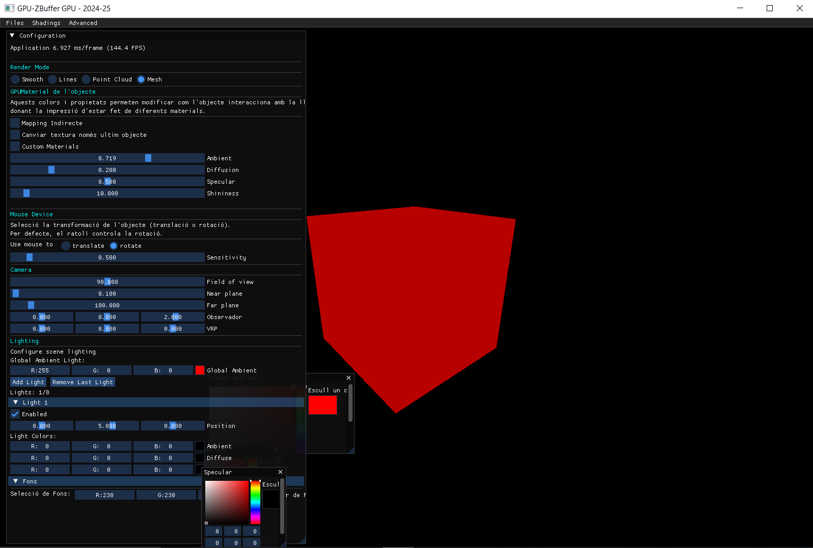
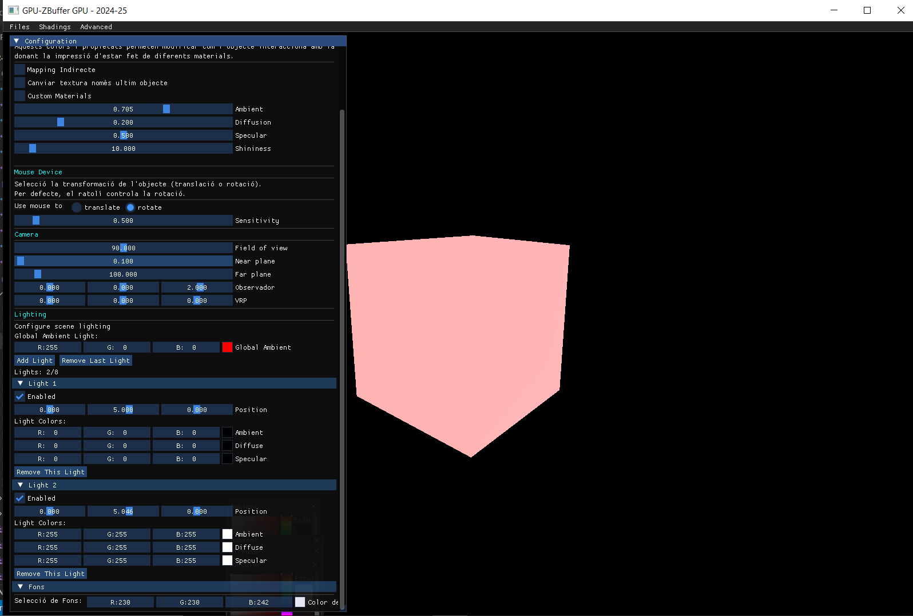
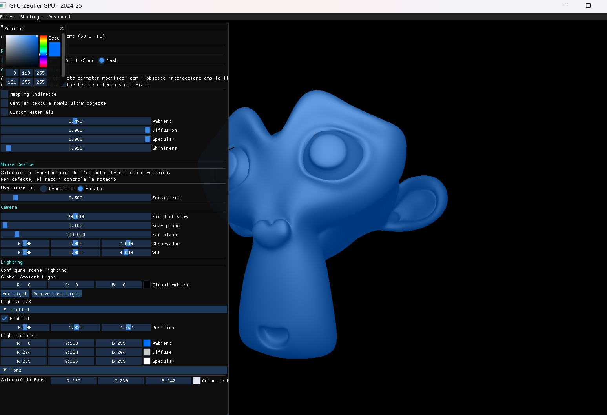
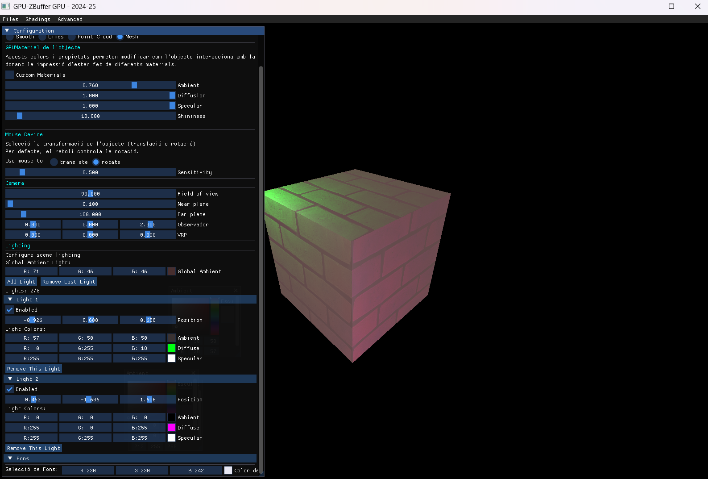
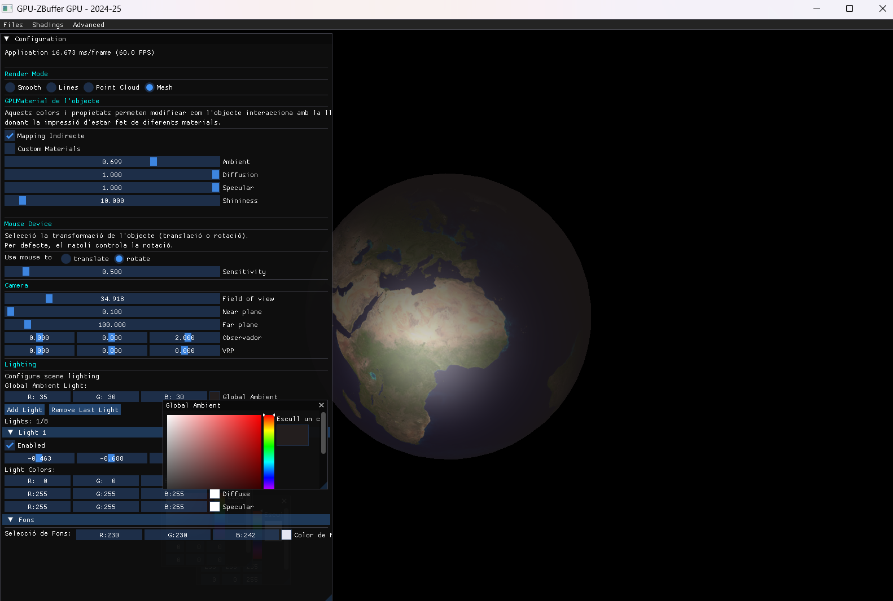
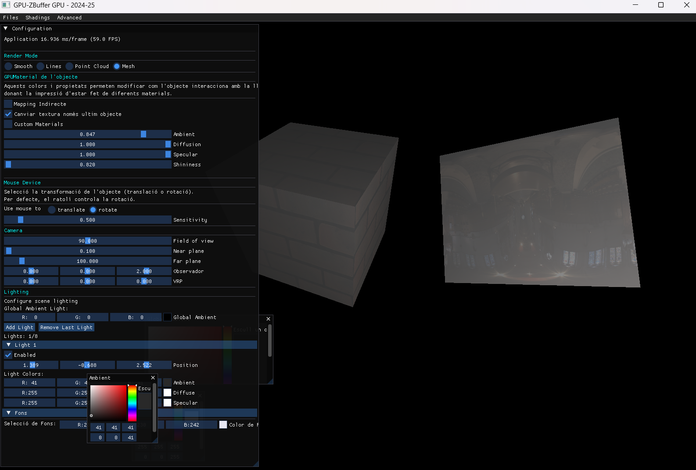
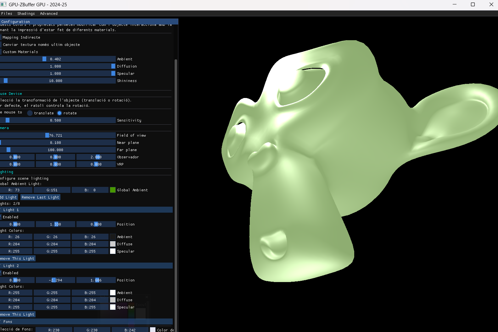
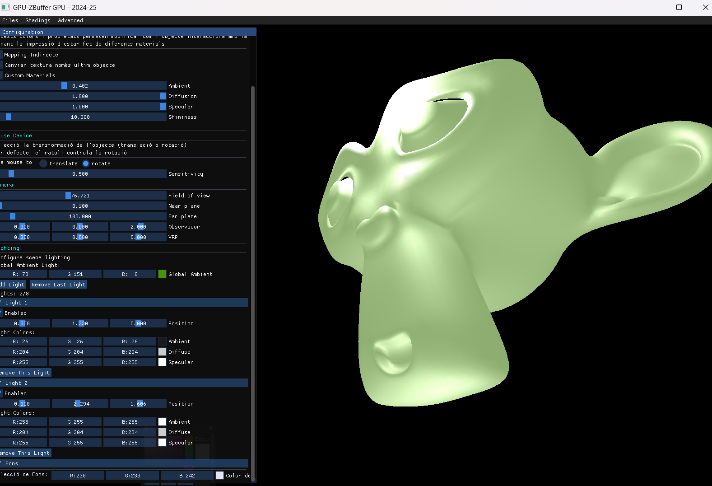
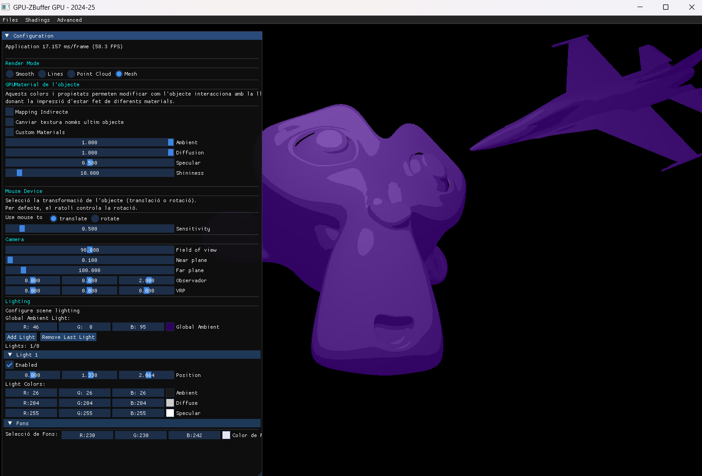
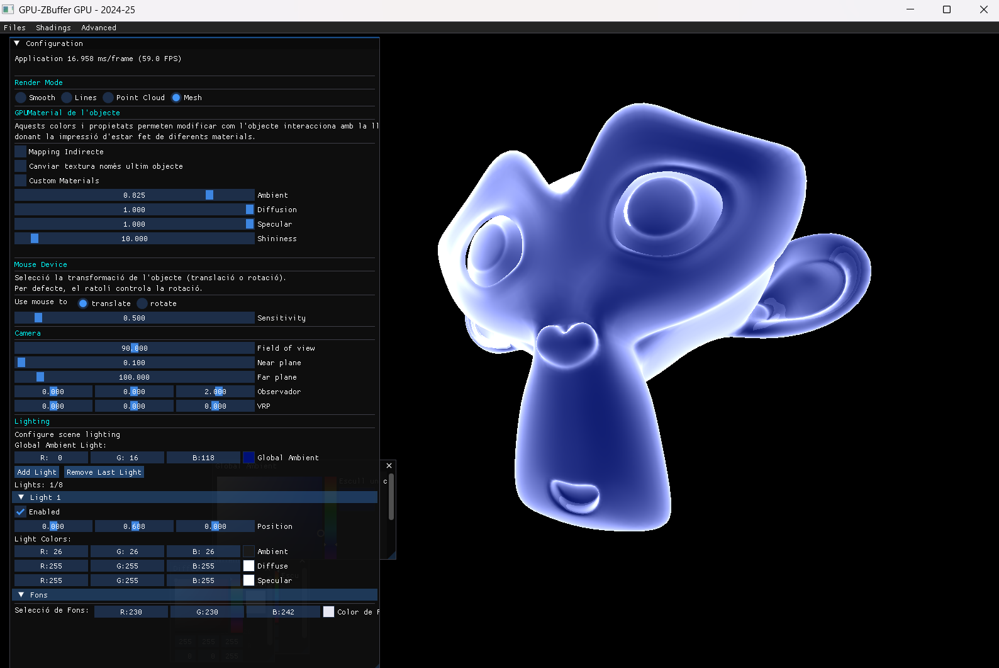

# p2-GPUToy: Pràctica 2 2024-25

En aquest fitxer cal que feu l'informe de la pràctica 2. Aneu omplint la informació que us demanem.

## Equip:

**Equip:** 

Grup BO8

Andres Rio Nogues        -- (AndresRioo)
Francesc Navarro Vazquez -- (quico16)


## Informe de progrés

Cal que aneu indicant a cada fitxa les tasques que heu realitzat i les que no, donant resposta a les preguntes que es formulen en l'enunciat.


### Features (marqueu les que heu fet i qui les ha fet)

- Fitxa 2:
    - [ ] PAS 1
        [ Francesc Navarro] PAS 1.1. Càlcul translacions de l’escena	
        [Francesc Navarro i Andres Rio ] PAS 1.2. Mou només el darrer objecte que s’ha carregat
        - Estudiants que hi han participat :	
    - [ ] PAS 2: Pas de les llums a la GPU	
        [ Andres Rio] PAS 2.1. Pas de la llum ambient global a la GPU	
        [ Andres Rio] PAS 2.2. Pas d’una llum de tipus puntual a la GPU	
        [ Andres Rio] PAS 2.3. Pas d’un conjunt de llums a la GPU	
        - Estudiants que hi han participat :
    - PAS 3. Modificació de la classe Material i pas a la GPU dels valors de materials	
        [Andres Rio ] PAS 3.1. Modificació de la classe Material	
        - Estudiants que hi han participat :
    - PAS 4. Implementació de shadings (Normal i Phong shading)	
        [Francesc Navarro ] PAS 4.1. Normal Shading
        [ Andres Rio] PAS 4.1. Phong shading
        - Estudiants que hi han participat :	
    
- Fitxa 3:
    - [ Andres Rio] PAS 1. Textures
    - Estudiants que hi han participat :

- Opcionals:
  - [ Andres Rio] Gouraud shading
  - [ Francesc Navarro] Cel o Toon Shading (tècnica no realista)
  - [ Andres Rio] Èmfasi de siluetes
  - [ ] Càrrega de materials des de mtl
  - [ Andres Rio] Textures per objecte
  - [ Andres Rio] Indirect mapping
  - [ ] Environmental mapping
  - [ ] Reflexions amb el background
  - [ ] Transparències amb el background


### Explicació de la pràctica    
  * **Organització de la pràctica**
    * Descriu com us heu organitzat :

    
  * **Decisions a destacar**
    * Comenteu les decisions que heu pres :

### Screenshots

Per tal de documentar els vostres resultats, és important que adjunteu imatges amb el resultat i quan convingui, captures de pantalla amb la configuració que el genera. Per totes les imatges cal incloure un peu d'imatge indicant què es mostra, i tota la informació necessària per reproduïr l'imatge (la configuració, els objectes i les seves propietats, llums, ...)


# Fitxa 2

## Pas 1 : Translacions 

***PAS 1.1. Càlcul translacions de l’escena***

En mode translació (config.mouseMode ≠ 1), es calcula el desplaçament del ratolí en píxels (dx i dy). Aquest desplaçament s’escala segons la sensibilitat definida a config i s’acumula en el vector accumulatedTranslation, que representa la translació total aplicada fins al moment.

Guardem aquest valor acumulat per mantenir la posició actual de l’objecte; si no ho féssim, cada nova translació o rotació el tornaria a la posició original.

Finalment, aquest vector s’utilitza per construir la matriu de transformació mitjançant glm::translate.

```c++

...

    // inicialització de la configuració
    config = GPUConfig(w, h); 
    transform = glm::mat4(1.0f);
    accumulatedTranslation = glm::vec3(0.0f, 0.0f, 0.0f);

...

void GLWidget::mouseMoveEvent(GLFWwindow* window, double xpos, double ypos)
{
    if (mousePressed) {
        double dx = xpos - lastMouseX;
        double dy = ypos - lastMouseY;

        lastMouseX = xpos;
        lastMouseY = ypos;
       
        transform = glm::mat4(1.0f);
       
        // Update rotation angles based on mouse movement
        if (config.mouseMode == 1) {
            // Rotació
            float newXRot = xRot + float(dy * config.sensitivityAmount);
            float newYRot = yRot + float(dx * config.sensitivityAmount);
        
            setXRotation(newXRot);
            setYRotation(newYRot);
        } else {
            // Translació
            float deltaX = float(dx * config.sensitivityAmount * 0.01f);  
            // Ajusta escala per evitar que pixels = unitats de mon
            float deltaY = float(-dy * config.sensitivityAmount * 0.01f); // Invertit per eix Y
        
            accumulatedTranslation += glm::vec3(deltaX, deltaY, 0.0f);
        }
        

        transform = glm::mat4(1.0f);

        // Aplicar translació acumulada
        transform = glm::translate(transform, accumulatedTranslation);
        
        transform = glm::rotate(transform, zRot, glm::vec3(0.0f, 0.0f, 1.0f));
        transform = glm::rotate(transform, xRot, glm::vec3(1.0f, 0.0f, 0.0f));
        transform = glm::rotate(transform, yRot, glm::vec3(0.0f, 1.0f, 0.0f));
        
        // Enviar la matriu de transformació a la GPU
        world->aplicaTG(transform);
    
    }
}
```

***PAS 1.2. Mou només el darrer objecte que s’ha carregat***


Ara cal modificar només el darrer objecte. Per aconseguir això primer cal canviar el mouseMoveEvent per a que en comptes de enviar la matriu de transformació a la GPU per a tota l'escena, només tingui en compte el darrer objecte amb el mètode `setTGLastObject()` que aquest simplement truca al mètode `setTGLastObject()` de la clase `GPUScene`. 

El mètode `setTGLastObject()` s’encarrega de passar la transformació només a l’últim objecte de la llista


```c++

void GLWidget::mouseMoveEvent(GLFWwindow* window, double xpos, double ypos)
{
    if (mousePressed) {
        double dx = xpos - lastMouseX;
        double dy = ypos - lastMouseY;

        lastMouseX = xpos;
        lastMouseY = ypos;
       
        transform = glm::mat4(1.0f);
       
        // Update rotation angles based on mouse movement
        if (config.mouseMode == 1) {
            // Rotació
            float newXRot = xRot + float(dy * config.sensitivityAmount);
            float newYRot = yRot + float(dx * config.sensitivityAmount);
        
            setXRotation(newXRot);
            setYRotation(newYRot);
        } else {
            // Translació
            float deltaX = float(dx * config.sensitivityAmount * 0.01f);  
             // Ajusta escala per evitar que pixels = unitats de mon 

            float deltaY = float(-dy * config.sensitivityAmount * 0.01f); // Invertit per eix Y
        
            accumulatedTranslation += glm::vec3(deltaX, deltaY, 0.0f);
        }
        
        // TO DO - Implementar la translació amb el ratolí

        transform = glm::mat4(1.0f);

        // Aplicar translació acumulada
        transform = glm::translate(transform, accumulatedTranslation);
        
        transform = glm::rotate(transform, zRot, glm::vec3(0.0f, 0.0f, 1.0f));
        transform = glm::rotate(transform, xRot, glm::vec3(1.0f, 0.0f, 0.0f));
        transform = glm::rotate(transform, yRot, glm::vec3(0.0f, 1.0f, 0.0f));
        
        /* versió original
        // Enviar la matriu de transformació a la GPU
        world->aplicaTG(transform);
        */

        // només últim objecte
        world->setTGLastObject(transform);
    
    }
}
```

Un cop estem en la clase `GPUScene` executem un nou mètode de object que simplement canvia la seva matriu `modelMatrix` abans de trucar al `draw()`, fent que només aquest cub sigui afectat per les transformacions. 

Per evitar que un nou cub "hereti" la transformació anterior (rotació o translació), cal reiniciar els valors després d’afegir-lo:

```c++

// CLASE GPU SCENE

void setTGLastObject(glm::mat4 m) {
        // TO DO: Implementar la transformació de l'últim objecte afegit
        if (!objects.empty()) {
            objects.back()->setModelMatrix(m);
        }
    }

```

```c++

// CLASE GLWIDGET per reiniciar valors de rotació i translació  del cub i de la mesh hem fet les següents modificacions

void GLWidget::addCube() {
    auto c = new Cub();
    c->make();

    // TO DO Fitxa 2: Cal afegir Material de forma aleatòria

    world->addObject(shared_ptr<Object>(c));
    // Cal actualitzar la GPU amb el nou objecte
    world->lastObjectToGPU(program->getId());
    world->aplicaTG(transform);

    // Reset transformación para no heredar la del cubo anterior
    transform = glm::mat4(1.0f);  
    accumulatedTranslation = glm::vec3(0.0f); 

    xRot = 0.0f;
    yRot = 0.0f;
    zRot = 0.0f;

    transform = glm::rotate(transform, zRot, glm::vec3(0.0f, 0.0f, 1.0f));
    transform = glm::rotate(transform, xRot, glm::vec3(1.0f, 0.0f, 0.0f));
    transform = glm::rotate(transform, yRot, glm::vec3(0.0f, 1.0f, 0.0f));


}


void GLWidget::loadObject(const char* filename) {
    // Load object from file
    // This function should load the object from the specified file
    // and update the object in the scene
    auto mesh = make_shared<Mesh>(filename);
    mesh->make(config.mappingIndirecte);
    
    // TO DO Fitxa 2: Cal afegir Material a l'objecte de forma aleatòria

    world->addObject(shared_ptr<Object>(mesh));

    // Cal actualitzar la GPU amb el nou objecte
    world->lastObjectToGPU(program->getId());
    world->aplicaTG(transform);

    // Reset transformación para no heredar la del cubo anterior
    transform = glm::mat4(1.0f);  
    accumulatedTranslation = glm::vec3(0.0f); 

    xRot = 0.0f;
    yRot = 0.0f;
    zRot = 0.0f;

    transform = glm::rotate(transform, zRot, glm::vec3(0.0f, 0.0f, 1.0f));
    transform = glm::rotate(transform, xRot, glm::vec3(1.0f, 0.0f, 0.0f));
    transform = glm::rotate(transform, yRot, glm::vec3(0.0f, 1.0f, 0.0f));
    
}

```

``` c++

// Clase Object

void Object::setModelMatrix(glm::mat4 m) {
    modelMatrix = m;  // Composa transformació
}


```


## Pas 2 : Pas de les llums a la GPU 

***PAS 2.1. Pas de la llum ambient global a la GPU***

En aquest pas hem d'implementar el métode `void ambientLightToGPU(GLuint program, vec3 a)` de la clase `GPULightsManager`. Aquest métode pasa a la GPU com uniform el vector de la llum ambient, ja que és igual per a tots els objectes de l'escena. 

``` c++

  // CLASE GPULightsManager

  void ambientLightToGPU(GLuint program, vec3 a) {
      ambientLight = a;
      // TO DO: Enviar la llum ambient global a la GPU i revisar des d'on es crida aquest mètode

      GLuint llumAmbient; 
      llumAmbient = glGetUniformLocation(program, "ambientGlobal");
      glUniform3fv(llumAmbient, 1, glm::value_ptr(ambientLight) ); 

  }

```

Per fer-ho cal agafar la referencia del vector de la GPU  `ambientGlobal` i pasar-li les direccions del vector de la llum ambient. 


``` glsl

#version 330 core

layout (location = 0) in vec4 vPosition;
layout (location = 1) in vec4 vColor;

uniform mat4 modelMatrix;
uniform mat4 viewMatrix;
uniform mat4 projectionMatrix;

out vec4 color;

uniform vec3 ambientGlobal;


void main() {
    // Calculate world space position
    gl_Position = projectionMatrix*viewMatrix*modelMatrix * vPosition;

    // Calculate the color out multiplying each factor ( rgb * light and alpha channel )
    color = vec4(vColor.rgb * ambientGlobal, vColor.a);

}

```

Al codi glsl, en comptes de retornar el color directament, el ponderem amb la llum (només les components rgb).


Sobre el tema de quan inicialitzar aquest uniform, caldria fer-ho després de activar el shader, per assegurar que la llum es guardi en el shader actiu. 

```c++

void GLWidget::initializeGL()
{
    // inicialitzacions OpenGL
    setupOpenGLFeatures();
    
    // Inicialitzacions dels shaders
    std::cout << "Inicialització dels shaders\n";
    initShadersGPU();

    // Creació dels objectes de l'escena
    std::cout << "Inicialització del mon virtual\n";
    initWorld();  

    // Activació del shader per defecte i enviament del mon a la GPU
    activateShader("Color", NULL);

    world->updateAmbientLight(program->getId(), config.ambientColor);
}

```


***PAS 2.2. Pas d’una llum de tipus puntual a la GPU***

En aquest pas cal implementar els métodes `toGPU()` de la classe `GPULight` i `GPUPointLight`, per poder implementar la 
clase `GPULightsManager` i poder pasar tota la info de la llum a la GPU.

```c++
void GPULight::toGPU(GLuint p) {
    // TO DO: enviar les propietats de Ia, Id, Is i enabled a la GPU. Pas 2.2
    program = p;

    
    struct {
        GLint ambient;
        GLint difosa;
        GLint especular;
        GLint enabled;
    } componentsLlumLoc;

    componentsLlumLoc.ambient   = glGetUniformLocation(program, "llumComponents.ambient");
    componentsLlumLoc.difosa    = glGetUniformLocation(program, "llumComponents.difosa");
    componentsLlumLoc.especular = glGetUniformLocation(program, "llumComponents.especular");
    componentsLlumLoc.enabled   = glGetUniformLocation(program, "llumComponents.enabled");

    glUniform3fv(componentsLlumLoc.ambient,   1, glm::value_ptr(this->getIa()));
    glUniform3fv(componentsLlumLoc.difosa,    1, glm::value_ptr(this->getId()));
    glUniform3fv(componentsLlumLoc.especular, 1, glm::value_ptr(this->getIs()));
    glUniform1i(componentsLlumLoc.enabled, this->enabled ? 1 : 0);
    
}
``` 

``` glsl

struct LlumPuntual {
    vec3 pos;
    float a;
    float b;
    float c;
};

struct LlumComponents {
    vec3 ambient;
    vec3 difosa;
    vec3 especular;
    int enabled; 
};


```

Aquest mètode associa el program de shader actiu i envia les propietats bàsiques de la llum (components ambient, difusa, especular i si està activada o no) mitjançant uniform variables. Aquestes dades es podran utilitzar dins del shader per calcular la il·luminació de l’escena.

El mètode `toGPU()` s’ha de cridar quan es crea la llum per primera vegada, dins de `initializeGL()`, i serveix per passar tota la informació inicial del conjunt de llums.

Quan es modifiquen les propietats d’una llum (per exemple, s’activa o desactiva, o es canvia la intensitat), no cal tornar a enviar totes les llums amb `toGPU()`, sinó que només caldria actualitzar la llum concreta amb el mètode `updateToGPU(index)`.

A més, si es canvia de shader (és a dir, el program), sí cal tornar a cridar `toGPU()`, ja que els uniform locations canvien i s’han de tornar a obtenir i assignar correctament.

Mitjançant el GPULightsManager es pot fer aquesta gestió centralitzada, i comprovar amb la visualització (color) que les components s’estan enviant i aplicant correctament.

***PAS 2.3. Pas d’un conjunt de llums a la GPU***

Per enviar múltiples llums a la GPU, hem definit dues estructures GLSL

``` glsl

struct LlumPuntual {
    vec3 pos;
    float a;
    float b;
    float c;
};

struct LlumComponents {
    vec3 ambient;
    vec3 difosa;
    vec3 especular;
    int enabled; // usem int perquè GLSL pot tenir problemes amb bools en structs
};


uniform LlumPuntual llumsPuntuals[8];
uniform LlumComponents llumsComponents[8]; //array de llums


```

A la CPU, cada llum es pot enviar a la GPU mitjançant el mètode updateToGPU(index), que escriu dins dels arrays de uniforms corresponents:

``` c++

void GPULight::updateToGPU(int index) {
    // TO DO: actualitzar les propietats de la llum a la GPU. Pas 2.3
    // Cal obtenir els identificadors de les variables uniform de la GPU
    // i actualitzar els seus valors amb les propietats de la llum
    
    std::string idx = std::to_string(index);

    GLint locAmbient   = glGetUniformLocation(program, ("llumsComponents[" + idx + "].ambient").c_str());
    GLint locDifosa    = glGetUniformLocation(program, ("llumsComponents[" + idx + "].difosa").c_str());
    GLint locEspecular = glGetUniformLocation(program, ("llumsComponents[" + idx + "].especular").c_str());
    GLint locEnabled   = glGetUniformLocation(program, ("llumsComponents[" + idx + "].enabled").c_str());

    glUniform3fv(locAmbient,   1, glm::value_ptr(this->getIa()));
    glUniform3fv(locDifosa,    1, glm::value_ptr(this->getId()));
    glUniform3fv(locEspecular, 1, glm::value_ptr(this->getIs()));
    glUniform1i(locEnabled, this->enabled ? 1 : 0);

    
}

```


``Quan l’hauries cridar a updateAllLights()? ``

Aquest mètode s'hauria de cridar només al canviar diverses llums. Això només pasa al canviar de shader, que cal canviar tota la localització dels uniforms i tornar a reenviar la info. Amb la nostra GUI, només podem canviar la informació de les llums de forma individual, llavors sempre tindriem que utilitzar el `updateSingleLight()` al canviar la configuració de les nostres llums. 


``Quan comproves si la llum està activada (enabled) o no? A la CPU o a la GPU? Raona la teva resposta.`` 

Les nostres llums mantenen la informació de si estan actives o no (variable enabled). Cal enviar-lo a la GPU ja que la GPU és qui realitza els càlculs d’il·luminació per píxel o per vertex. Per tant, tot el que afecta el resultat final ha de ser conegut dins del shader. El valor de enabled que decideix si una llum contribueix o no al càlcul ha d’estar disponible a la GPU via uniform.


## Pas 3 : Modificació de la classe Material i pas a la GPU dels valors de materials	 

***PAS 3.1. Modificació de la classe Material***

Primer pasem les dades de la CPU a la GPU mitjançant structs 

``` glsl

uniform struct {
    vec3 ambient;
    vec3 diffuse;
    vec3 specular;
    float shininess;
} material ;


```


``` c++

void GPUMaterial::toGPU(GLuint program) {
    // Set material properties to GPU
    // TO DO: PAS 3.1: Enviar les propietats del material a la GPU

    // Obtenir localitzadors dels uniforms a la GPU
    GLint locAmbient   = glGetUniformLocation(program, "material.ambient");
    GLint locDiffuse   = glGetUniformLocation(program, "material.diffuse");
    GLint locSpecular  = glGetUniformLocation(program, "material.specular");
    GLint locShininess = glGetUniformLocation(program, "material.shininess");

    // Enviar dades del material si els uniform existeixen
    if (locAmbient != -1)
        glUniform3fv(locAmbient, 1, glm::value_ptr(Ka));

    if (locDiffuse != -1)
        glUniform3fv(locDiffuse, 1, glm::value_ptr(Kd));

    if (locSpecular != -1)
        glUniform3fv(locSpecular, 1, glm::value_ptr(Ks));

    if (locShininess != -1)
        glUniform1f(locShininess, shininess);

}
```

``Des d’on es cridarà aquest mètode? Des del toGPU() d’objecte? Des del draw() d’objecte?``

El mètode GPUMaterial::toGPU(GLuint program) s’ha de cridar des de dins del mètode draw() de cada objecte, just abans de dibuixar-lo, per tal que cada objecte pugui configurar el seu material actual a la GPU.

A diferència de les llums (que poden ser compartides per tota l’escena), els materials són específics de cada objecte. Per tant, en cada draw() cal assegurar que el material de l’objecte que es dibuixa està actiu a la GPU en aquell moment, i això es fa cridant material->toGPU(program) dins de draw().


``Creació d'un nou shader vMaterialShader.glsl``

Creem un nou shader per a poder testejar que les components del objecte siguin les de l'interficie. Cal crear el nou cas d'ús a `GLWidget` i crear els nous archius de la següent manera:

``` glsl

//vMaterialShader.glsl

#version 330 core

layout (location = 0) in vec4 vPosition;

uniform mat4 modelMatrix;
uniform mat4 viewMatrix;
uniform mat4 projectionMatrix;

out vec3 materialColor;

struct Material {
    vec3 ambient;
    vec3 diffuse;
    vec3 specular;
    float shininess;
};

uniform Material material;

void main()
{
    gl_Position = projectionMatrix * viewMatrix * modelMatrix * vPosition;

    // materialColor = material.ambient;   // para testear Ka
    materialColor = material.diffuse;      // para testear Kd
    // materialColor = material.specular;  // para testear Ks
}


```

``` glsl

// fMaterialShader

#version 330 core

in vec3 materialColor;
out vec4 colorOut;

void main()
{
    colorOut = vec4(materialColor, 1.0);
}


```

Amb aquest shader podem comprobar que el material seleccionat a la nostra interficie es pasa correctament a la GPU.


``Si vols utilitzar diferents shaders en temps d'execució raona on s'inicialitzaran els shaders i com controlar quin shader s'usa? En alguns casos es voldrà fer reload dels shaders per no haver de tornar a executar de nou tota l’aplicació si es canvia algun fitxer glsl. Com activaràs aquesta utilitat des del menú de Shaders->Reload Shaders?``

Per poder canviar els shaders en temps d’execució, cal inicialitzar-los prèviament (a `initShadersGPU`) i activar el desitjat amb `program = shaderX; program->use();`. Si el nou shader utilitza atributs diferents o espera altres uniforms, tornem a carregar les dades a GPU amb `world->toGPU(program->getId())`.


``` c++
void GLWidget::initShadersGPU()
{
    shaderColor = make_shared<GPUShader>("Color", "vshader1.glsl", "fshader1.glsl");
    shaderTexture = make_shared<GPUShader>("Texture", "vshader2.glsl", "fshader2.glsl");
    shaderNormal = make_shared<GPUShader>("Normal", "vNormalShading.glsl", "fNormalShading.glsl");
    shaderPhong = make_shared<GPUShader>("Phong", "vPhongShader.glsl", "fPhongShader.glsl");
    shaderMaterial = make_shared<GPUShader>("Material", "vMaterialShader.glsl", "fMaterialShader.glsl");

    // shaders per defecte
    program = shaderColor;
}

void GLWidget::activateShader(const char* typeShader, const char* nameTexture) {

    // TO DO: Modificar el mètode per a poder suportar més tipus de shaders
    if (std::strcmp(typeShader,"Color")==0) {
        program = shaderColor;
        program->use();
        world->toGPU(program->getId());
    } else if (std::strcmp(typeShader, "Texture")==0) {
        program = shaderTexture;
        program->use();
        world->toGPUTexture(program->getId());
       if (nameTexture != NULL && nameTexture[0] != '\0') {
            world->initTextureGL(nameTexture);
        } else {
            std::cerr << "ERROR: No hi ha nom de textura." << std::endl;
        }
    } else if(std::strcmp(typeShader, "Normal")==0){
        program = shaderNormal;
        program->use();
        world->toGPU(program->getId());
    }else if(std::strcmp(typeShader, "Phong")==0){
        program = shaderPhong;
        program->use();
        world->toGPU(program->getId());
    }else if(std::strcmp(typeShader, "Material")==0){
        program = shaderMaterial;
        program->use();
        world->toGPU(program->getId());
    } else {
        std::cerr << "Error: Tipus de shader desconegut." << std::endl;
    }
    world->aplicaTG(transform);
}
```

## Pas 4 : Implementació de shadings (Normal i Phong shading)	 

***PAS 4.1. Normal Shading***

Per crear el Normal Shading, hem definit el següent parell  vèrtex-fragment:

vèrtex Normal Shading

```glsl

#version 330 core

layout(location = 0) in vec4 vPosition;   // Posición del vértice
layout(location = 1) in vec4 vNormal;     // Normal del vértice

uniform mat4 modelMatrix;
uniform mat4 viewMatrix;
uniform mat4 projectionMatrix;

out vec3 normalColor;

void main()
{
    // Transformación de la posición
    gl_Position = projectionMatrix * viewMatrix * modelMatrix * vPosition;

    // Transformación de la normal al espacio del mundo
    vec3 normal = normalize(mat3(modelMatrix) * vNormal.xyz);

    // Mapeamos [-1,1] a [0,1] para visualizar como color
    normalColor = normal * 0.5 + 0.5;
}

```
fragment Normal Shading

```glsl
#version 330 core

in vec3 normalColor;
out vec4 fragColor;

void main()
{
    fragColor = vec4(normalColor, 1.0);  // Pintamos según normal
}

´´´

A part, hem afegit el següent atribut a la classe GLWidget.hpp, i hem modificat els metodes initShadersGPU() i activateShader() per afegir el nou shader.

``` c++
    shared_ptr<GPUShader> shaderNormal;


    void GLWidget::initShadersGPU()
    {
        shaderColor = make_shared<GPUShader>("Color", "vshader1.glsl", "fshader1.glsl");
        //shaderTexture = make_shared<GPUShader>("Texture", "vshader2.glsl", "fshader2.glsl");
        shaderNormal = make_shared<GPUShader>("Normal", "vNormalShading.glsl", "fNormalShading.glsl");
        shaderPhong = make_shared<GPUShader>("Phong", "vPhongShader.glsl", "fPhongShader.glsl");    
        shaderMaterial = make_shared<GPUShader>("Material", "vMaterialShader.glsl", "fMaterialShader.glsl");

        shaderTexture = make_shared<GPUShader>("Texture", "vTextureShader.glsl", "fTextureShader.glsl");

        // shaders per defecte
        program = shaderColor;
    }


    void GLWidget::activateShader(const char* typeShader, const char* nameTexture) {

        // TO DO: Modificar el mètode per a poder suportar més tipus de shaders
        if (std::strcmp(typeShader,"Color")==0) {
            program = shaderColor;
            program->use();
            world->toGPU(program->getId());
        } else if (std::strcmp(typeShader, "Texture")==0) {
            program = shaderTexture;
            program->use();
            world->toGPUTexture(program->getId());
        if (nameTexture != NULL && nameTexture[0] != '\0') {
                world->initTextureGL(nameTexture);
            } else {
                std::cerr << "ERROR: No hi ha nom de textura." << std::endl;
            }
        } else if(std::strcmp(typeShader, "Normal")==0){
            program = shaderNormal;
            program->use();
            world->toGPU(program->getId());
        }else if(std::strcmp(typeShader, "Material")==0){
            program = shaderMaterial;
            program->use();
            world->toGPU(program->getId());
        } else {
            std::cerr << "Error: Tipus de shader desconegut." << std::endl;
        }
        world->aplicaTG(transform);
    }
```

Per acabar, hem hagut de modificar les classes de Mesh.cpp per calcular les normals de manera correcta. També hem hagut de modificar la classe object, per a passar el vector de normals a la GPU.

```c++
void Object::toGPU(GLuint p)
{
    this->program = p;
    
    glGenVertexArrays(1, &VAO);
	glGenBuffers(1, &vertex_buffer);
    
    
    
    //glGenBuffers(1, &color_buffer);  ?? quitar color buffer? (paso 3.1)
    
    
    
    glGenBuffers(1, &normal_buffer);  //buffer para las normales

    glBindVertexArray(VAO);
	// Bind vertices to layout location 0
	glBindBuffer(GL_ARRAY_BUFFER, vertex_buffer );
	glBufferData(GL_ARRAY_BUFFER, sizeof(vec4) * objectVertices.size(), &objectVertices[0], GL_STATIC_DRAW);
	glEnableVertexAttribArray(0); // This allows usage of layout location 0 in the vertex shader
	glVertexAttribPointer(0, 4, GL_FLOAT, GL_FALSE, 4 * sizeof(GLfloat), 0);
    /*
	// Bind normals to layout location 1
	glBindBuffer(GL_ARRAY_BUFFER, color_buffer );
	glBufferData(GL_ARRAY_BUFFER, sizeof(vec4) * objectColors.size(), &objectColors[0], GL_STATIC_DRAW);
	glEnableVertexAttribArray(1); // This allows usage of layout location 1 in the vertex shader
	glVertexAttribPointer(1, 4, GL_FLOAT, GL_FALSE, 4 * sizeof(GLfloat), 0);
    */
    // TO DO: A modificar per a considerar les normals

    // ----- Normals: location = 1 -----
    glBindBuffer(GL_ARRAY_BUFFER, normal_buffer);
    glBufferData(GL_ARRAY_BUFFER, sizeof(vec4) * objectNormals.size(), &objectNormals[0], GL_STATIC_DRAW);
    glEnableVertexAttribArray(1);
    glVertexAttribPointer(1, 4, GL_FLOAT, GL_FALSE, 0, 0);

	glBindBuffer(GL_ARRAY_BUFFER, 0);
	glBindVertexArray(0);

    
    
void Mesh::make(bool mappingIndirecte) {
   // Cal passar els vertexs, les cares i les normals a les
   // estructures per ser llegides a la GPU en els buffers corresponents

    // TO DO Pràctica 2: Crear estructures de normals i textures per a l'objecte
    
    for (int i = 0; i < cares.size(); i++) {
        Face f = cares[i];
        for (int j = 0; j < f.idxVertices.size(); j++) {


            
            int idxV = f.idxVertices[j];
            objectVertices.push_back(vertexs[idxV]);

            if (!f.idxNormals.empty()) {
                int idxN = f.idxNormals[j];
                objectNormals.push_back(normalsVertexs[idxN]);
            }
            

            // FITXA 3
            // carregar les coordenades de textura

            
            if (!mappingIndirecte)
            {
                // DIRECT MAPPING
                if (f.idxTextures.size() > 0) {
                    int idxT = f.idxTextures[j];
                    objectTextures.push_back(textVertexs[idxT]);
                }

            } else {
                
                // INDIRECT 
                idxV = f.idxVertices[j];
                vec3 p = vec3(vertexs[idxV]); // assume que són vec4

                vec3 center = vec3(0.0f); // suposar que el centre és (0,0,0)

                vec3 d = normalize(p - center); // vector unitari de p fins al centre

                float u = 0.5f - atan2(d.z, d.x) / (2.0f * M_PI);
                float v = 0.5f - asin(d.y) / M_PI;

                objectTextures.push_back(vec2(u, v));

            }
            


            /*
            int idx = f.idxVertices[j];
            objectVertices.push_back(vertexs[idx]);
            
            // Assignem un color aleatori a cada vertex
            vec4 color = vec4((rand() % 100) / 100.0, (rand() % 100) / 100.0, (rand() % 100) / 100.0, 1.0);
            objectColors.push_back(color);
            */


            
        }
        // TO DO: PAS 4.1. Cal posar les normals i 
        // TO DO: Fitxa 3. Cal posarles coordenades de textura als vectors de dades per poder passar-les a la GPU
    }
}

}
```


***PAS 4.2. Phong shading***

Per fer-ho hem hagut de crear un parell vèrtex-fragment com hem fet en el normal shading.

vertex phong shading

```glsl
#version 330 core

layout(location = 0) in vec4 vPosition;
layout(location = 1) in vec4 vNormal;

uniform mat4 modelMatrix;
uniform mat4 viewMatrix;
uniform mat4 projectionMatrix;

out vec3 fragNormal;
out vec3 fragPosition;

void main()
{
    vec4 worldPos = modelMatrix * vPosition;
    fragPosition = vec3(worldPos);

    // Transformamos la normal correctamente
    fragNormal = normalize(mat3(transpose(inverse(modelMatrix))) * vNormal.xyz);

    gl_Position = projectionMatrix * viewMatrix * worldPos;
}

```

fragment phong shading

```glsl
#version 330 core

in vec3 fragNormal;
in vec3 fragPosition;

out vec4 fragColor;

uniform vec3 viewPos;

uniform vec3 ambientGlobal;


struct LlumPuntual {
    vec3 pos;
    float a; // constante
    float b; // lineal
    float c; // cuadrática
};

struct LlumComponents {
    vec3 ambient;
    vec3 difosa;
    vec3 especular;
    int enabled;
};

struct Material {
    vec3 ambient;
    vec3 diffuse;
    vec3 specular;
    float shininess;
};

uniform int numLights;
uniform LlumPuntual llumsPuntuals[8];
uniform LlumComponents llumsComponents[8];
uniform Material material;

void main()
{

    // TESTING DE LA INFORMACIO
    //fragColor = vec4(llumsComponents[0].ambient, 1.0);
    //fragColor = vec4(material.ambient, 1.0);
    //fragColor = vec4(llumsPuntuals[0].pos, 1.0);

    vec3 N = normalize(fragNormal);
    vec3 V = normalize(viewPos - fragPosition);

    vec3 result = vec3(0.0);

    for (int i = 0; i < 8; ++i) {
        if (llumsComponents[i].enabled == 1) {
            vec3 L = normalize(llumsPuntuals[i].pos - fragPosition);
            vec3 H = normalize(L + V);
            float d = length(llumsPuntuals[i].pos - fragPosition);
            float att = 1.0 / (llumsPuntuals[i].a + llumsPuntuals[i].b * d + llumsPuntuals[i].c * d * d);

            float NdotL = max(dot(N, L), 0.0);
            float NdotH = max(dot(N, H), 0.0);

            vec3 ambient  = llumsComponents[i].ambient   * material.ambient;
            vec3 diffuse  = llumsComponents[i].difosa    * material.diffuse  * NdotL;
            vec3 specular = llumsComponents[i].especular * material.specular * pow(NdotH, material.shininess);

            result += ambient + att * (diffuse + specular);
        }
    }

    result += ambientGlobal * material.ambient;

    fragColor = vec4(clamp(result, 0.0, 1.0), 1.0);
}

```

També, com en el normal shading hem afegit el següent atribut a la classe GLWidget.hpp, i hem modificat els metodes initShadersGPU() i activateShader() per afegir el nou shader.

```c++
shared_ptr<GPUShader> shaderPhong;


void GLWidget::initShadersGPU()
{
    shaderColor = make_shared<GPUShader>("Color", "vshader1.glsl", "fshader1.glsl");
    
    shaderNormal = make_shared<GPUShader>("Normal", "vNormalShading.glsl", "fNormalShading.glsl");
    shaderPhong = make_shared<GPUShader>("Phong", "vPhongShader.glsl", "fPhongShader.glsl");    
    shaderMaterial = make_shared<GPUShader>("Material", "vMaterialShader.glsl", "fMaterialShader.glsl");

    shaderTexture = make_shared<GPUShader>("Texture", "vTextureShader.glsl", "fTextureShader.glsl");
    //shaderTexture = make_shared<GPUShader>("Texture", "vshader2.glsl", "fshader2.glsl");

    // shaders per defecte
    program = shaderColor;
}

void GLWidget::activateShader(const char* typeShader, const char* nameTexture) {

    // TO DO: Modificar el mètode per a poder suportar més tipus de shaders
    if (std::strcmp(typeShader,"Color")==0) {
        program = shaderColor;
        program->use();
        world->toGPU(program->getId());
    } else if (std::strcmp(typeShader, "Texture")==0) {
        program = shaderTexture;
        program->use();

        updateAllLights();
        updateGlobalAmbientLight();
        updateMaterial();

        world->toGPUTexture(program->getId());

        

       if (nameTexture != NULL && nameTexture[0] != '\0') {
            world->initTextureGL(nameTexture, config.changeLastObjectTexture);
        } else {
            std::cerr << "ERROR: No hi ha nom de textura." << std::endl;
        }

        

    } else if(std::strcmp(typeShader, "Normal")==0){
        program = shaderNormal;
        program->use();
        world->toGPU(program->getId());
    }else if(std::strcmp(typeShader, "Phong")==0){
        program = shaderPhong;
        program->use();
        world->toGPU(program->getId());

        updateAllLights();
        updateGlobalAmbientLight();
        updateMaterial();

    }else if(std::strcmp(typeShader, "Material")==0){
        program = shaderMaterial;
        program->use();
        world->toGPU(program->getId());

        updateAllLights();
        updateGlobalAmbientLight();
        updateMaterial();

    } else {
        std::cerr << "Error: Tipus de shader desconegut." << std::endl;
    }
    world->aplicaTG(transform);
}
```


Per comprovar que el Phong Shading dona un resultat correcte posarem dues imatges d'un cub amb diferents llums i materials de manera que per a cada configuració de l'escena donarà un resultat diferent però amb sentit d'acrod a la configuració.





Com es pot observar, al afegir una nova llum a la mateixa posició, però que les seves components ambient, especular i difusa són blanques, fa que el color final sigui diferent degut a la formula del phong shading



# Fitxa 3

***PAS 1 : Textures***

Per comprobar que les textures es pasen correctament a la nostra GPU usem el vshader2.glsl i fshader2.glsl, on apliquem la textura com a color base :

``` glsl

// vshader2 shader

#version 330

layout (location = 0) in vec4 vPosition;
layout (location = 1) in vec4 vColor;
layout (location = 2) in vec2 vCoordTexture;

uniform mat4 modelMatrix;
uniform mat4 viewMatrix;
uniform mat4 projectionMatrix;

out vec4 color;
out vec2 v_texcoord;

void main()
{
   // Calculate world space position
    gl_Position = projectionMatrix*viewMatrix*modelMatrix * vPosition;
    color = vColor;

  // Pas de les coordenades de textura al fragment shader
   v_texcoord = vCoordTexture;
  // El valor dels colors i les coordenades de textura s'interpolaran automaticament
  // en els pixels interiors a les cares dels polígons
   
}

```


``` glsl

// fshader2 shader

#version 330

in vec4 color;
in vec2 v_texcoord;
out vec4 colorOut;

uniform sampler2D textureMap;

void main()
{
  colorOut = vec4(texture(textureMap, v_texcoord).rgb, 1.0f);
}

```

Un cop comprobem que funciona, fem el nou parell de fragment i vertex shader `Texture` per fusionar el codi anterior amb el phong, sustituint la component difosa de blinn-Phong amb el color de la textura ponderada 75-25

``` glsl

// vTextureShader

#version 330 core

layout(location = 0) in vec4 vPosition;
layout(location = 1) in vec4 vColor;
layout(location = 2) in vec2 vTexCoord;
layout(location = 3) in vec4 vNormal;

uniform mat4 modelMatrix;
uniform mat4 viewMatrix;
uniform mat4 projectionMatrix;

out vec3 fragNormal;
out vec3 fragPosition;
out vec2 fragTexCoord;

void main() {


    vec4 worldPos = modelMatrix * vPosition; // phong
    fragPosition = vec3(worldPos); // phong
    fragNormal = normalize(mat3(transpose(inverse(modelMatrix))) * vNormal.xyz); // phong

    fragTexCoord = vTexCoord; // texture

    gl_Position = projectionMatrix * viewMatrix * worldPos;
}

```

``` glsl

// fTextureShader

#version 330 core

in vec3 fragNormal;
in vec3 fragPosition;
in vec2 fragTexCoord;

out vec4 fragColor;

uniform vec3 viewPos;
uniform vec3 ambientGlobal;

uniform sampler2D textureMap;

struct LlumPuntual {
    vec3 pos;
    float a;
    float b;
    float c;
};

struct LlumComponents {
    vec3 ambient;
    vec3 difosa;
    vec3 especular;
    int enabled;
};

struct Material {
    vec3 ambient;
    vec3 difosa;
    vec3 specular;
    float shininess;
};

uniform int numLights;
uniform LlumPuntual llumsPuntuals[8];
uniform LlumComponents llumsComponents[8];
uniform Material material;

void main() {
    vec3 N = normalize(fragNormal);
    vec3 V = normalize(viewPos - fragPosition);
    vec3 result = vec3(0.0);

    vec3 texColor = texture(textureMap, fragTexCoord).rgb;

    for (int i = 0; i < 8; ++i) {
        if (llumsComponents[i].enabled == 1) {
            vec3 L = normalize(llumsPuntuals[i].pos - fragPosition);
            vec3 H = normalize(L + V);
            float d = length(llumsPuntuals[i].pos - fragPosition);
            float att = 1.0 / (llumsPuntuals[i].a + llumsPuntuals[i].b * d + llumsPuntuals[i].c * d * d);

            float NdotL = max(dot(N, L), 0.0);
            float NdotH = max(dot(N, H), 0.0);

            vec3 ambient = llumsComponents[i].ambient * material.ambient;
            
            vec3 baseDiffuse = 0.75 * texColor + 0.25 * material.difosa;
            vec3 diffuse = llumsComponents[i].difosa * baseDiffuse * NdotL;

            vec3 specular = llumsComponents[i].especular * material.specular * pow(NdotH, material.shininess);
            result += ambient + att * (diffuse + specular);
        }
    }

    result += ambientGlobal * material.ambient;
    fragColor = vec4(clamp(result, 0.0, 1.0), 1.0);
}

```


També cal pasar la informació dels vèrtexs de textura associats a cada vèrtex de l'objecte dins el `make()`.


``` c++


void Mesh::make() {
   // Cal passar els vertexs, les cares i les normals a les
   // estructures per ser llegides a la GPU en els buffers corresponents

    // TO DO Pràctica 2: Crear estructures de normals i textures per a l'objecte
    
    for (int i = 0; i < cares.size(); i++) {
        Face f = cares[i];
        for (int j = 0; j < f.idxVertices.size(); j++) {


            
            int idxV = f.idxVertices[j];
            objectVertices.push_back(vertexs[idxV]);

            if (!f.idxNormals.empty()) {
                int idxN = f.idxNormals[j];
                objectNormals.push_back(normalsVertexs[idxN]);
            }
            

            // FITXA 3
            // carregar les coordenades de textura

            
            // DIRECT MAPPING
            if (f.idxTextures.size() > 0) {
                int idxT = f.idxTextures[j];
                objectTextures.push_back(textVertexs[idxT]);
            }
        }
      }
   }

```

A més de pasar la info de les normals al fer el `toGPUTexture()` i definir quan trucar al toGPU normal o amb textura
``` c++

// Mètode per passar els vertexs de textura a la GPU
void Object::toGPUTexture(GLuint p)
{
    this->program = p;
    
    glGenVertexArrays(1, &VAO);
	glGenBuffers(1, &vertex_buffer);
	glGenBuffers(1, &color_buffer);
    glGenBuffers(1, &texture_buffer);

    glBindVertexArray(VAO);
	// Bind vertices to layout location 0
	glBindBuffer(GL_ARRAY_BUFFER, vertex_buffer );
	glBufferData(GL_ARRAY_BUFFER, sizeof(vec4) * objectVertices.size(), &objectVertices[0], GL_STATIC_DRAW);
	glEnableVertexAttribArray(0); // This allows usage of layout location 0 in the vertex shader
	glVertexAttribPointer(0, 4, GL_FLOAT, GL_FALSE, 4 * sizeof(GLfloat), 0);

    
	// Bind colors to layout location 1
	glBindBuffer(GL_ARRAY_BUFFER, color_buffer );
	glBufferData(GL_ARRAY_BUFFER, sizeof(vec4) * objectColors.size(), &objectColors[0], GL_STATIC_DRAW);
	glEnableVertexAttribArray(1); // This allows usage of layout location 1 in the vertex shader
	glVertexAttribPointer(1, 4, GL_FLOAT, GL_FALSE, 4 * sizeof(GLfloat), 0);
    

    // Bind texture coordinates to layout location 2
    glBindBuffer(GL_ARRAY_BUFFER, texture_buffer );
    glBufferData(GL_ARRAY_BUFFER, sizeof(vec2) * objectTextures.size(), &objectTextures[0], GL_STATIC_DRAW);
    glEnableVertexAttribArray(2); // This allows usage of layout location 2 in the vertex shader
    glVertexAttribPointer(2, 2, GL_FLOAT, GL_FALSE, 2 * sizeof(GLfloat), 0);


    // TO DO: A modificar per a considerar les normals
    // Considerar normals
    glGenBuffers(1, &normal_buffer);
    glBindBuffer(GL_ARRAY_BUFFER, normal_buffer);
    glBufferData(GL_ARRAY_BUFFER, sizeof(vec4) * objectNormals.size(), &objectNormals[0], GL_STATIC_DRAW);
    glEnableVertexAttribArray(3); // layout location 3 para normals
    glVertexAttribPointer(3, 4, GL_FLOAT, GL_FALSE, 4 * sizeof(GLfloat), 0);


	glBindBuffer(GL_ARRAY_BUFFER, 0);
	glBindVertexArray(0);

}

```

``` c++

void Object::draw()
{
    // TO DO: A modificar si es necessari
    GLuint modelMatrixLoc = glGetUniformLocation(program, "modelMatrix");
    glUniformMatrix4fv(modelMatrixLoc, 1, GL_FALSE, glm::value_ptr(modelMatrix));

    // materiales
    if (material) {
        material->toGPU(program);
    }

    // texturas
    if (isTextured()) {
        glActiveTexture(GL_TEXTURE0);
        glBindTexture(GL_TEXTURE_2D, textureID); // o el teu objecte textura
        glUniform1i(glGetUniformLocation(program, "textureMap"), 0);
    }
    

    glBindVertexArray(VAO);
    glDrawArrays(GL_TRIANGLES, 0, objectVertices.size());
    glBindVertexArray(0);

    

    
} 

```

``` c++

/**
 * @brief GPUScene::toGPU
 */
void GPUScene::toGPU(GLuint p) {
    program = p;
    for (unsigned int i = 0; i < objects.size(); i++) {
        if (objects[i]->isTextured())
            objects[i]->toGPUTexture(p);
        else
            objects[i]->toGPU(p);
    }
}

void GPUScene::lastObjectToGPU(GLuint program) {
    if (objects.size()>0) {
        if (objects.at(objects.size()-1)->isTextured())
            objects.at(objects.size()-1)->toGPUTexture(program);
        else
            objects.at(objects.size()-1)->toGPU(program);
    }
}

```

Amb això aconseguim el Blinn-Phong amb textures 

 

 En aquest escenari tenim un cub amb textura de brick.png amb dues llums de diferents colors.


# OPCIONALS

Llista de opcionals fets :

- Indirect Mapping
- Cambiar només la textura del últim objecte
- Gouraud shading
- Toon shading
- Silueta

## INDIRECT MAPPING

Per aconseguir el mapping indirecte cal calcular les components u,v del objecte segons el seu centre. En aquest cas asumim que el nostre centre es troba al (0,0,0). Canviem el següent mètode per tenir el indirect mapping : 

```c++

void Mesh::make(bool mappingIndirecte) {
   // Cal passar els vertexs, les cares i les normals a les
   // estructures per ser llegides a la GPU en els buffers corresponents

    // TO DO Pràctica 2: Crear estructures de normals i textures per a l'objecte
    
    for (int i = 0; i < cares.size(); i++) {
        Face f = cares[i];
        for (int j = 0; j < f.idxVertices.size(); j++) {


            
            int idxV = f.idxVertices[j];
            objectVertices.push_back(vertexs[idxV]);

            if (!f.idxNormals.empty()) {
                int idxN = f.idxNormals[j];
                objectNormals.push_back(normalsVertexs[idxN]);
            }
            

            // FITXA 3
            // carregar les coordenades de textura

            
            if (!mappingIndirecte)
            {
                // DIRECT MAPPING
                if (f.idxTextures.size() > 0) {
                    int idxT = f.idxTextures[j];
                    objectTextures.push_back(textVertexs[idxT]);
                }

            } else {
                
                // INDIRECT 
                idxV = f.idxVertices[j];
                vec3 p = vec3(vertexs[idxV]); // assume que són vec4

                vec3 center = vec3(0.0f); // suposar que el centre és (0,0,0)

                vec3 d = normalize(p - center); // vector unitari de p fins al centre

                float u = 0.5f - atan2(d.z, d.x) / (2.0f * M_PI);
                float v = 0.5f - asin(d.y) / M_PI;

                objectTextures.push_back(vec2(u, v));

            } 
          }
        }
      }

```

També hem afegit una checkBox a la UI per poder canviar de mètode

 

Escenari amb una esfera amb textura


## CAMBIAR NOMÉS LA TEXTURA DEL ÚLTIM OBJECTE 

Per a que diferents objectes tinguin diferents textures hem creat una nova checkbox que indica al nostre codi si volem
canviar la textura de tots els objectes o si volem només intercanviar la última. Per seleccionar la textura reutilitzem 
el codi al canviar de shader, però afegint un flag de la següent manera:

``` c++
void GLWidget::activateShader(const char* typeShader, const char* nameTexture) {

    // TO DO: Modificar el mètode per a poder suportar més tipus de shaders
    if (std::strcmp(typeShader,"Color")==0) {
        program = shaderColor;
        program->use();
        world->toGPU(program->getId());
    } else if (std::strcmp(typeShader, "Texture")==0) {
        program = shaderTexture;
        program->use();

        updateAllLights();
        updateGlobalAmbientLight();
        updateMaterial();

        world->toGPUTexture(program->getId());

        

       if (nameTexture != NULL && nameTexture[0] != '\0') {
            world->initTextureGL(nameTexture, config.changeLastObjectTexture);
        } else {
            std::cerr << "ERROR: No hi ha nom de textura." << std::endl;
        }

        

    }

```

Al initTexturaGL pasem el flag de la checkBox

```c++

    void initTextureGL(const char *nomTextura, bool onlyLast) {

        if (onlyLast){
            if (objects.back()->isTextured()) objects.back()->initTextureGL(nomTextura);
            return;
        }
        

        for (auto obj : objects) {
            if (obj->isTextured()) obj->initTextureGL(nomTextura);
        }
    };

```

Si el flag està actiu, truquem al `initTextureGL` de l'últim objecte.

 

 Escenari amb dos cubs amb textures diferents


## GOURAUD SHADING

Gouraud shading és similar al Phong shading en el sentit que tots dos models fan servir la mateixa fórmula d’il·luminació, però la diferència principal és en quina etapa del pipeline es fan aquests càlculs:

A Gouraud, el càlcul de la il·luminació (incloent-hi l’efecte de totes les llums i del material) es fa al vertex shader, per a cada vèrtex.

Els valors de color resultants es interpolen automàticament durant el rasteritzat entre els vèrtexs, i el fragment shader només mostra el color interpolat.

A Phong, en canvi, s’interpolen les normals i altres propietats, i el càlcul d’il·luminació es fa al fragment shader, per a cada píxel.

``` glsl

// Vértex shader de Gouraud

#version 330 core

layout(location = 0) in vec4 vPosition;
layout(location = 3) in vec4 vNormal;

uniform mat4 modelMatrix;
uniform mat4 viewMatrix;
uniform mat4 projectionMatrix;
uniform vec3 viewPos;
uniform vec3 ambientGlobal;

struct LlumPuntual {
    vec3 pos;
    float a;
    float b;
    float c;
};

struct LlumComponents {
    vec3 ambient;
    vec3 difosa;
    vec3 especular;
    int enabled;
};

struct Material {
    vec3 ambient;
    vec3 diffuse;
    vec3 specular;
    float shininess;
};

uniform int numLights;
uniform LlumPuntual llumsPuntuals[8];
uniform LlumComponents llumsComponents[8];
uniform Material material;

out vec3 vertexColor;

void main()
{
    vec4 worldPos4 = modelMatrix * vPosition;
    vec3 fragPosition = vec3(worldPos4);
    vec3 N = normalize(mat3(transpose(inverse(modelMatrix))) * vNormal.xyz);
    vec3 V = normalize(viewPos - fragPosition);

    vec3 result = vec3(0.0);

    for (int i = 0; i < 8; ++i) {
        if (llumsComponents[i].enabled == 1) {
            vec3 L = normalize(llumsPuntuals[i].pos - fragPosition);
            vec3 H = normalize(L + V);
            float d = length(llumsPuntuals[i].pos - fragPosition);
            float att = 1.0 / (llumsPuntuals[i].a + llumsPuntuals[i].b * d + llumsPuntuals[i].c * d * d);

            float NdotL = max(dot(N, L), 0.0);
            float NdotH = max(dot(N, H), 0.0);

            vec3 ambient  = llumsComponents[i].ambient   * material.ambient;
            vec3 diffuse  = llumsComponents[i].difosa    * material.diffuse  * NdotL;
            vec3 specular = llumsComponents[i].especular * material.specular * pow(NdotH, material.shininess);

            result += ambient + att * (diffuse + specular);
        }
    }

    result += ambientGlobal * material.ambient;

    vertexColor = clamp(result, 0.0, 1.0);

    gl_Position = projectionMatrix * viewMatrix * worldPos4;
}


```


``` glsl

// Fragment shader de Gouraud

#version 330 core

in vec3 vertexColor;
out vec4 fragColor;

void main()
{
    fragColor = vec4(vertexColor, 1.0);
}


```

 

 

La primera foto seria el phong de la pràctica, la segona seria el gouraud shading 


## TOON SHADING

Toon shading fa servir una aproximació similar al model de Phong pel que fa al càlcul de la il·luminació, però amb una diferència clau, la intensitat de la llum es quantitza en uns quants nivells discrets per aconseguir un efecte visual "esglaonat".

Els càlculs d’il·luminació es fan a nivell de píxel (fragment shader) per tal de tenir control precís sobre els trencaments entre nivells de llum. Això evita artefactes que apareixerien si es fes a nivell de vèrtex, com interpolacions suaus que difuminen els esglaons.


``` glsl

// Vertex Toon shader

#version 330 core

layout(location = 0) in vec4 vPosition;
layout(location = 3) in vec4 vNormal;

uniform mat4 modelMatrix;
uniform mat4 viewMatrix;
uniform mat4 projectionMatrix;

out vec3 fragNormal;
out vec3 fragPosition;

void main()
{
    vec4 worldPos = modelMatrix * vPosition;
    fragPosition = vec3(worldPos);

    fragNormal = normalize(mat3(transpose(inverse(modelMatrix))) * vNormal.xyz);

    gl_Position = projectionMatrix * viewMatrix * worldPos;
}


```


``` glsl

// Fragment Toon shader

#version 330 core

in vec3 fragNormal;
in vec3 fragPosition;

out vec4 fragColor;

uniform vec3 viewPos;

struct LlumPuntual {
    vec3 pos;
    float a;
    float b;
    float c;
};

struct LlumComponents {
    vec3 ambient;
    vec3 difosa;
    vec3 especular;
    int enabled;
};

struct Material {
    vec3 ambient;
    vec3 diffuse;
    vec3 specular;
    float shininess;
};

uniform int numLights;
uniform LlumPuntual llumsPuntuals[8];
uniform LlumComponents llumsComponents[8];
uniform Material material;
uniform vec3 ambientGlobal;

void main()
{
    vec3 N = normalize(fragNormal);
    vec3 V = normalize(viewPos - fragPosition);
    vec3 result = vec3(0.0);

    for (int i = 0; i < numLights; ++i) {
        if (llumsComponents[i].enabled == 1) {
            vec3 L = normalize(llumsPuntuals[i].pos - fragPosition);
            float d = length(llumsPuntuals[i].pos - fragPosition);
            float att = 1.0 / (llumsPuntuals[i].a + llumsPuntuals[i].b * d + llumsPuntuals[i].c * d * d);

            float NdotL = max(dot(N, L), 0.0);

            // === Toon shading: quantitzar NdotL ===
            float intensity;
            if (NdotL > 0.95)
                intensity = 1.0;
            else if (NdotL > 0.5)
                intensity = 0.7;
            else if (NdotL > 0.25)
                intensity = 0.4;
            else
                intensity = 0.1;

            vec3 diffuse = llumsComponents[i].difosa * material.diffuse * intensity;

            result += att * diffuse;
        }
    }

    result += ambientGlobal * material.ambient;

    fragColor = vec4(clamp(result, 0.0, 1.0), 1.0);
}


```

 

 Toon shading amb diferents objectes tipus Mesh


## SILUETA

Per afegir èmfasi al contorn del nostre Toon Shading cal detectar quins píxels es troben a les zones de silueta de l’objecte.

Aquestes siluetes es detecten observant l’angle entre la normal de la superfície i la direcció de visió:

Quan es mira una superfície de cara, la normal i la direcció de visió són gairebé paral·leles, l’angle és petit i per tant cos(a) es casi 1.

Quan s’observa de costat, al límit del volum, l’angle és pròxim a 90° llavors cos(a) és 0.

Aprofitem aquest comportament per remarcar la silueta afegint una contribució visual extra proporcional a 1 - |cos(a)|, de manera que els píxels més propers a la silueta reben més color difús, destacant el contorn sense dependre d’un segon pas de dibuix.


``` glsl

// Fragmens shader Toon , part final afegida 

// Silueta 
float cosAlpha = dot(N, V);
float outlineFactor = 1.0 - abs(cosAlpha);  // major com més de perfil mires
vec3 edgeColor = material.diffuse * outlineFactor;

// Suma toon shading + silueta 
result += edgeColor;

```

 

 Toon shading amb silueta
